# Architecture

This document is the deep-dive companion to `README.md`. It assumes you've
read the README's mental model and API overview; this file exists to make
every cross-cutting mechanism — layering, RLS, the outbox, OpenBao custody,
observability — traceable to the exact code and LLD section that define it.
The canonical, signed-off design is `docs/iam-lld-token-service.md` (rev
1.0, Approved); this file is a navigable summary of it, kept in sync by
hand.

---

## Layer model

Clean Architecture, enforced structurally by `.go-arch-lint.yml` (`make
lint` fails on any violation, not just a style warning). Three binaries
(`cmd/server`, `cmd/consumer`, `cmd/rotator`) share one image and one set of
inner layers; `cmd/rotator` is deliberately walled off from the `service`
layer — it drives `postgres`/`openbao` directly under a `BYPASSRLS`
connection for cross-tenant enumeration (RLS-7), a privilege no HTTP- or
event-triggered code path may ever hold.

> Source: [layer-model.mmd](docs/architecture/mermaid/layer-model.mmd)

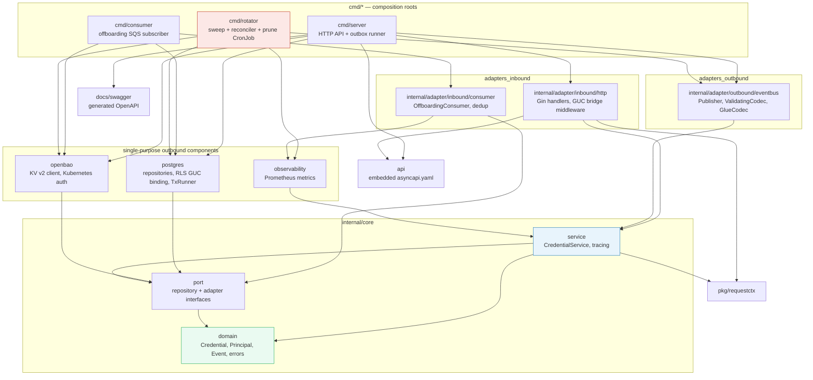

| Layer (`.go-arch-lint.yml` component) | Package | May depend on |
|---|---|---|
| `domain` | `internal/core/domain` | vendor only — pure value types, no internal imports |
| `port` | `internal/core/port` | `domain` |
| `service` | `internal/core/service` | `domain`, `port`, `requestctx` |
| `observability` | `internal/adapter/outbound/metrics` | `domain`, `port`, `service` |
| `postgres` | `internal/adapter/outbound/postgres` | `domain`, `port` |
| `openbao` | `internal/adapter/outbound/openbao` | `domain`, `port` |
| `adapters_outbound` | `internal/adapter/outbound/eventbus` | `domain`, `port`, `service`, `observability` |
| `adapters_inbound` | `internal/adapter/inbound/{http,consumer}` | `domain`, `port`, `service`, `requestctx`, `apispec`, `observability` |
| `reconciler_jobs` | `cmd/rotator` | `domain`, `port`, `postgres`, `openbao`, `observability`, `adapters_outbound` — **never `service`** |
| `cmd` | `cmd/{server,consumer}` | everything |

---

## Package dependency graph

The same rules as an import graph — this is what `make lint` (`go-arch-lint
check`) actually verifies on every PR.

> Source: [package-dependencies.mmd](docs/architecture/mermaid/package-dependencies.mmd)

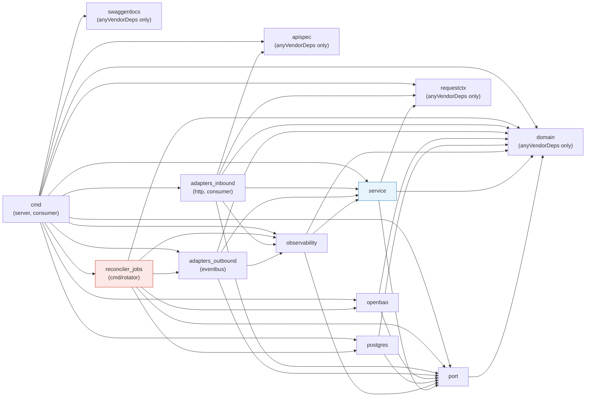

Why `postgres` and `openbao` are each their own component instead of folded
into `adapters_outbound`: it keeps two structural invariants mechanically
checkable rather than just documented — **TS-INV-1** (no `gocloak`
dependency anywhere in this service) and **TS-INV-2** (no credential
plaintext ever reaches Postgres) both fail loudly in CI (`make lint`,
`no-gocloak`, `no-secret-log` gates) the moment a future change would
violate them, instead of relying on code review to catch it.

---

## Credential issue/rotate flow (TS-1)

The crux endpoint — the only one that ever returns a plaintext secret, and
the only write path with genuine two-system (Postgres + OpenBao)
choreography. Material-then-metadata ordering: OpenBao is written **before**
the Postgres transaction opens, so a crash between the two leaves
recoverable orphaned material, never a committed row with nothing backing
it.

> Source: [credential-issue-rotate-flow.mmd](docs/architecture/mermaid/credential-issue-rotate-flow.mmd)

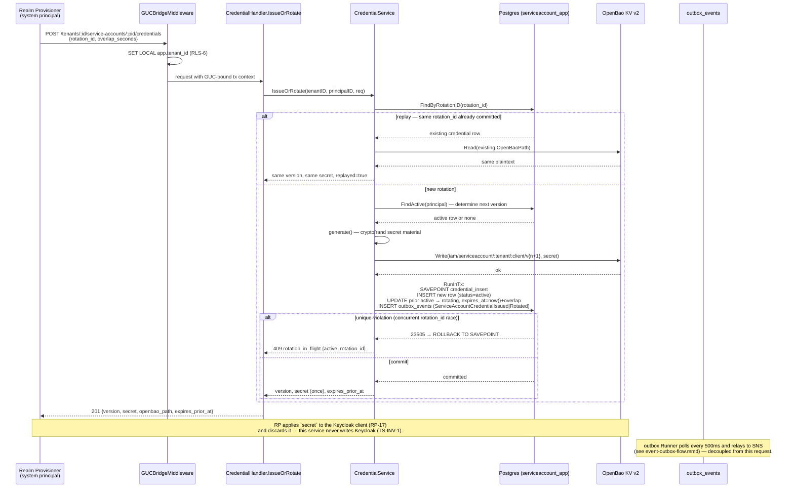

**The `SAVEPOINT`/`ROLLBACK TO SAVEPOINT` matters, not just decoration.**
Once any statement inside a Postgres transaction fails, the whole
transaction is aborted (`25P02`) and every subsequent statement errors until
a rollback — including the best-effort lookup that populates
`details.active_rotation_id` on a `409`. Without the savepoint, that
enrichment could never succeed against a real `23505`, silently defeating
the API contract's own documented behavior. This was found and fixed during
this service's test-coverage hardening pass, verified by a test that failed
before the fix and passes after.

Idempotency is per `rotation_id` (`uq_sac_rotation_id`): a retried request
under the same key returns the same version and secret without generating
new material, a double-emit, or an orphaned OpenBao entry (§9.2). A
*different* `rotation_id` arriving mid-rotation is `409 rotation_in_flight`,
never silently queued or overwritten.

---

## Credential revoke flow (TS-2)

Same material-first discipline as issue/rotate, but in the destructive
direction: OpenBao is purged **before** the Postgres commit.

> Source: [credential-revoke-flow.mmd](docs/architecture/mermaid/credential-revoke-flow.mmd)

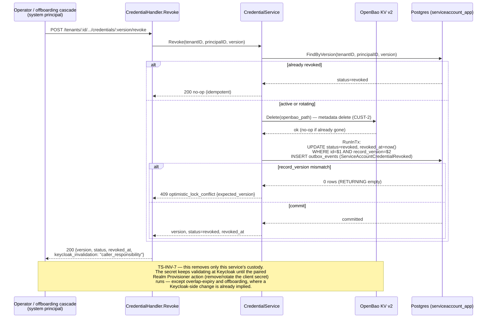

**TS-INV-7 — revocation is two-halves, like rotation.** TS-2 alone is
*complete* only where a Keycloak-side change is already implied by the same
event (overlap-expiry: Keycloak's own grace TTL expires the superseded
secret; offboarding: the Realm Provisioner deletes the whole realm). It is
**not** sufficient alone for a break-glass revoke of a live `active` version
— cutting off a leaked secret requires the paired Realm Provisioner action.
The `keycloak_invalidation: "caller_responsibility"` response field exists
specifically to make that gap visible to the caller, not to paper over it.

---

## Offboarding cascade flow

This service's one inbound event subscription (`TenantMembershipsPurged` on
`tenant-lifecycle-tokensvc-q`). Idempotent via `processed_events` keyed on
the envelope id; a missing/invalid envelope id or an unrecognized event type
is **acked, not retried** — a producer's future schema addition must never
turn into a DLQ storm on this queue.

> Source: [offboarding-cascade-flow.mmd](docs/architecture/mermaid/offboarding-cascade-flow.mmd)

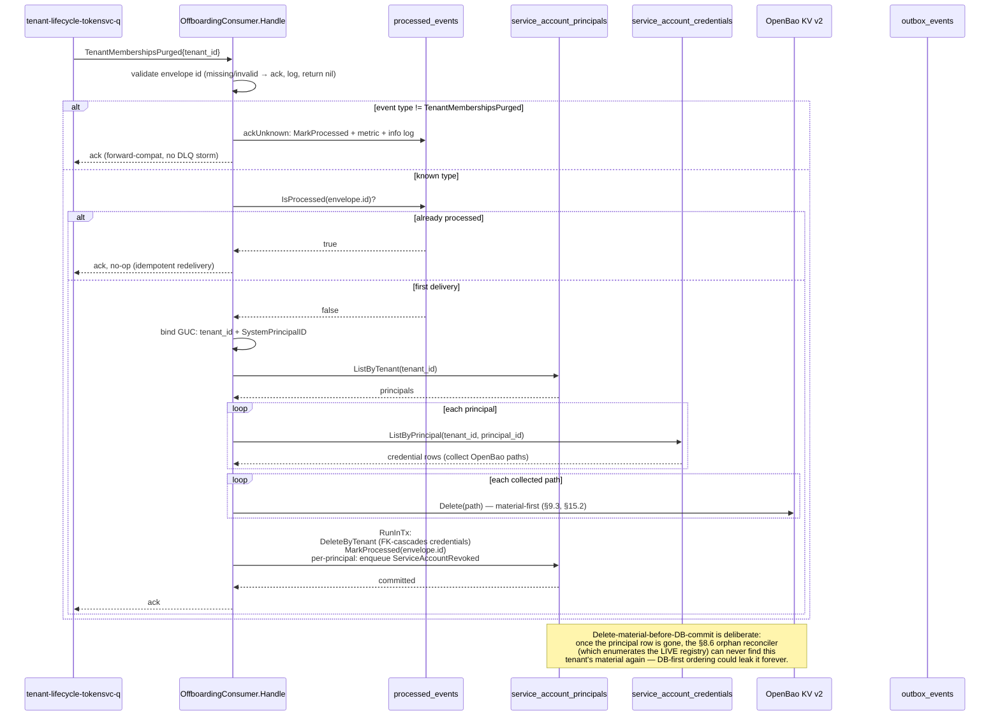

**Why this service consumes `TenantMembershipsPurged` at all.** Tenant
offboarding must destroy the tenant's credentials everywhere they live. The
Realm Provisioner deletes the Keycloak realm and Org & Membership scrubs its
own rows, but neither of those reaches this service's own database or its
OpenBao material — each service destroys the data *it* owns on the same
terminal event (the GDPR-correct boundary, LLD §15.2). This service does
**not** consume `MembershipRevoked` — a per-user membership removal never
touches a service-account principal, which is a non-member by construction
(TS-INV-4).

---

## Reconciler sweep flow (cmd/rotator)

A run-to-completion CronJob invocation, not a long-lived process — three
phases in one binary run, connecting as `serviceaccount_reconciler`
(`BYPASSRLS`, `SELECT`-only, no `GUCProvider`) for cross-tenant enumeration
and opening ordinary RLS-scoped `serviceaccount_app` transactions for the
actual per-tenant writes.

> Source: [reconciler-sweep-flow.mmd](docs/architecture/mermaid/reconciler-sweep-flow.mmd)

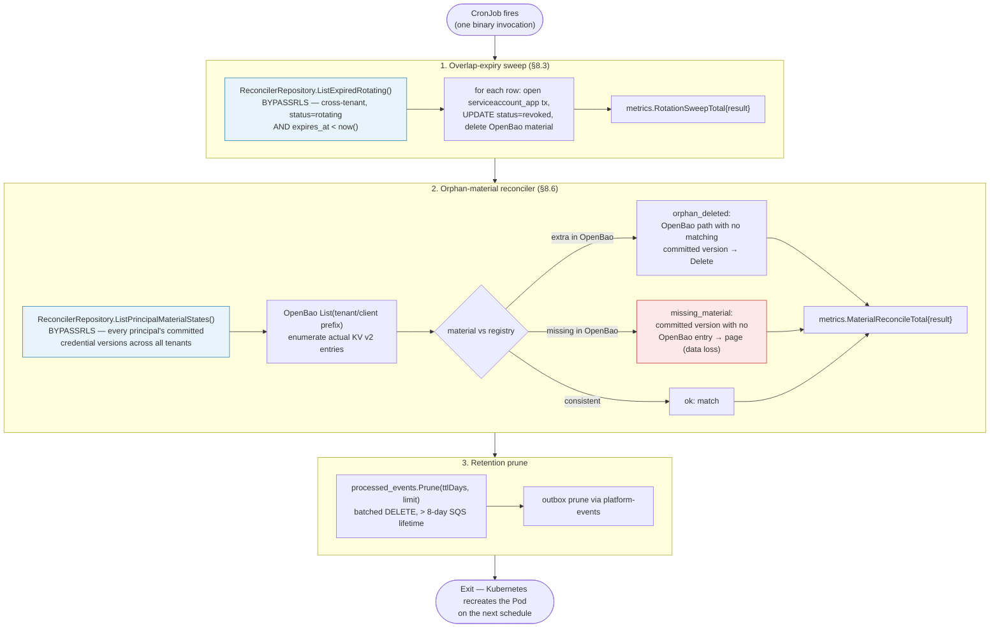

`iam_token_service_material_reconcile_total{result="missing_material"}` is
the one metric on this service worth paging on immediately — it means a
credential Postgres believes is live has no backing OpenBao entry, i.e.
irrecoverable data loss for that version. Everything else in this flow is
routine, expected background convergence.

---

## Row-Level Security (RLS) and GUC injection

Tenant isolation is enforced in Postgres itself, not just in application
code — `FORCE ROW LEVEL SECURITY` applies even to the table owner, and the
policy predicate fails closed (no GUC set → zero rows / write rejected,
never "no restriction").

> Source: [rls-guc-flow.mmd](docs/architecture/mermaid/rls-guc-flow.mmd)

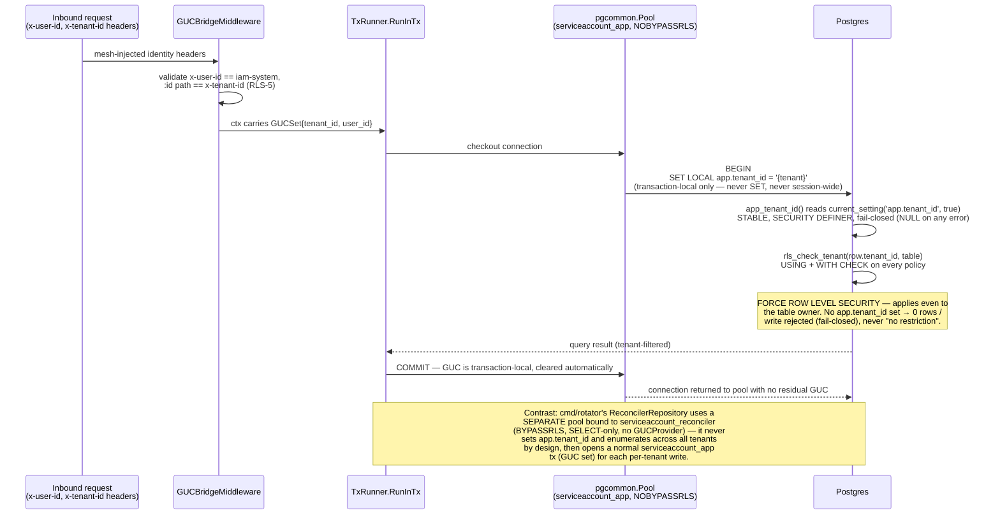

Three Postgres roles, one purpose each:

| Role | Attributes | Used by |
|---|---|---|
| `serviceaccount_app` | `NOSUPERUSER NOBYPASSRLS NOCREATEDB NOCREATEROLE` | `cmd/server`, `cmd/consumer` — every RLS-scoped read/write |
| `serviceaccount_migrator` | `BYPASSRLS` + DDL privileges | migrations only, direct connection, bypasses PgBouncer (`pg_advisory_lock` is session-scoped) |
| `serviceaccount_reconciler` | `BYPASSRLS`, `SELECT`-only, no write grant | `cmd/rotator`'s cross-tenant enumeration only |

`SET LOCAL` (never plain `SET`) is the load-bearing detail: it scopes the
GUC to the current transaction, so a pooled connection returned to
PgBouncer/pgcommon carries no residual tenant binding into the next
checkout — a plain `SET` here would be a cross-tenant data leak waiting to
happen under connection pooling.

---

## Event and outbox flow

Every credential state transition emits exactly one event, in the **same
transaction** as the state write (EVT-1) — an event is never published for
a rotation that rolled back, and no committed transition lacks its event.
Enqueue-time validation is schema-check-only against plain JSON; Glue
wire-encoding happens later, at publish time, so `outbox_events.payload`
stays human-readable for observability and replay.

> Source: [event-outbox-flow.mmd](docs/architecture/mermaid/event-outbox-flow.mmd)

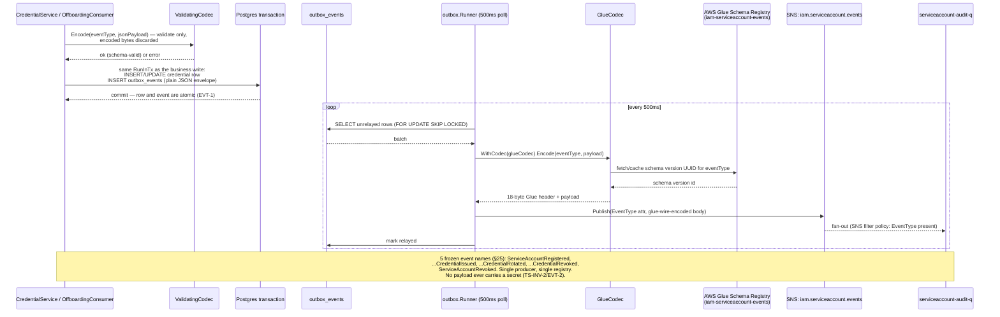

| Event | Emitted when | Consumers |
|---|---|---|
| `ServiceAccountRegistered` | TS-4 registers a principal | Audit |
| `ServiceAccountCredentialIssued` | TS-1 first credential (`version=1`) | Audit |
| `ServiceAccountCredentialRotated` | TS-1 rotation (`version>1`) | Audit |
| `ServiceAccountCredentialRevoked` | TS-2, overlap sweep, or offboarding revoke | Audit |
| `ServiceAccountRevoked` | Principal fully revoked (offboarding) | Audit |

No downstream authorization consumer subscribes to this topic — the
automation principal carries no roles (TS-INV-4), so these events are
audit-only by construction, not by convention.

---

## OpenBao credential custody lifecycle

The only OpenBao integration in this service, and its most distinctive flow
— no sibling service has an analogue. Kubernetes auth only: no static
token, no AWS Secrets Manager permission, no fallback credential path.

> Source: [openbao-credential-lifecycle.mmd](docs/architecture/mermaid/openbao-credential-lifecycle.mmd)

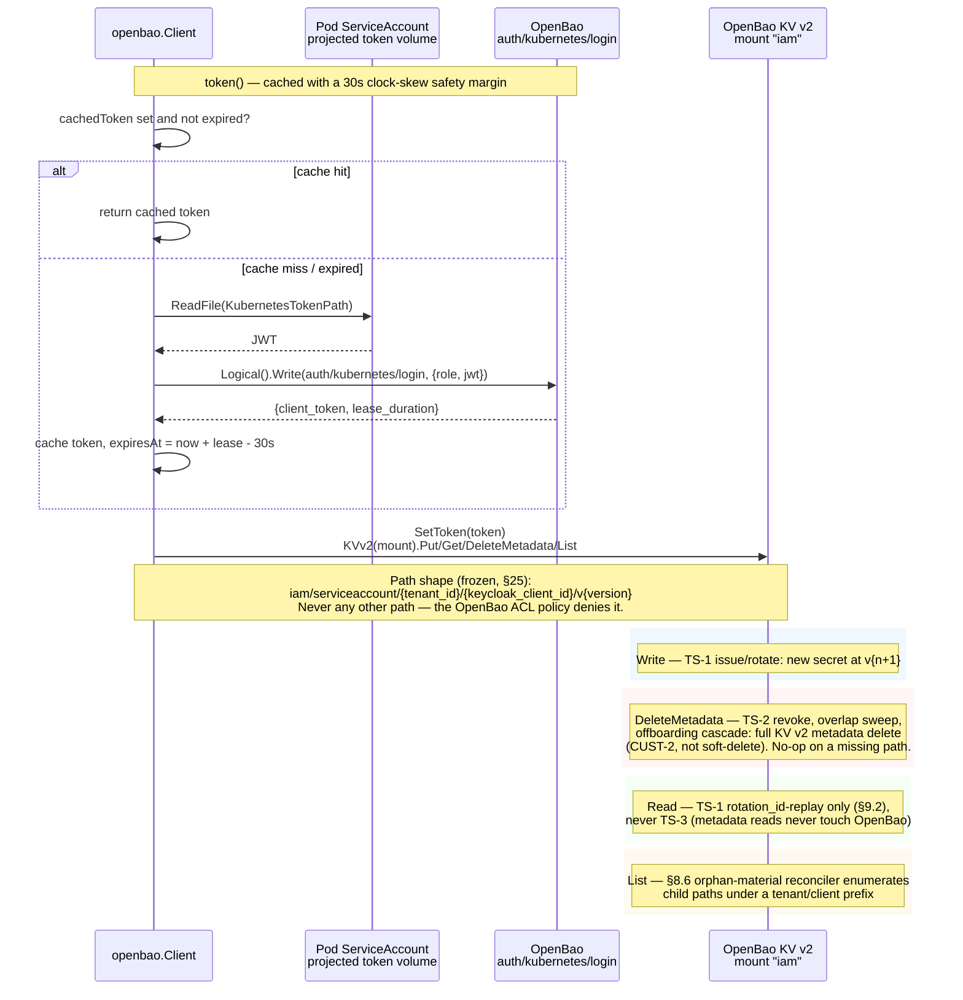

`iam/serviceaccount/<tenant_id>/<keycloak_client_id>/v<version>` is frozen
(LLD §25) — the OpenBao ACL policy (`deploy/openbao/policy.hcl`) grants only
`iam/data/serviceaccount/*` and `iam/metadata/serviceaccount/*`, so widening
this path shape is a security-review-gated change, not a routine one.
Locally (`make docker-up`), OpenBao runs in dev-mode with no real Kubernetes
cluster to authenticate against — a real credential round-trip only works
via `make test-integration`'s fake Kubernetes TokenReview server, or by
seeding OpenBao by hand.

**`SetToken` runs on a per-call clone, not the shared client.** `Client` is
shared across concurrent requests (`cmd/server` handles them concurrently),
and the OpenBao SDK's `SetToken` mutates a plain field with no atomicity
guarantee across "set mine, then use it" — two goroutines calling
`kvClient()` at once could otherwise interleave their `SetToken` calls
before either's actual KV request executes. `kvClient()` calls
`c.baoClient.Clone()` (same underlying `http.Client`/connection pool, an
independent token field) before `SetToken`, removing this at zero
connection-setup cost.

---

## Observability stack

Metrics are served on a dedicated port/listener, separate from the API
port, so a `/metrics` scrape never competes with request traffic or shares
its middleware chain.

> Source: [observability-stack.mmd](docs/architecture/mermaid/observability-stack.mmd)

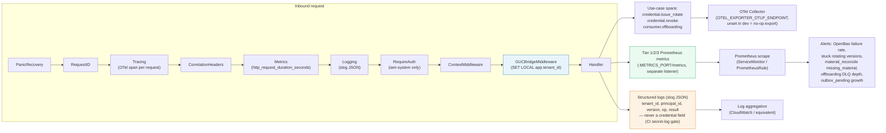

### Metrics — three-tier taxonomy

Metrics follow the **Enterprise Platform Observability Standard**: Tier 1
(`platform_*`, shared across every domain), Tier 2 (`iam_*`, shared across
IAM services), Tier 3 (`iam_token_service_*`, this service only). Labels
required by each tier (`domain`/`service`/`environment` for Tier 1,
`service`/`environment` for Tier 2) are injected **centrally** by
`internal/adapter/outbound/metrics.Register(environment)` — instrumentation
call sites never set them themselves (Standard requirement #8), so they
cannot be omitted or misspelled. `make gates`'s `metrics-taxonomy` check
enforces naming/namespace compliance in CI.

Every Tier-1/Tier-2 metric below is **registry-proposed, not yet
ratified** — see `docs/observability-registry-proposals.md` for the full
submission (semantic definition, labels, allowed values, aggregation
expectations) and is **dual-emitted alongside its legacy Tier-3
equivalent** per the Standard's Backward Compatibility migration process;
alerts/dashboards remain on the legacy name until a governance reviewer
ratifies the proposal.

| Metric | Tier | Type | Meaning |
|---|---|---|---|
| `iam_token_service_credentials_issued_total{op}` | 3 | counter | Credential state transitions (`issue`/`rotate`/`revoke`) |
| `iam_token_service_rotation_overlap_active` | 3 | gauge | Live `rotating` versions — should trend to zero between rotations |
| `iam_token_service_openbao_call_duration_seconds{op}` | 3 (legacy) | histogram | OpenBao KV latency (`write`/`delete`) |
| `platform_dependency_request_seconds{domain,service,environment,dependency,operation}` | 1 (proposed) | histogram | Same as above, generalized across dependencies/services |
| `iam_token_service_offboarding_cascade_total{result}` | 3 (legacy) | counter | Offboarding-cascade outcomes |
| `iam_offboarding_cascade_total{service,environment,outcome}` | 2 (proposed) | counter | Same as above, generalized across IAM services |
| `iam_token_service_rotation_sweep_total{result}` | 3 | counter | Overlap-expiry sweep outcomes |
| `iam_token_service_material_reconcile_total{result}` | 3 | counter | Orphan-material reconciler outcomes; `missing_material` is page-worthy |
| `iam_token_service_processed_events_duplicates_total` | 3 (legacy) | counter | Deduped redeliveries (skipDuplicate) |
| `platform_duplicate_messages_total{domain,service,environment,queue}` | 1 (proposed) | counter | Same as above, generalized across queues/services |
| `iam_token_service_unknown_event_acknowledged_total` | 3 | counter | Forward-compat acks of unrecognized event types |
| `iam_token_service_outbox_pending` | 3 | gauge | Unrelayed outbox rows — bus-health signal |

Shared-library metrics (`http_request_duration_seconds`/`http_requests_total`
from `platform-gincommon`, `outbox_*`/`sqs_*`/`events_*` from
`platform-events`, `pgcommon_pool_*` from `platform-pgcommon`) are emitted
under those libraries' own pre-Standard names and a `service` const label
that is domain+service combined (`"iam-token-service"`), not the
Standard's domain-less `service` + separate `domain` shape — bringing
those into full compliance requires a change in the shared library itself,
outside this repo's scope; noted here as a known platform-wide follow-up,
not something this service can unilaterally fix.

`credential.issue_rotate` and `credential.revoke` spans propagate their
`trace_id` onto the produced event envelope, so a rotation is traceable
end-to-end from the TS-1 call through to the Audit projection.

---

## Concurrency and optimistic locking

Every mutable row carries `record_version`, bumped by a `touch_row()`
trigger that fires only when a row actually changes (`WHEN (OLD.* IS
DISTINCT FROM NEW.*)`) — so an idempotent replay that produces an identical
row never spuriously invalidates a concurrent optimistic-lock holder. A
mutation's `UPDATE ... WHERE id = $1 AND record_version = $2 RETURNING ...`
returning zero rows is `409 optimistic_lock_conflict` with the caller's
stale `expected_version` in `details`, not a silent overwrite.

**A concurrent revoke race is not a real conflict.** TS-2's `revoke` and
the overlap-expiry sweep's `revokeExpiredRotating` both revoke the same
kind of row through the same optimistic-lock path — if they race each
other (another TS-2 call, or the sweep, wins first), the loser's `Update`
correctly reports `optimistic_lock_conflict`, but both call sites re-check
the row afterward and, finding it already `revoked`, return the
already-achieved idempotent outcome instead of surfacing a `409` (TS-2) or
counting a sweep failure for a race that converged correctly.

`rotation_id` is the other concurrency axis, orthogonal to
`record_version`: it makes TS-1 itself idempotent (`uq_sac_rotation_id`),
distinct from optimistic locking, which guards TS-2 and any other row
mutation against a stale read-modify-write.

---

## Failure domains

| Failure | Behavior |
|---|---|
| OpenBao unreachable during issue/rotate/revoke | `502 secret_store_unavailable`; nothing committed to Postgres (material-write precedes the tx; material-delete precedes the tx on revoke) |
| Postgres connectivity/resource error (SQLSTATE class `08`/`53`/`57`/`58`, closed pool, network I/O error) | Remapped by `wrapConnErr` to `domain.ErrDBUnavailable` → `503`, never a raw `500` |
| Crash between OpenBao write and Postgres commit (issue/rotate) | Orphaned OpenBao material, no committed row — reconcilable by the §8.6 orphan-material reconciler (`orphan_deleted`), never a phantom credential |
| Crash between OpenBao delete and Postgres commit (revoke/offboarding) | Delete is a no-op on an already-missing path, so retrying the whole operation is always safe |
| Committed credential with no backing OpenBao material | `missing_material` — irrecoverable per-version data loss; the reconciler pages rather than silently reissuing |
| Unknown inbound event type or malformed envelope id | Acked immediately, never retried — a producer schema addition must never DLQ-storm this consumer |
| Outbox/SNS/SQS relay failure | At-least-once; `processed_events` on both the outbound Audit consumer side (elsewhere) and this service's own inbound offboarding-dedup side make redelivery safe |
| Offboarding cascade fails partway through a multi-credential tenant (e.g. OpenBao delete succeeds for credential 1 of 3, fails on 2) | `Handle` returns the error before any DB write and before `processed_events` is marked, so nothing commits — SQS redelivers and the whole loop retries from scratch (credential 1's delete is a no-op the second time). If retries exhaust `maxReceiveCount` and the message DLQs, the tenant's Postgres rows remain fully intact (nothing was ever deleted from Postgres) while some OpenBao material is already gone; the §8.6 reconciler's `ListPrincipalMaterialStates` still sees the live principal and correctly reports the missing entries as `missing_material` (page-worthy) rather than silently losing them |
| A revoke (TS-2, or the overlap-expiry sweep) races another revoke of the exact same row | The loser's `Update` hits `ErrOptimisticLockConflict`; both `revokeCredential` (TS-2) and the sweep's `revokeExpiredRotating` re-check the row afterward and, finding it already `revoked`, return the idempotent success/skip outcome instead of surfacing a conflict for a race that already converged correctly |
| TS-1 `rotation_id` replay against a version that has since been revoked | Classified explicitly as `409 credential_replay_revoked` rather than letting the OpenBao read fail and surface as a misleading `502 secret_store_unavailable` |

---

## Key invariants

| # | Invariant |
|---|---|
| TS-INV-1 | This service never writes Keycloak — no `gocloak` dependency, no Keycloak Admin credential (CI `no-gocloak` gate) |
| TS-INV-2 | No plaintext secret is ever persisted in Postgres or logged (CI `no-secret-log` gate); it exists only in OpenBao and transiently in the TS-1 response body |
| TS-INV-3 | One live credential version per principal, plus at most one `rotating` version inside the bounded overlap window |
| TS-INV-4 | The automation principal holds no roles and no membership — this service issues credentials only, never authorizes |
| TS-INV-5 | Every credential state transition is recorded locally **and** emitted through the outbox in the same transaction (EVT-1) |
| TS-INV-6 | Reachable only in-mesh on `/api/v1/internal/*` under the reserved `iam-system` principal; no tenant-facing surface at MVP |
| TS-INV-7 | Revocation is two-halves, like rotation — TS-2 removes this service's custody/metadata, not the Keycloak-side validity, except where a Keycloak change is already implied |
| RLS-6 | Tenant scoping is via `SET LOCAL app.tenant_id`, transaction-local only — never a session-wide `SET` |
| RLS-7 | Only `cmd/rotator`'s reconciler pool may bypass RLS, and only for `SELECT`-only cross-tenant enumeration |

---

## Deployment

**Three binaries, one image.** `cmd/server` (HTTP API + outbox runner),
`cmd/consumer` (offboarding SQS subscriber), `cmd/rotator` (sweep +
reconciler + prune CronJob) are built from one `Dockerfile`, selected by
`ENTRYPOINT` override — `deploy/helm/templates/deployment-server.yaml`,
`deployment-consumer.yaml`, and `cronjob-rotator.yaml` each point the same
`image.repository:tag` at a different entrypoint.

**Topology.** 2 replicas each for `server`/`consumer` (HA, not load — this
service is trivially small); the rotation CronJob is a singleton
run-to-completion job. `server`/`consumer` connect as `serviceaccount_app`
(RLS-scoped); `rotator` connects as `serviceaccount_reconciler`
(`BYPASSRLS`, read-only) for enumeration and opens ordinary
`serviceaccount_app` transactions for the writes it makes.

**Migration safety.** `MIGRATION_DATABASE_URL` bypasses PgBouncer —
`pg_advisory_lock` is session-scoped and breaks under transaction pooling.
Dev-stage migrations are outright (no expand/contract dance): this service
has never been deployed anywhere, so there is exactly one migration. The
down migration's `REVOKE ... FROM admin_readonly` is guarded the same way
the up migration's grant is (`admin_readonly` is infra-provisioned ahead of
the migration in prod and may not exist in dev/CI) — verified against a
real Postgres instance with the role both present and absent.

**Helm chart** (`deploy/helm/`): `Deployment` × 2 (server, consumer),
`CronJob` × 1 (rotator — `activeDeadlineSeconds: 240s`, deliberately
shorter than the 5-minute schedule so a run never eats into the next tick
under `concurrencyPolicy: Forbid`), `NetworkPolicy` restricting ingress to
in-mesh callers (`ingressNamespaceSelector` is a required value — the
render fails closed if left unset, since an empty selector matches every
namespace in the cluster), `ServiceAccount` bound to the OpenBao
Kubernetes-auth role, `PrometheusRule`/`ServiceMonitor` for the alerts in
`deploy/monitoring/app-alerts.yml`, `PodDisruptionBudget`.

---

## Testing strategy

| Suite | Location | What it proves |
|---|---|---|
| Unit | `internal/**/*_test.go`, `test/unit/**` | Business logic in isolation, hand-written fakes with force-error injection, no I/O |
| Contract | `test/contract` | Wire-shape/error-taxonomy conformance |
| Postgres (RLS) | `test/postgres` (`-tags=integration`) | Real Postgres via testcontainers-go: RLS-6/RLS-7 invariants, `FORCE ROW LEVEL SECURITY`, real SQLSTATE-driven error paths |
| Integration | `test/integration` (`-tags=integration`) | Real OpenBao via testcontainers-go + a fake Kubernetes TokenReview server, proving the actual Kubernetes-auth login |
| E2E | `test/e2e` (`-tags=e2e`) | Full black-box proof of `cmd/*` wiring — the one place composition-root code is actually exercised |
| Smoke | `make test-smoke` | Fast subset for a quick local sanity check |

Coverage is measured with `-coverpkg` scoped to `internal/...` and
`pkg/...` only (`cmd/` is deliberately excluded from the denominator —
`main()` can never be unit-invoked; `test/e2e` is what proves it works),
merged across all suites with a max-count strategy
(`scripts/merge_coverage.py`). `make test-ci` runs the full merged
pipeline; the CI gate (`.github/workflows/validate-test.yml`) enforces a
coverage floor.

---

## Schema lifecycle

Database migrations live in `internal/adapter/outbound/postgres/migrations`
and are outright (no expand/contract) at this dev stage — there has only
ever been one. Event schemas are the other axis: each of the 5 published
event types has a JSON Schema embedded at
`internal/adapter/outbound/eventbus/schemas/*.json`,
registered as its own Glue schema version in the single
`iam-serviceaccount-events` registry. `api/asyncapi.yaml` is the
design-time contract; the Glue registry is the runtime enforcement point —
both must move together (`schema-gov validate`/`register` in CI). Additive
changes (new optional field) register a new schema version in place;
breaking changes (remove/rename a field, change a type) require a new event
name entirely — the 5 current names are frozen (§25) and never reused.

---

## Threat model

| Threat | Mitigation |
|---|---|
| Cross-tenant data access | `FORCE ROW LEVEL SECURITY` + fail-closed policy predicate; `serviceaccount_app` is `NOBYPASSRLS` |
| Credential plaintext leakage via logs/traces/DB | TS-INV-2, enforced by the CI `no-secret-log` gate, not just code review |
| This service becoming a second Keycloak-Admin writer | TS-INV-1, enforced by the CI `no-gocloak` gate |
| Stolen/leaked OpenBao credential | Kubernetes-auth-only login (no static token anywhere), short-lived cached token with a 30s clock-skew margin |
| Compromised `active` secret | TS-2 revoke + the required paired Realm Provisioner action (TS-INV-7) — this service alone cannot fully cut it off |
| Replayed/duplicate SQS delivery | `processed_events` idempotency ledger, keyed on envelope id |
| Malicious/malformed inbound event | Envelope-id validation and unknown-type handling both ack-and-drop rather than retry-and-crash-loop |
| Privilege escalation via the reconciler pool | `serviceaccount_reconciler` is `BYPASSRLS` but grantless beyond `SELECT` — structurally cannot write |
| Widening OpenBao access beyond this service's own path | The OpenBao ACL policy denies everything outside `iam/{data,metadata}/serviceaccount/*` |
| Out-of-mesh ingress to the server/consumer pods | `networkPolicy.ingressNamespaceSelector` has no safe default — the Helm render refuses an unset/empty selector rather than silently matching every namespace in the cluster |
| Code-level vulnerabilities (hardcoded credentials, unsafe patterns) in this service's own source | `gosec` (`make sast`), a Go-code SAST gate distinct from `govulncheck` (dependency CVEs) and the release pipeline's Trivy scan (container/OS CVEs) |

---

## Developer tools

- `make lint` — `go-arch-lint` (layer boundaries) + `golangci-lint` (via the `go tool` directive, no local/CI version drift)
- `make gates` — the three invariant gates (`no-gocloak`, `no-secret-log`, `set-local-only`) plus `gincommon-obs` and `metrics-taxonomy`
- `make test-ci` — the full coverage-instrumented, merged test pipeline
- `make docker-up` — infra-only local stack (Postgres/PgBouncer/OpenBao/Floci); `make run`/`make run-consumer` run the service natively against it
- `make godoc` — serves package documentation locally
- `make vuln-check` — `govulncheck` against `internal/...`/`pkg/...`
- `make sast` — `gosec` static-analysis scan
- `make metrics-taxonomy` — Enterprise Platform Observability Standard naming/namespace-classification gate

---

## Documentation assets

| Doc | Purpose |
|---|---|
| `README.md` | Onboarding, API overview, local dev, environment variables |
| `ARCHITECTURE.md` (this file) | Deep-dive mechanisms, one diagram per cross-cutting concern |
| `docs/architecture/mermaid/*.mmd` | Canonical diagram sources — edit here first |
| `docs/architecture/README.md` | Index mapping each diagram to its section/LLD reference |
| `docs/iam-lld-token-service.md` | The signed-off Low-Level Design (rev 1.0) — the ultimate source of truth |
| `api/asyncapi.yaml` | Event contract (design-time); served at `/asyncapi` |
| `docs/swagger/` | Generated OpenAPI spec (`make swag`); served at `/swagger` |
| `VERSIONING.md` | SemVer scope, release process, frozen-contract enumeration |
| `CHANGELOG.md` | Keep a Changelog-format history |
| `docs/observability-registry-proposals.md` | Enterprise Platform Observability Standard registry submissions for this service's Tier-1/Tier-2 proposed metrics |

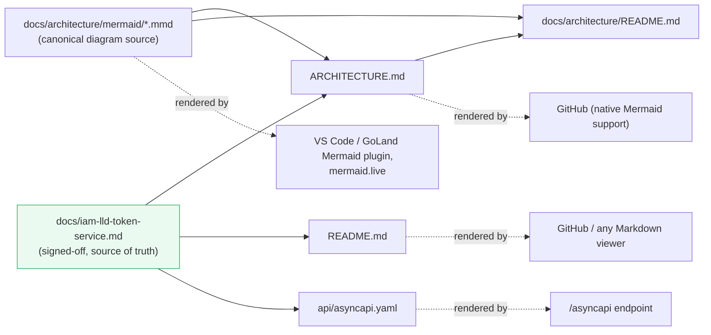

Every diagram in this file is a verbatim copy of its `.mmd` source — if
they ever diverge, the `.mmd` file wins; update this file to match, not the
reverse.
