# Architecture

This document is the deep-dive companion to `README.md`. It assumes you've
read the README's mental model and API overview; this file exists to make
every cross-cutting mechanism — layering, RLS, the outbox, OpenBao custody,
observability — traceable to the exact code and LLD section that define it.
The canonical, signed-off design is `docs/lld/iam-lld-token-service.md` (rev
1.4, Approved); this file is a navigable summary of it, kept in sync by
hand.

---

## Layer model

Clean Architecture, enforced structurally by `.go-arch-lint.yml` (`make
arch-lint` fails on any violation, not just a style warning). Four binaries
(`cmd/server`, `cmd/consumer`, `cmd/rotator`, `cmd/scheduler`) share one
image and one set of inner layers; `cmd/rotator` is deliberately walled
off from the `service` layer — it drives `postgres`/`openbao` directly
under a `BYPASSRLS` connection for cross-tenant enumeration (RLS-7), a
privilege no HTTP- or event-triggered code path may ever hold.
`cmd/scheduler` (§16 TSQ-6 Resolved) also uses that same `BYPASSRLS`
connection for its own cross-tenant due-list enumeration, but — unlike
`cmd/rotator` — is NOT walled off from `service`: every actual rotation it
performs goes through `CredentialService.IssueOrRotate`, an ordinary
RLS-scoped write, the same code `cmd/server`'s HTTP handler calls.

> Source: [layer-model.mmd](docs/architecture/mermaid/layer-model.mmd)

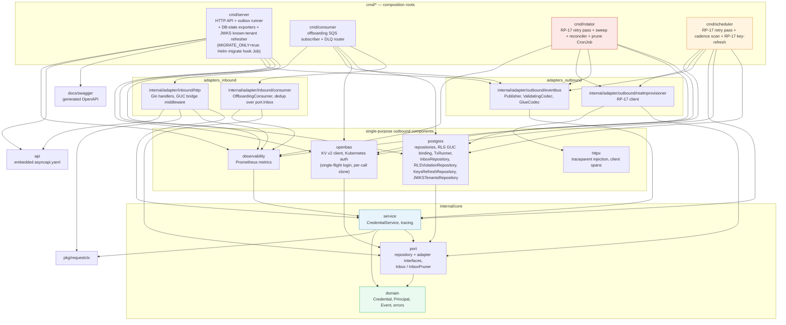

| Layer (`.go-arch-lint.yml` component) | Package | May depend on |
|---|---|---|
| `domain` | `internal/core/domain` | vendor only — pure value types, no internal imports |
| `port` | `internal/core/port` | `domain` |
| `service` | `internal/core/service` | `domain`, `port`, `requestctx` |
| `observability` | `internal/adapter/outbound/metrics` | `domain`, `port`, `service` |
| `postgres` | `internal/adapter/outbound/postgres` | `domain`, `port` |
| `openbao` | `internal/adapter/outbound/openbao` | `domain`, `port` |
| `httpx` | `internal/adapter/outbound/httpx` | vendor only — shared outbound-HTTP transport (traceparent injection, client spans) |
| `adapters_outbound` | `internal/adapter/outbound/{eventbus,realmprovisioner}` | `domain`, `port`, `service`, `observability`, `httpx` |
| `adapters_inbound` | `internal/adapter/inbound/{http,consumer}` | `domain`, `port`, `service`, `requestctx`, `apispec`, `observability` |
| `reconciler_jobs` | `cmd/rotator` | `domain`, `port`, `postgres`, `openbao`, `observability`, `adapters_outbound` — **never `service`** |
| `cmd` | `cmd/{server,consumer,rotator,scheduler}` | everything — `cmd/scheduler` is the one composition root besides `server` that actually exercises the `service` dependency for a write path. `cmd/scheduler` is listed only here, never under `reconciler_jobs`; `cmd/rotator` is listed under both |

---

## Package dependency graph

The same rules as an import graph — this is what `make arch-lint`
(`go-arch-lint check`) actually verifies on every PR.

> Source: [package-dependencies.mmd](docs/architecture/mermaid/package-dependencies.mmd)

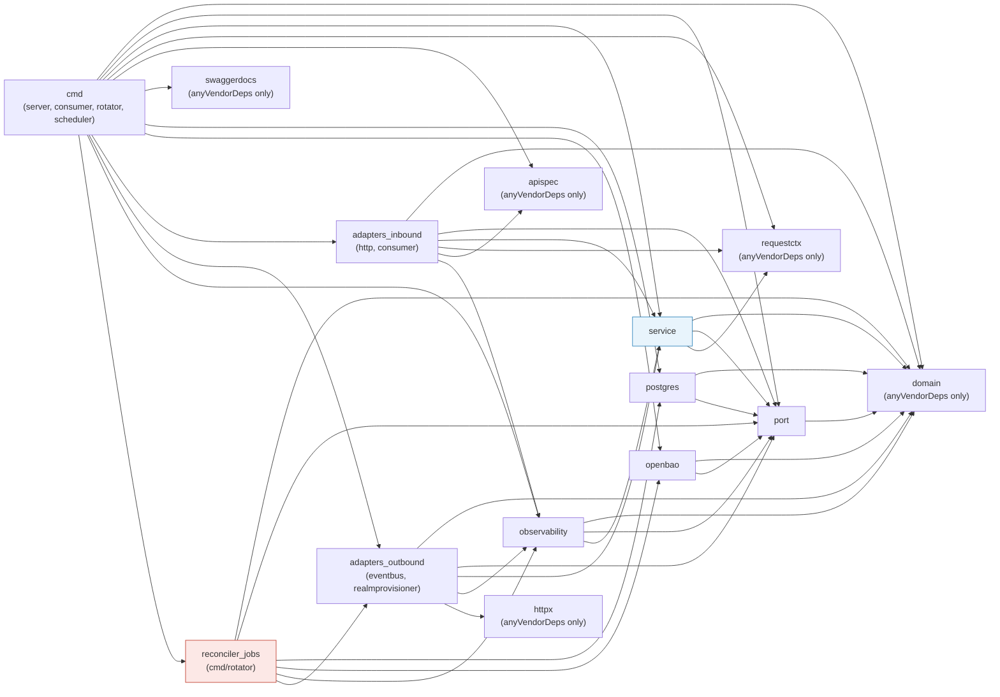

Two rules worth calling out: `reconciler_jobs` may **not** depend on
`service` — `cmd/rotator` drives `postgres`/`openbao` directly under
`BYPASSRLS`, never through the RLS-scoped service layer. `cmd/scheduler`
(§16 TSQ-6 Resolved) is the opposite case: it uses that same `BYPASSRLS`
pool for its own cross-tenant due-list scan, but lives under `cmd` (not
`reconciler_jobs`) precisely because it **does** depend on `service` for
every actual rotation write.

Why `postgres` and `openbao` are each their own component instead of folded
into `adapters_outbound`: it keeps two structural invariants mechanically
checkable rather than just documented — **TS-INV-1** (no `gocloak`
dependency anywhere in this service) and **TS-INV-2** (no credential
plaintext ever reaches Postgres) both fail loudly in CI (`make arch-lint`
plus the `no-gocloak` and `no-secret-log` gates in `make gates`) the
moment a future change would violate them, instead of relying on code
review to catch it.

---

## Write ordering discipline

Every mutating operation follows **one** ordering discipline (LLD §9.3,
TS-D11) — there is no distributed transaction spanning OpenBao, Postgres,
and (since EXT-6) the Realm Provisioner, so the order each of those three
systems is touched in relative to the Postgres commit is itself the
correctness mechanism. Unlike the Realm Provisioner's own two disciplines
(external-effect-first for most writes, local-intent-first-then-reconcile
when Keycloak is transiently down), this service has exactly one for
OpenBao: it is **fail-closed**, not reconcile-later, when OpenBao is
unavailable — there is no `pending`/`reconciling` state a credential row
can be in. The Realm Provisioner side is different: an RP-17 call that
fails after a commit is recorded in `keys_refresh_pending` and retried by
the next CronJob run (TS-D22/23).

> Source: [write-ordering-discipline.mmd](docs/architecture/mermaid/write-ordering-discipline.mmd)

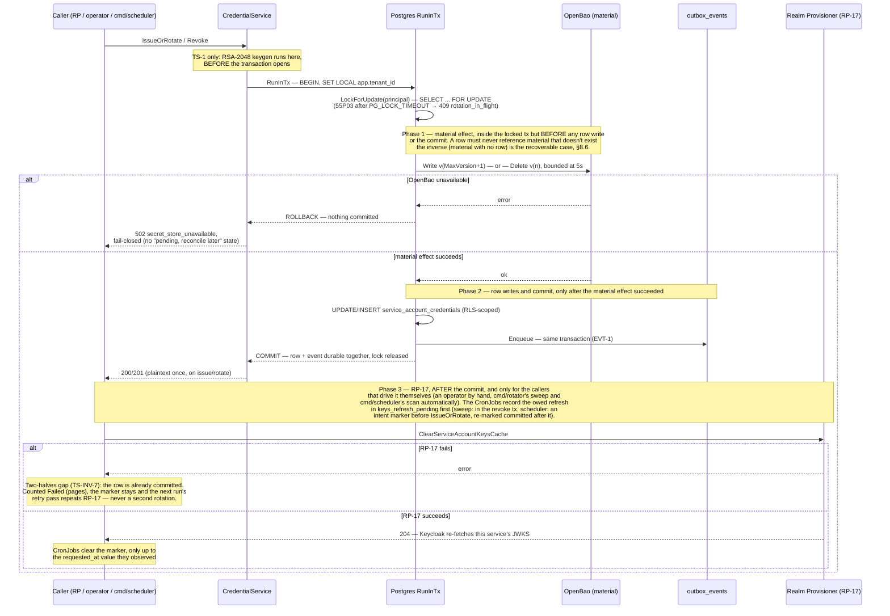

**Two external systems, two positions relative to the commit, for two
different reasons.** OpenBao is touched **before** the row write and the
commit because a committed row must never reference material that doesn't
exist — the inverse (material with no row, an orphan) is the recoverable
direction, reclaimed by the §8.6 reconciler. The call runs inside the
transaction, after the principal row lock is taken (TS-D21), so two writers
for one principal can never pick the same version or overwrite each
other's material; it is bounded at 5s (`inLockSecretWriteTimeout`) because
every other writer for the principal waits on that lock only
`PG_LOCK_TIMEOUT`. The Realm Provisioner is called **after** the commit,
and only by callers that drive RP-17 themselves (an operator by hand for
the on-demand path; `cmd/rotator`'s sweep and `cmd/scheduler`'s scan
automatically, TS-D14/15) — it is deliberately last because it is the one
step this service cannot roll back: the row is durable either way. An
RP-17 failure is the documented two-halves gap (TS-INV-7). The CronJobs
count it as Failed (it pages), but the `keys_refresh_pending` marker keeps
the owed refresh on record, so the next run retries it and the gap closes
once the Realm Provisioner is healthy (TS-D22/23). This same material-first
shape repeats, delete instead of write, in the Credential revoke flow
(TS-2), the overlap sweep and the Offboarding cascade flow below.

---

## Credential issue/rotate flow (TS-1)

The crux endpoint — the only one that ever returns a private key, and the
only write path with genuine two-system (Postgres + OpenBao) choreography.
Issue, rotate and revoke for one principal are serialized on the principal
row lock. Material-then-metadata ordering: OpenBao is written **before**
the credential rows and the commit, so a crash between the two leaves
recoverable orphaned material, never a committed row with nothing backing
it.

> Source: [credential-issue-rotate-flow.mmd](docs/architecture/mermaid/credential-issue-rotate-flow.mmd)

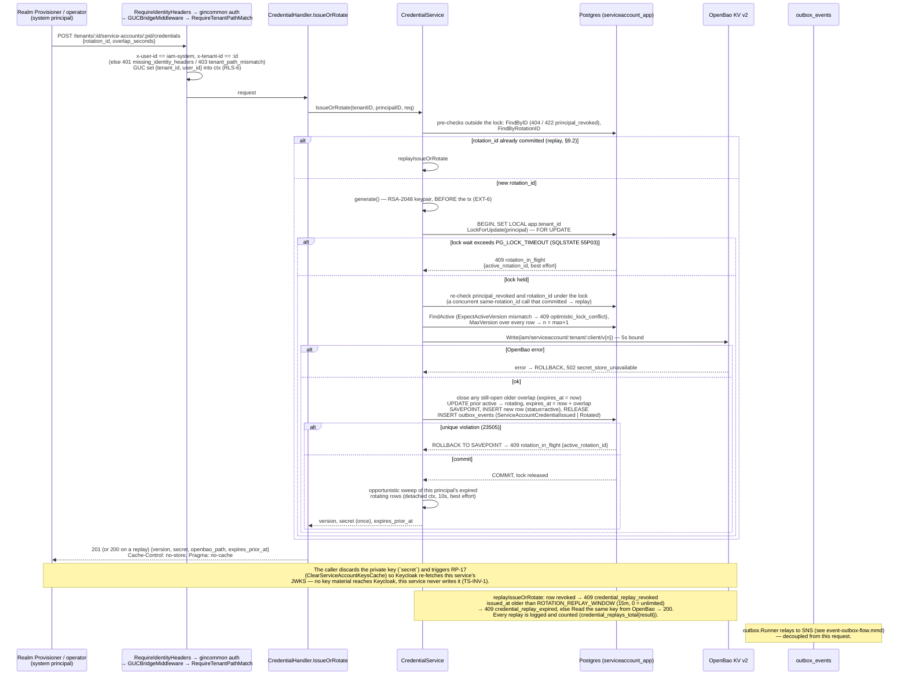

**The principal lock is what makes concurrent TS-1 calls safe.** Every
TS-1, TS-2 and the offboarding cascade start their transaction with
`SELECT … FOR UPDATE` on the principal row (`LockForUpdate`, or
`LockByTenant` for offboarding). Two TS-1 calls with different
`rotation_id`s therefore get consecutive versions instead of racing for the
same OpenBao path; a caller that waits longer than `PG_LOCK_TIMEOUT` gets
`409 rotation_in_flight` (SQLSTATE `55P03`, mapped once in `db.go`'s
`errLockNotAvailable`), with `details.active_rotation_id` filled in best
effort from the last committed active row. The next version is `MaxVersion
+ 1` over every row, revoked ones included, so a version number is never
reused after a revoke (`uq_sac_version`). The keypair is generated before
the transaction and the in-lock OpenBao write is bounded at 5s, so the lock
is held only for the write and the row updates. A second rotation inside
an open overlap window first ends the older overlap (TS-INV-3: at most the
new `active` plus the one being demoted stay live). `cmd/scheduler` sets
`ExpectActiveVersion`, so a cadence rotation that races an operator
rotation becomes `optimistic_lock_conflict` (Skipped) instead of a second
rotation.

**The `SAVEPOINT`/`ROLLBACK TO SAVEPOINT` matters, not just decoration.**
Once any statement inside a Postgres transaction fails, the whole
transaction is aborted (`25P02`) and every subsequent statement errors until
a rollback — including the best-effort lookup that populates
`details.active_rotation_id` on a `409`. Without the savepoint, that
enrichment could never succeed against a real `23505`, silently defeating
the API contract's own documented behavior. This was found and fixed during
this service's test-coverage hardening pass, verified by a test that failed
before the fix and passes after.

Idempotency is per `rotation_id` (`uq_sac_rotation_id`): a retried request
under the same key returns the same version and private key without
generating new material, a double-emit, or an orphaned OpenBao entry
(§9.2) — but only within `ROTATION_REPLAY_WINDOW` (default 15m, `0` =
unlimited) of the credential's `issued_at`. Past the window the replay is
`409 credential_replay_expired`; once the version is revoked it is `409
credential_replay_revoked`. Each replay is logged at Info (identifiers
only) and counted in `iam_token_service_credential_replays_total{result}`
(`served`/`expired`/`revoked`), since a served replay hands out a live
private key again (TS-D22/23). Success responses carry `Cache-Control:
no-store`.

---

## Credential revoke flow (TS-2)

Same material-first discipline as issue/rotate, but in the destructive
direction: OpenBao is purged inside the locked transaction **before** the
row update and the commit.

> Source: [credential-revoke-flow.mmd](docs/architecture/mermaid/credential-revoke-flow.mmd)

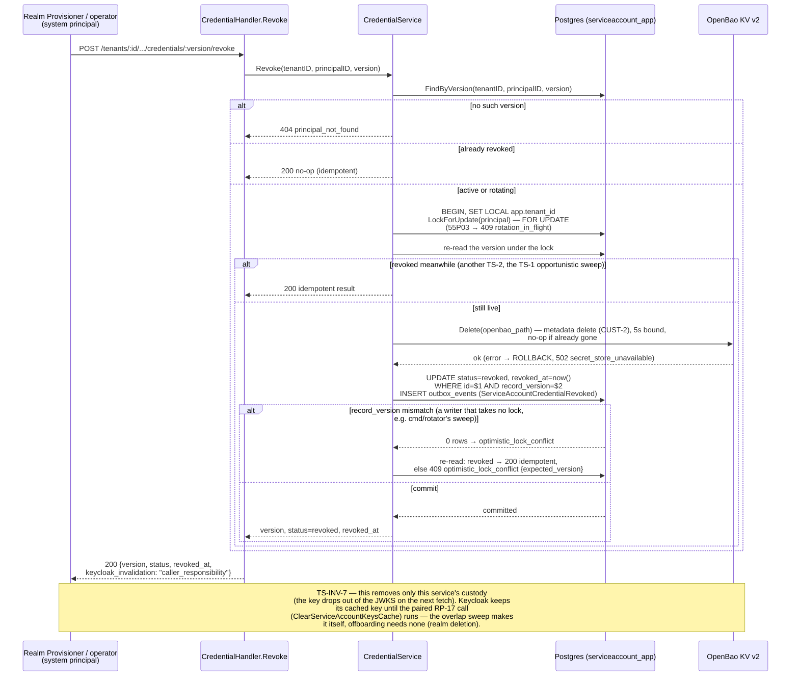

**TS-INV-7 — revocation is two-halves, like rotation.** TS-2 alone is
*complete* only for offboarding, where the Realm Provisioner deletes the
whole realm. Under EXT-6 there is no Keycloak-side TTL: Keycloak keeps a
key it has cached until RP-17 (`ClearServiceAccountKeysCache`) evicts it,
so the overlap-expiry sweep makes that call itself after every tenant's
revokes (TS-D15, with the `keys_refresh_pending` retry since TS-D22). TS-2
is **not** sufficient alone for a break-glass revoke of a live `active`
version — cutting off a leaked key requires the caller's paired RP-17
call. The `keycloak_invalidation: "caller_responsibility"` response field
exists specifically to make that gap visible to the caller, not to paper
over it.

---

## Offboarding cascade flow

This service's one inbound event subscription (`TenantMembershipsPurged` on
`tenant-lifecycle-tokensvc-q`). Exactly-once via `platform-events`'
`pkg/inbox` over the service-owned `processed_events` table (LLD TS-D19),
keyed on the envelope id under the frozen consumer name
`tenant_offboarding`. An unrecognized event type is **acked, not retried**
— a producer's future schema addition must never turn into a DLQ storm on
this queue. A `TenantMembershipsPurged` with a missing or non-UUID envelope
id is the opposite case: it cannot be deduplicated, and acking it would
silently skip the tenant's erasure, so it is a permanent reject sent
straight to the DLQ (`DLQReason=invalid_envelope_id`, TS-D22/23).

> Source: [offboarding-cascade-flow.mmd](docs/architecture/mermaid/offboarding-cascade-flow.mmd)

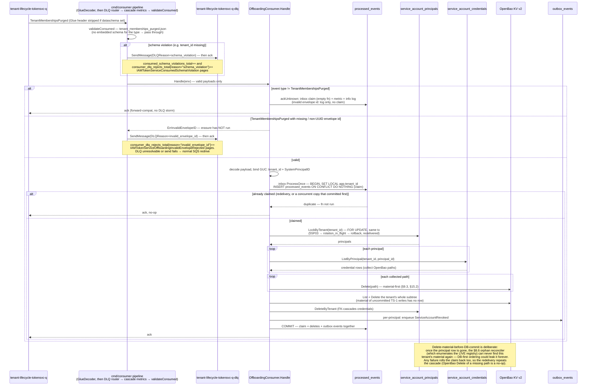

**One transaction, claim first.** `port.Inbox.ProcessOnce`
(`internal/core/port/inbox.go`, implemented by `postgres.InboxRepository`
— one `inbox.Store` per consumer name, the same shape as
iam-org-membership) runs the whole cascade in **one** transaction on the
RLS-scoped app pool (`SET LOCAL app.tenant_id`, bound from the GUC set
`Handle` puts in ctx). The `processed_events` claim (`INSERT … ON CONFLICT
DO NOTHING`) is the first statement, so a concurrent delivery of the same
event blocks on the claim's row lock and then sees a duplicate — two
copies can never both pass a pre-check and run the cascade twice. The
cascade then locks the tenant's principal rows (`LockByTenant`, `FOR
UPDATE`), so no TS-1 for the tenant can write new material while it runs.
After deleting every stored path it also deletes whatever else is under
the tenant's OpenBao prefix: material a crashed or racing TS-1 wrote but
never committed has no row, and once the principal row is gone the §8.6
reconciler could never find it. The claim, the row deletes and the
`ServiceAccountRevoked` outbox rows commit or roll back together: any
failure un-claims the event and the redelivery repeats the whole cascade.
`processOnce`/`ackUnknown` (`internal/adapter/inbound/consumer/dedup.go`)
are thin wrappers that add the Tier-3 duplicate/unknown-type counters;
unknown types are labelled from a closed set (anything else → `other`). The
accepted trade-off: the OpenBao HTTP calls run while that transaction is
open, which is why `SQS_HANDLER_TIMEOUT` (45s) stays below the 60s
visibility timeout — a hung cascade fails and is redelivered rather than
hiding its message. `cmd/rotator` prunes `processed_events` through the
same inbox (`inbox.Store.Prune`, `PROCESSED_EVENTS_TTL_DAYS`).

**The DLQ router.** `routeRejectsToDLQ` (`cmd/consumer/dlq.go`) is the
outermost handler wrapper. It turns the two permanent rejects —
`schema_violation` from `validateConsumed` and `invalid_envelope_id` from
`Handle` — into a `SendMessage` to the DLQ named by the source queue's
`RedrivePolicy`, with a `DLQReason` attribute, and acks the source
message. Each send is counted in
`iam_token_service_consumer_dlq_rejects_total{reason}`. If the DLQ cannot be
resolved at startup or a send fails, the error is returned and normal SQS
redrive after `maxReceiveCount` delivers the message there instead.

**Why this service consumes `TenantMembershipsPurged` at all.** Tenant
offboarding must destroy the tenant's credentials everywhere they live. The
Realm Provisioner deletes the Keycloak realm and Org & Membership scrubs its
own rows, but neither of those reaches this service's own database or its
OpenBao material — each service destroys the data *it* owns on the same
terminal event (the GDPR-correct boundary, LLD §15.2). This service does
**not** consume `MembershipRevoked` — a per-user membership removal never
touches a service-account principal, which is a non-member by construction
(TS-INV-4).

---

## Reconciler sweep flow (cmd/rotator)

A run-to-completion CronJob invocation, not a long-lived process — four
phases in one binary run, connecting as `serviceaccount_reconciler`
(`BYPASSRLS`, `SELECT`-only, no `GUCProvider`) for cross-tenant enumeration
and opening ordinary RLS-scoped `serviceaccount_app` transactions for the
actual per-tenant writes. The run has a budget (`ROTATOR_RUN_TIMEOUT`,
180s, inside the CronJob's 240s `activeDeadlineSeconds`), and SIGTERM
cancels it: no new tenant, principal or prune step starts, while the
in-flight unit finishes on a context detached from the signal.

> Source: [reconciler-sweep-flow.mmd](docs/architecture/mermaid/reconciler-sweep-flow.mmd)

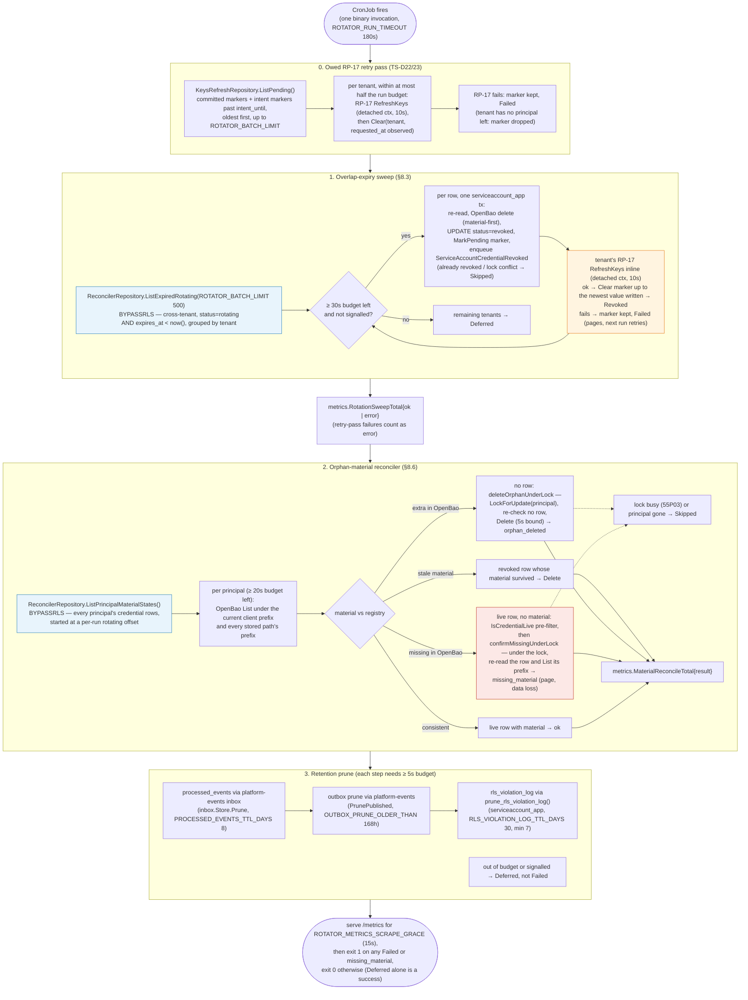

**RP-17 runs per tenant, inside the budget.** The sweep groups its batch by
tenant (oldest `expires_at` first) and starts a tenant only while
`rowReserve` + `rp17Timeout` (20s + 10s) of budget is left. Each revoke
writes the tenant's `keys_refresh_pending` marker in the same transaction
as the `revoked` update, so a revoke is never committed without a record
that Keycloak still needs a refresh. Once the tenant's rows are done,
RP-17 runs inline on a context detached from the run deadline and SIGTERM
(bounded at 10s), and on success the marker is cleared, but only up to the
`requested_at` value this run wrote — a request a concurrent run added
since survives for its own refresh. A failed RP-17 is still Failed and
pages, since a revoked key keeps authenticating at Keycloak until the
refresh lands, but the marker stays, and the next run (of this job or
`cmd/scheduler`) retries it first. The retry pass takes at most half the
remaining budget, so an RP-17 outage cannot starve the sweep. The
`RealmProvisionerClient` makes 2 attempts with a 3s timeout each, retries
429/502/503/504 and treats any 2xx as success.

The sweep revokes through the repositories directly and does **not** take
the principal row lock (`reconciler_jobs` may not use `service`); its
`record_version`-checked update makes a race with TS-2 or TS-1 come out as
`optimistic_lock_conflict`, which it counts as Skipped.

`iam_token_service_material_reconcile_total{result="missing_material"}` is
the one metric on this service worth paging on immediately — it means a
credential Postgres believes is live has no backing OpenBao entry, i.e.
irrecoverable data loss for that version. It is reported only after a
re-check under the principal lock: TS-2 deletes material before it commits
while holding that lock, so an unlocked check could catch a revoke between
its two steps. Existence is re-checked with an OpenBao `List` of the row's
own prefix, not a `Read`, which could not tell a missing path from an
outage and would load private-key plaintext for nothing. Everything else in
this flow is routine, expected background convergence.

---

## Cadence scheduler flow (cmd/scheduler)

A separate run-to-completion CronJob from `cmd/rotator` above (§16 TSQ-6
Resolved, TS-D14) — `cmd/rotator` never calls TS-1, though it shares this
flow's RP-17 dependency, retry pass and marker table for its own revoke
path. It shares `cmd/rotator`'s connection shape
(`serviceaccount_reconciler`, `BYPASSRLS`, `SELECT`-only, for its own
cross-tenant due-list scan) but not its architectural isolation: every
actual rotation goes through `CredentialService.IssueOrRotate`, the
ordinary RLS-scoped write `cmd/server`'s TS-1 handler also calls, which
generates a fresh RSA-2048 keypair and returns the plaintext private key
once (EXT-6/rev 1.3) — the job then calls RP-17
(`RealmProvisionerClient.RefreshKeys`, wrapping
`ClearServiceAccountKeysCache`) so Keycloak re-fetches this service's JWKS
and recognizes the new key, discarding the private-key plaintext
immediately. This is the same two-call sequence an operator performs by
hand (§8.2), automated.

> Source: [cadence-scheduler-flow.mmd](docs/architecture/mermaid/cadence-scheduler-flow.mmd)

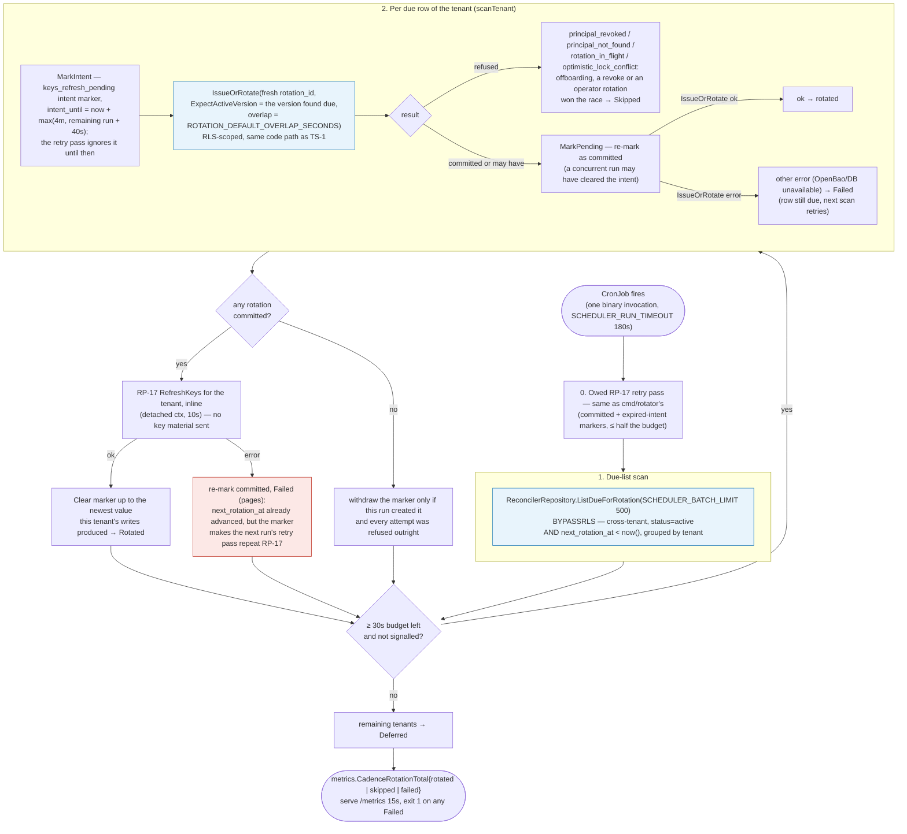

`iam_token_service_cadence_rotation_total{result="failed"}` is the metric
worth paging on (alert: `IAMTokenServiceCadenceRotationFailures`): it can
mean an outright failure (OpenBao/DB unavailable, retried next scan since
the row is still due), **or** the two-halves gap above — `IssueOrRotate`
committed but the RP-17 call didn't. The row's `next_rotation_at` has
already moved on, so the next scan won't revisit it, but the
`keys_refresh_pending` marker (an intent before the rotation, re-marked
committed after it and again after a failed RP-17) makes the next run
retry RP-17, so the gap closes once the Realm Provisioner is healthy. The
intent marker exists because the rotation and the marker cannot commit in
one transaction here: `IssueOrRotate` owns its own. The retry pass leaves
a live intent alone (its writer may not have committed yet, and a refresh
before the commit would miss the new key); an expired intent is retried
like a committed marker. The alert still pages, and
`IAMTokenServiceKeysRefreshBacklog` fires if the oldest owed refresh is
older than 15 minutes. The tenant/principal/version are logged (never key
material, TS-INV-2).

---

## Cache strategy

This service sits on **no hot path at all** (Keycloak is the hot
token-validation path, not this service, §21) — there is no
request-latency-driven cache, and correctness never depends on one. The
three things that resemble a cache exist for different reasons:

1. **The OpenBao Kubernetes-auth token cache**
   (`internal/adapter/outbound/openbao/client.go`, see "OpenBao credential
   custody lifecycle" below) — the short-lived token from
   `auth/kubernetes/login`, kept until `min(30s, lease/2)` before its lease
   ends, so the service does not re-authenticate on every KV call.
   Concurrent cache misses share **one** login (single-flight), run on a
   context detached from any one caller, so a cancelled request never
   fails the login others are waiting on. A 403 drops the token and logs in
   again once (TS-D21/22).
2. **The JWKS known-tenant set** (`JWKSHandler.RunKnownTenantRefresher`) —
   the tenants with an `active` or `rotating` credential, reloaded from
   Postgres every `JWKS_KNOWN_TENANTS_REFRESH` (15s) over the reconciler
   pool, plus tenants served since the last reload. It only decides which
   rate-limit bucket a request spends from (see "JWKS route (EXT-6)"
   below, TS-D23); a stale entry cannot change what keys are served.
3. **No HTTP caching of the JWKS response.** The route sends
   `Cache-Control: no-cache` (it used to send `public, max-age=60`). An
   intermediary cache between Keycloak and this service could otherwise
   hand Keycloak a key set up to `max-age` stale right after RP-17 cleared
   Keycloak's cache — still serving a revoked key, or missing the new one —
   and Keycloak would then keep that stale set until the next RP-17. OpenBao
   read amplification is bounded by the route's rate limiters instead.

Everything else this service reads — TS-3's/TS-5's/TS-6's
principal/credential lookups, the JWKS route's own key derivation — goes to
Postgres or OpenBao on every call. This is a deliberate simplification
matching the service's scale (§21): the steady-state read paths are single
RLS-scoped indexed queries, cheap enough that a cache would add failure
modes (staleness after a rotation, invalidation on revoke) without a
measurable latency win.

---

## Row-Level Security (RLS) and GUC injection

Tenant isolation is enforced in Postgres itself, not just in application
code — `FORCE ROW LEVEL SECURITY` applies even to the table owner, and the
policy predicate fails closed (no GUC set → zero rows / write rejected,
never "no restriction").

> Source: [rls-guc-flow.mmd](docs/architecture/mermaid/rls-guc-flow.mmd)

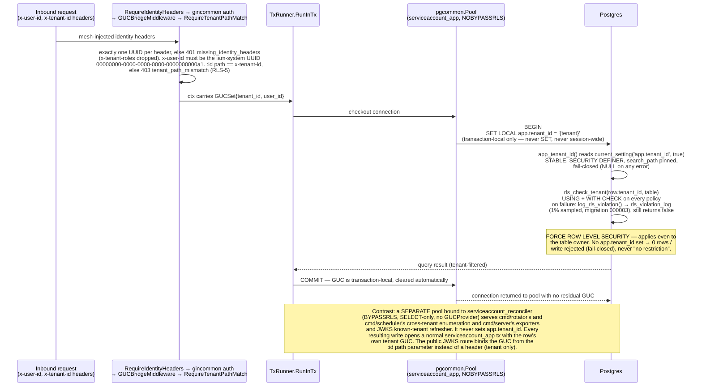

Three Postgres roles, one purpose each:

| Role | Attributes | Used by |
|---|---|---|
| `serviceaccount_app` | `NOSUPERUSER NOBYPASSRLS NOCREATEDB NOCREATEROLE` | `cmd/server`, `cmd/consumer` — every RLS-scoped read/write; also `cmd/rotator`'s per-tenant revoke, orphan-reclaim and marker writes and `cmd/scheduler`'s per-tenant `IssueOrRotate` and marker writes (all via a normal RLS-scoped transaction bound to the row's own tenant, RLS-7) |
| `serviceaccount_migrator` | `BYPASSRLS` + DDL privileges | migrations only, direct connection, bypasses PgBouncer (`pg_advisory_lock` is session-scoped); in Kubernetes only the migrate hook Job holds this DSN |
| `serviceaccount_reconciler` | `BYPASSRLS`, `SELECT`-only, no write grant | `cmd/rotator`'s and `cmd/scheduler`'s cross-tenant enumeration (§16 TSQ-6 Resolved) and owed-refresh listing, and `cmd/server`'s background readers: the three DB-state exporters (rotation-overlap gauge, RLS-violation counter, `keys_refresh_pending` gauges) and the JWKS known-tenant refresher |

`SET LOCAL` (never plain `SET`) is the load-bearing detail: it scopes the
GUC to the current transaction, so a pooled connection returned to
PgBouncer/pgcommon carries no residual tenant binding into the next
checkout — a plain `SET` here would be a cross-tenant data leak waiting to
happen under connection pooling. `PG_STATEMENT_TIMEOUT`/`PG_LOCK_TIMEOUT`
are applied the same way: `platform-pgcommon` issues them per transaction
with `SET LOCAL` on both the app and the reconciler pool
(`SystemPoolConfig` copies `ConfigFromEnv`), never on the migration DSN.
`PG_LOCK_TIMEOUT` is also how long a writer waits on the principal row
lock before `409 rotation_in_flight`.

### RLS violation logging (LLD TS-D18)

The policy fails closed either way; migration `000003_rls_violation_log`
only makes the failures visible. `rls_check_tenant()` now calls
`log_rls_violation(table, row_tenant_id, type)` on each failed check before
returning `false` — `SECURITY DEFINER`, swallows its own errors (a logging
failure can never abort the caller's transaction), sampled at 1% unless the
`app.rls_violation_sample_rate` GUC overrides it (the Postgres tests set
1). Rows land in the RLS-exempt `rls_violation_log` with `violation_type`
`missing_or_invalid_guc` (no/malformed `app.tenant_id`) or
`cross_tenant_access` (GUC set to another tenant).

`cmd/server`'s `runRLSViolationExporter` (`cmd/server/exporters.go`) reads
new rows every `RLS_VIOLATION_EXPORTER_INTERVAL` (1m) over the reconciler
pool through `postgres.RLSViolationRepository` and adds them to the Tier 2
`iam_rls_violations_total{violation_type}` (unknown types map to `other`).
It keeps an id cursor, so each row is counted once per pod; a restarted pod
starts one interval back and re-counts at most that interval. Every server
replica counts the same rows — alert on `increase() > 0` and aggregate
with `max`, not `sum` (`IAMTokenServiceRLSCrossTenantAccess`,
`IAMTokenServiceRLSMissingGUC`). `cmd/rotator` prunes the table through
`prune_rls_violation_log(ttl_days, limit)` (`RLS_VIOLATION_LOG_TTL_DAYS`,
default 30; since `000004_hardening` the function refuses a TTL under 7
days, so a compromised app credential cannot erase recent evidence).
Grants: `SELECT` to `serviceaccount_reconciler` and `admin_readonly`;
`serviceaccount_app` has no table grant, only `EXECUTE` on the prune
function.

**Known limit:** a cross-tenant **write** rejected by a policy's `WITH
CHECK` is not logged — the error aborts the caller's transaction and rolls
the log row back with it. Only checks that silently filter rows (`USING`)
leave a row behind, for either violation type.

---

## Data model overview

Database `serviceaccount` on a dedicated Postgres instance (dev stage —
nothing shared). **2 tenant-scoped tables**, both `ENABLE ROW LEVEL
SECURITY` + `FORCE ROW LEVEL SECURITY` + `REVOKE ALL FROM PUBLIC`:
`service_account_principals` (one row per tenant automation principal;
`uq_sap_active_principal UNIQUE (tenant_id, principal_type)` is what makes
TS-4 idempotent) and `service_account_credentials` (one row per
issued/rotated version; `fk_sac_principal` is a **composite**
`(principal_id, tenant_id)` FK back to the principals table — a
cross-tenant credential row is structurally impossible, not just
policy-blocked). Plus operational, RLS-exempt tables:
`processed_events` (the offboarding consumer's inbox ledger, read and
written through `platform-events`' `pkg/inbox` — `PRIMARY KEY (event_id,
consumer)`, `event_id` is `text` not `uuid` since SQS/SNS message IDs are
external strings), `rls_violation_log` (the sampled RLS-failure audit
trail behind `iam_rls_violations_total`, see "RLS violation logging"
above), `keys_refresh_pending` (one row per tenant owed an RP-17 key-cache
refresh: `tenant_id` primary key, `requested_at`, and a nullable
`intent_until` — NULL is a committed marker the next run retries at once,
non-NULL is a `cmd/scheduler` intent ignored until it expires; app role
CRUD, reconciler role `SELECT`) and `outbox_events` / `outbox_dead_letters`
(owned by `platform-events`' `outbox.ApplySchema`; the base migration only
customizes the `payload` column type). Since this service has never been
deployed, the history is five outright migrations, not an expand/contract
sequence: `000001_schema` (the consolidated base schema),
`000002_rotation_cadence` (§16 TSQ-6 — `rotation_cadence_days`/
`next_rotation_at` + `idx_sac_next_rotation`), `000003_rls_violation_log`
(TS-D18 — the table, `log_rls_violation()`, the logging
`rls_check_tenant()`, `prune_rls_violation_log()` and their grants),
`000004_hardening` (TS-D21 — app grants on the outbox dead-letter table
and ordering sequence, `app_tenant_id()` with a pinned `search_path` and
no `PUBLIC` execute, the 7-day minimum prune TTL) and
`000005_keys_refresh_pending` (TS-D22/23 — the marker table and its
grants).

Both tenant-scoped tables carry `record_version`, bumped by the shared
`touch_row()` `BEFORE UPDATE` trigger, guarded by
`WHEN (OLD.* IS DISTINCT FROM NEW.*)` so a no-op write never spuriously
advances the version (CONC-1). `uq_sac_one_active UNIQUE (principal_id)
WHERE status = 'active' AND deleted_at IS NULL` (CONC-2) is why TS-1
demotes the prior `active` row to `rotating` *before* inserting the new
one — an insert-then-demote ordering would briefly hold two `active` rows
and violate this index immediately. `uq_sac_version UNIQUE (principal_id,
version)` is why the next version is `MaxVersion + 1` over every row,
revoked ones included. `idx_sac_overlap (expires_at) WHERE status =
'rotating'` is the exact partial index the §8.3 overlap-expiry sweep scans.

Full table catalogue, RLS policy definition, and every trigger/migration
detail is in [`.claude/database-schema.md`](.claude/database-schema.md).

---

## Event and outbox flow

Every credential state transition emits exactly one event, in the **same
transaction** as the state write (EVT-1) — an event is never published for
a rotation that rolled back, and no committed transition lacks its event.
Enqueue-time validation is schema-check-only against plain JSON; Glue
wire-encoding happens later, at publish time, so `outbox_events.payload`
stays human-readable for observability and replay. The Glue version UUID
each event carries is resolved **once at startup, by definition**
(`glue:GetSchemaByDefinition` with the binary's own embedded schema, sent in
exactly the compact form `schema-gov register` uploads) — so every build
stamps the version that describes its own payloads, never merely the
registry's latest. No refresher, no per-event Glue call; a definition that
isn't registered yet fails startup until `schema-registry.yml` registers
it (production releases run it from `release.yml` before the deploy gate).

> Source: [event-outbox-flow.mmd](docs/architecture/mermaid/event-outbox-flow.mmd)

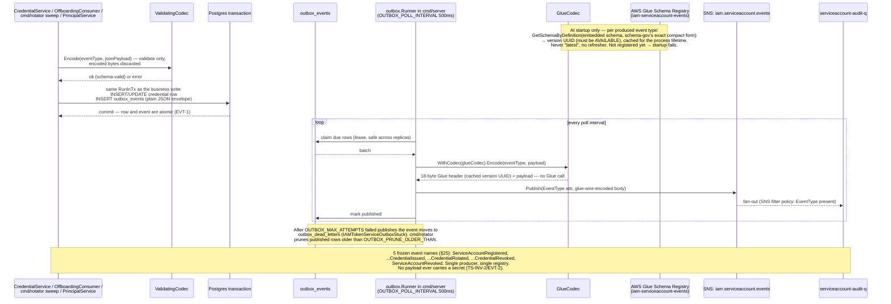

| Event | Emitted when | Consumers |
|---|---|---|
| `ServiceAccountRegistered` | TS-4 registers a principal | Audit |
| `ServiceAccountCredentialIssued` | TS-1 first credential for a principal (no prior `active` row) | Audit |
| `ServiceAccountCredentialRotated` | TS-1 rotation (a prior `active` row was demoted) | Audit |
| `ServiceAccountCredentialRevoked` | TS-2, TS-1's opportunistic sweep, or `cmd/rotator`'s overlap sweep | Audit |
| `ServiceAccountRevoked` | Principal fully revoked (offboarding) | Audit |

No downstream authorization consumer subscribes to this topic — the
automation principal carries no roles (TS-INV-4), so these events are
audit-only by construction, not by convention.

---

## OpenBao credential custody lifecycle

The only OpenBao integration in this service, and its most distinctive flow
— no sibling service has an analogue. Kubernetes auth only: no static
token, no AWS Secrets Manager permission, no fallback credential path.

> Source: [openbao-credential-lifecycle.mmd](docs/architecture/mermaid/openbao-credential-lifecycle.mmd)

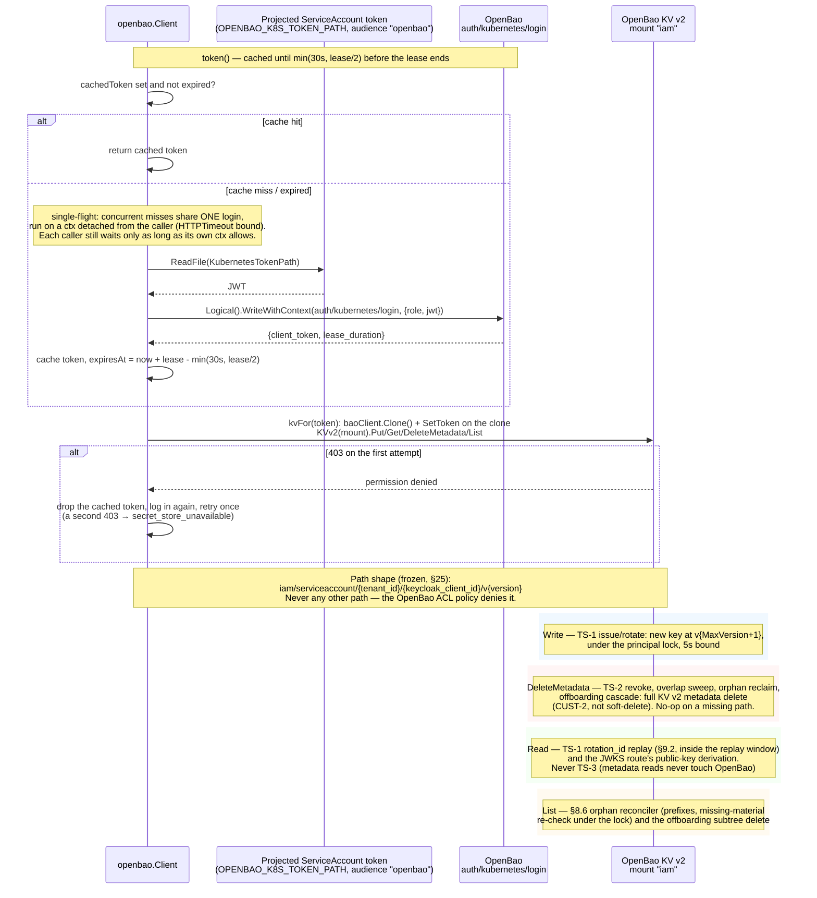

`iam/serviceaccount/<tenant_id>/<keycloak_client_id>/v<version>` is frozen
(LLD §25) — the OpenBao ACL policy (`deploy/openbao/policy.hcl`) grants only
`iam/data/serviceaccount/*` and `iam/metadata/serviceaccount/*`, so widening
this path shape is a security-review-gated change, not a routine one. In
Helm the OpenBao Kubernetes-auth role is bound to the four workload
ServiceAccounts with the audience `openbao`, and each pod mounts a
projected token with that audience (`openbao.tokenAudience`); a private CA
for `OPENBAO_ADDR` is supplied through `BAO_CACERT`
(`openbao.caCertSecret`), which the OpenBao SDK reads itself. Locally
(`make docker-up`), OpenBao runs in dev-mode with no real Kubernetes
cluster to authenticate against — a real credential round-trip only works
via `make test-integration`'s fake Kubernetes TokenReview server, or by
seeding OpenBao by hand.

**`SetToken` runs on a per-call clone, not the shared client.** `Client` is
shared across concurrent requests (`cmd/server` handles them concurrently),
and the OpenBao SDK's `SetToken` mutates a plain field with no atomicity
guarantee across "set mine, then use it" — two goroutines calling
`SetToken` at once could otherwise interleave their calls before
either's actual KV request executes. `withKV` gets a token and runs the
call on `kvFor(token)`, which calls `c.baoClient.Clone()` (same underlying
`http.Client`/connection pool, an independent token field) before
`SetToken`, removing this at zero connection-setup cost.

**Logins are single-flight.** `token()` holds `c.mu` only to read or write
the cached token, never across the network call. Concurrent cache misses
join one `singleflight` login that runs on `context.WithoutCancel` of the
first caller's context, bounded by `HTTPTimeout` (8s), so one cancelled
request cannot fail the login every other caller is waiting on (TS-D22).
The token is treated as expired `min(30s, lease/2)` before its lease ends,
so a short lease is never cached past its end.

**A 403 re-logs in once.** The cached token is dropped early when OpenBao
revokes it (a role or policy change, a restart that lost the token store)
rather than when it expires. `withKV` treats a 403 as "this token is no
longer valid": it invalidates the cache, logs in again and retries the
call once. A second 403 is a real policy denial and surfaces as
`secret_store_unavailable` (TS-D21). Callers that hold the principal lock
(TS-1, TS-2, the orphan reconciler) bound the whole call, re-login
included, at 5s.

---

## JWKS route (EXT-6)

`GET /api/v1/internal/tenants/:id/service-accounts/platform-automation/jwks.json`
is the one route outside the protected middleware group: Keycloak's own
outbound `jwks.url` fetch carries no identity headers (§5.6). RLS still
applies — `JWKSHandler` binds the tenant GUC from the path parameter.
`JWKSService.PublicKeys` lists the principal's `active` and `rotating`
credentials, skips `rotating` keys whose overlap has already expired, reads
each private key from OpenBao and returns the public JWK.

- **Unreadable keys.** A live credential whose material cannot be read is
  skipped and counted in `iam_token_service_jwks_key_errors_total`
  (page-worthy). If the **active** key, or every live key, is unreadable,
  the response is `503 jwks_keys_unavailable` (TS-D23): a 200 would make
  Keycloak cache a set without the key the principal signs with today. A
  set missing only `rotating` keys is still a 200.
- **Rate limits** (TS-D22/23), three token buckets: per tenant
  (`JWKS_RATE_LIMIT_PER_TENANT_RPS`/`_BURST`, 5/10, kept in a bounded LRU);
  a global bucket (`JWKS_RATE_LIMIT_RPS`/`_BURST`, 20/40) spent **only** by
  known tenants; and a small shared bucket (`JWKS_RATE_LIMIT_UNKNOWN_TENANT_RPS`/
  `_BURST`, 2/5) for every other tenant id. Known tenants are the
  database's tenants with an `active` or `rotating` credential, reloaded
  every `JWKS_KNOWN_TENANTS_REFRESH` (15s) over the reconciler pool, plus
  tenants served since the last reload — so a flood of random tenant ids
  can only exhaust the unknown bucket, never a real tenant's fetch after
  RP-17. Every 429 (`rate_limited`) is counted in
  `iam_token_service_jwks_rate_limited_total` and, by bucket, in
  `iam_token_service_jwks_rate_limited_by_bucket_total{bucket}`
  (`IAMTokenServiceJWKSRateLimited` excludes the `unknown` bucket).
- **Headers.** `Cache-Control: no-cache` (see "Cache strategy" above) and
  `X-Content-Type-Options: nosniff`.
- **Network.** NetworkPolicy admits the Keycloak namespace to the server's
  HTTP port; the Istio `AuthorizationPolicy` limits it to `GET` on this
  route only (see "Deployment").

---

## Observability stack

All four binaries share one wiring, aligned with iam-org-membership and
enforced by the `gincommon-obs` gate
(`.github/scripts/check-gincommon-observability.sh`, which rejects a direct
`promhttp.Handler()`, the old `InitTracingFromEnv()` and any OpenTelemetry
or Prometheus-client setup outside `platform-gincommon`). Tracing is
initialised with `gincommon.InitTracingWithConfig(TracingConfig{ServiceName,
BuildVersion, Domain, Environment, Logger})`, so traces carry the same
identity as metrics (`service.namespace`, `deployment.environment.name`);
the service name comes from `APP_NAME` — `OTEL_SERVICE_NAME` is not read.
`OTEL_EXPORTER_OTLP_ENDPOINT=none` (or `OTEL_TRACES_EXPORTER=none`, gincommon
v1.6.0) disables export but keeps the TracerProvider, so trace IDs still
reach logs and events. DB spans come from `pgCfg.Tracer =
gincommon.NewSpanTracer(serviceName)` on both pools; job, exporter and
consumer spans from `gincommon.NewTracer`; log lines get `trace_id` from
`gincommon.SpanTraceID`.

`/metrics` is `gincommon.MetricsHandler()`, served on a dedicated
port/listener (`METRICS_PORT`) separate from the API port in every binary,
so a scrape never competes with request traffic or shares its middleware
chain. The CronJobs keep it up for `*_METRICS_SCRAPE_GRACE` (15s) after
their run so Prometheus can scrape the run's counters before the Pod exits;
the chart's `PodMonitor` scrapes those pods every 5s
(`serviceMonitor.podMonitorInterval`), since they have no Service for the
`ServiceMonitor` to find. Both the `ServiceMonitor` and the `PodMonitor` set
`honorLabels: true`, so the series' own `{domain, service, environment}`
labels win over colliding target labels (the alerts select on `service`).

The request timeout is `gincommon.Config.RequestTimeout = 30s` (server and
the consumer's health router), which appends gincommon's
`TimeoutMiddleware` as the **innermost** observability handler. The
earlier outer `r.Use(gincommon.TimeoutMiddleware(30s))` was removed: it ran
before the observability middleware, so a timed-out request was recorded
as `200` while the client received `503`.

> Source: [observability-stack.mmd](docs/architecture/mermaid/observability-stack.mmd)

```mermaid
graph LR
    subgraph BOOT["Startup — all four binaries, in this order"]
        B1["gincommon.InitTracingWithConfig<br/>(APP_NAME, version, domain, environment)"] --> B2["gincommon.ObservabilityMiddlewares(cfg)<br/>fixes the metric identity"]
        B2 --> B3["metrics.InitLibraryMetrics<br/>(events.InitMetrics, pgmetrics.InitWithIdentity)"]
        B3 --> B4["metrics.Register<br/>(adopts platform-events' shared collectors)"]
        B4 --> B5["pgcommon.NewPool<br/>(Tracer = gincommon.NewSpanTracer)"]
    end

    subgraph REQ["Inbound request (cmd/server)"]
        R0["1 MB body cap"] --> R1["PanicRecovery"]
        R1 --> R2["RequestID"]
        R2 --> R3["Tracing<br/>(OTel span per request)"]
        R3 --> R4["CorrelationHeaders"]
        R4 --> R5["Metrics<br/>(platform_http_request_duration_seconds)"]
        R5 --> R6["Logging<br/>(Zap JSON)"]
        R6 --> RT["Timeout<br/>(Config.RequestTimeout 30s —<br/>innermost, so a 503 is recorded as 503)"]
        RT --> RI["RequireIdentityHeaders<br/>(401 missing_identity_headers)"]
        RI --> R7["gincommon ProtectedMiddlewares<br/>(RequireAuth, ContextMiddleware)"]
        R7 --> R9["GUCBridgeMiddleware<br/>(iam-system only, GUC set for SET LOCAL)"]
        R9 --> R10["RequireJSONContentType, RequireTenantPathMatch"]
        R10 --> HANDLER["Handler"]
        RT -.->|"JWKS route: no identity chain,<br/>rate limiters + GUC from path"| HANDLER
    end

    BOOT --> REQ

    HANDLER --> SPANS["Spans: HTTP, db.query (NewSpanTracer),<br/>credential.issue_rotate, credential.revoke,<br/>consumer.offboarding, rotator.* / scheduler.* / exporter.* (NewTracer)"]
    SPANS --> OTLP["OTel Collector<br/>(OTEL_EXPORTER_OTLP_ENDPOINT;<br/>&quot;none&quot; = no export, trace IDs kept)"]

    HANDLER --> METRICS["Tier 1/2/3 Prometheus metrics<br/>(gincommon.MetricsHandler on<br/>:METRICS_PORT/metrics, separate listener)"]
    EXPORTERS["cmd/server background loops (reconciler pool)<br/>rotation overlap, RLS violations,<br/>keys_refresh_pending backlog"] --> METRICS
    JOBS["cmd/rotator / cmd/scheduler run counters<br/>(served for 15s after the run)"] --> METRICS
    METRICS --> PROM["Prometheus scrape<br/>(ServiceMonitor: server, consumer;<br/>PodMonitor: CronJob pods; honorLabels)"]
    PROM --> ALERTS["PrometheusRule (app-alerts) + prometheusrule-slo:<br/>OpenBao errors/latency, stuck rotating versions,<br/>missing_material, RLS violations, JWKS key errors / 429s,<br/>keys-refresh backlog, CronJob not running / failed,<br/>offboarding queue/DLQ, invalid envelope id (critical),<br/>consumed_schema_violations (critical), outbox,<br/>SLO-1..4 burn rates"]

    HANDLER --> LOGS["Structured logs (Zap JSON)<br/>tenant_id, principal_id, version, op, result, trace_id<br/>— never a credential field (CI secret-log gate)"]
    LOGS --> AGG["Log aggregation<br/>(CloudWatch / equivalent)"]

    style R9 fill:#e8f4fc,stroke:#2980b9
    style RT fill:#fdf2e3,stroke:#e67e22
    style METRICS fill:#eafaf1,stroke:#27ae60
    style LOGS fill:#fdf2e3,stroke:#e67e22
```

**Registration order** (every binary, pinned by
`test/unit/metricsstandard`'s `TestStandard_LibrariesShareRegistryCollectors`):
`InitTracingWithConfig` → `ObservabilityMiddlewares` (fixes the identity)
→ `metrics.InitLibraryMetrics` (`events.InitMetrics`,
`pgmetrics.InitWithIdentity`) → `metrics.Register` → pools.
`Register` builds this service's collectors and, through `registerShared`,
**adopts** platform-events' `platform_dependency_request_seconds` and
`platform_duplicate_messages_total` collectors (identical descriptor →
the library's collector is returned) instead of registering a second,
differently-shaped one that would disable platform-events' own SNS/SQS/codec
series. `InitLibraryMetrics` must run before `NewPool`, which registers the
pool gauges.

**Background exporters** (`cmd/server/exporters.go`, all over the
reconciler pool, every server replica — aggregate with `max`):
`runRotationOverlapExporter` (`ROTATION_OVERLAP_GAUGE_INTERVAL`, 30s),
`runRLSViolationExporter` (`RLS_VIOLATION_EXPORTER_INTERVAL`, 1m) and
`runKeysRefreshPendingExporter` (`KEYS_REFRESH_EXPORTER_INTERVAL`, 30s),
which turns `keys_refresh_pending` into a count and an oldest-age gauge so
an RP-17 refresh that keeps failing is visible between CronJob runs.

### Metrics — three-tier taxonomy

Metrics follow the **Enterprise Platform Observability Standard**: Tier 1
(`platform_*`, shared across every domain), Tier 2 (`iam_*`, shared across
IAM services), Tier 3 (`iam_token_service_*`, this service only, names
frozen §25 or added since as additive). Every collector carries gincommon's
centrally injected `{domain, service, environment}` const labels —
instrumentation call sites never set them themselves (Standard requirement
#8), so they cannot be omitted or misspelled.

- **Tier 1** is emitted by the shared libraries. The service records only
  into `platform_dependency_request_seconds`, for
  `dependency="openbao"` (dual-emitted with the legacy Tier-3 OpenBao
  histogram) and `dependency="realm_provisioner",operation="refresh_keys"`
  (the RP-17 client in `cmd/rotator` and `cmd/scheduler`).
  `platform_duplicate_messages_total` is counted **only** by
  platform-events' inbox — the service no longer records it.
- **Tier 2**: `iam_rls_violations_total{violation_type}` is emitted, built
  from its Platform Observability Registry entry (name, help, labels) and
  shared with iam-org-membership / iam-user-profile / iam-audit-log. The
  proposed `iam_offboarding_cascade_total` is withheld (not emitted) until
  ratified — see `docs/observability-registry-proposals.md`.
- **Tier 3**: 17 `iam_token_service_*` metrics. The generated
  `docs/observability/metric-registry.md` is the complete inventory.

| Metric | Tier | Type | Meaning |
|---|---|---|---|
| `iam_token_service_credentials_issued_total{op}` | 3 | counter | Credential state transitions (`issue`/`rotate`/`revoke`) |
| `iam_token_service_credential_replays_total{result}` | 3 | counter | TS-1 `rotation_id` replays (`served`/`expired`/`revoked`); `served` handed out a live private key again |
| `iam_token_service_rotation_overlap_active` | 3 | gauge | Live `rotating` versions (cross-tenant, `cmd/server` exporter every `ROTATION_OVERLAP_GAUGE_INTERVAL`) — should trend to zero between rotations |
| `iam_token_service_openbao_call_duration_seconds{op}` | 3 (legacy) | histogram | OpenBao KV latency (`write`/`delete`) |
| `platform_dependency_request_seconds{dependency,operation,outcome}` | 1 (proposed, owned by platform-events) | histogram | OpenBao calls and RP-17 (`realm_provisioner`/`refresh_keys`), generalized across dependencies/services |
| `iam_token_service_offboarding_cascade_total{result}` | 3 | counter | Offboarding-cascade outcomes — authoritative |
| `iam_offboarding_cascade_total{outcome}` | 2 (proposed, **not emitted** until ratified in the registry) | counter | Same as above, generalized across IAM services |
| `iam_token_service_rotation_sweep_total{result}` | 3 | counter | One per `cmd/rotator` run: `ok`, or `error` if any revoke, RP-17, retry-pass or enumeration step failed |
| `iam_token_service_material_reconcile_total{result}` | 3 | counter | Orphan-material reconciler outcomes (`orphan_deleted`/`missing_material`/`ok`/`error`); `missing_material` is page-worthy |
| `iam_token_service_cadence_rotation_total{result}` | 3 | counter | `cmd/scheduler` outcomes (`rotated`/`skipped`/`failed`); `failed` is page-worthy |
| `iam_token_service_keys_refresh_pending` | 3 | gauge | Tenants owed an RP-17 refresh (rows in `keys_refresh_pending`, intents included) |
| `iam_token_service_keys_refresh_oldest_age_seconds` | 3 | gauge | Age of the oldest owed refresh; `IAMTokenServiceKeysRefreshBacklog` fires above 15m |
| `iam_token_service_jwks_key_errors_total` | 3 | counter | Live credentials the JWKS route could not serve — page-worthy |
| `iam_token_service_jwks_rate_limited_total` | 3 | counter | JWKS requests answered 429 by any limiter |
| `iam_token_service_jwks_rate_limited_by_bucket_total{bucket}` | 3 | counter | Same, by the bucket that refused (`tenant`/`global`/`unknown`) |
| `iam_token_service_processed_events_duplicates_total{consumer}` | 3 | counter | Redeliveries the inbox found already claimed — the authoritative duplicate signal (recorded by `processOnce`) |
| `platform_duplicate_messages_total{queue,event_type}` | 1 (proposed, platform-events) | counter | Same as above, counted by platform-events' inbox itself |
| `iam_token_service_unknown_event_acknowledged_total{consumer,event_type}` | 3 | counter | Forward-compat acks of unrecognized event types (`event_type` from a closed set, else `other`) |
| `iam_token_service_consumed_schema_violations_total{consumer,event_type}` | 3 | counter | Inbound payloads rejected to the `-dlq` by the consumed-schema check — pages |
| `iam_token_service_consumer_dlq_rejects_total{reason}` | 3 | counter | Permanent rejects the DLQ router sent to the `-dlq` (`schema_violation`/`invalid_envelope_id`/`other`); `invalid_envelope_id` pages (critical, GDPR erasure pending) |
| `iam_rls_violations_total{violation_type}` | 2 | counter | Sampled RLS check failures from `rls_violation_log` (`cmd/server` exporter); aggregate with `max` across replicas |
| `platform_outbox_pending_events` | 1 (proposed, platform-events) | gauge | Unrelayed outbox rows — bus-health signal |
| `platform_queue_depth` / `platform_dlq_depth` | 1 (platform-events) | gauge | Offboarding queue and DLQ depth, sampled by `cmd/consumer` every `SQS_QUEUE_DEPTH_INTERVAL` (60s, `0s` disables) |

Shared-library metrics: `platform_http_*` (`platform-gincommon`),
`platform_messages_*` / `platform_outbox_*` / `platform_dlq_messages_total`
/ `platform_queue_depth` / `platform_dlq_depth` /
`platform_dependency_request_seconds` (`platform-events`) and
`platform_db_*` (`platform-pgcommon`, whose `pool` label is `default` for
the RLS-scoped app pool and `reconciler` for the BYPASSRLS pool). They all
carry one identity, `{domain="iam", service="iam-token-service",
environment=APP_ENV}`, set on `gincommon.Config` (`Domain`, or
`OBSERVABILITY_DOMAIN`) and handed to platform-events / platform-pgcommon by
`metrics.InitLibraryMetrics`. The libraries' pre-standard names were
removed (no compatibility period); renamed/removed names are recorded in
`docs/observability/migration.md`.

`deploy/monitoring/app-alerts.yml` and the chart's `prometheusrule.yaml`
carry the same alerts. Besides the per-metric alerts above, the CronJobs
are covered by `IAMTokenServiceRotatorNotRunning`,
`IAMTokenServiceSchedulerNotRunning` and `IAMTokenServiceCronJobRunFailed`.
The queue-depth gauges back `IAMTokenServiceOffboardingQueueStalled`
(`platform_queue_depth > 0` for 15m) and
`IAMTokenServiceOffboardingDLQBacklog` (`platform_dlq_depth > 0` for 30m);
`IAMTokenServiceOffboardingQueueBacklogGrowing` (CloudWatch message age)
stays, dormant until an exporter supplies it. The two RLS alerts
(`IAMTokenServiceRLSCrossTenantAccess`, `IAMTokenServiceRLSMissingGUC`)
query `iam_rls_violations_total`. Each alert has a runbook entry in
`docs/observability/runbooks.md`.

`credential.issue_rotate` and `credential.revoke` spans propagate their
`trace_id` onto the produced event envelope, so a rotation is traceable
end-to-end from the TS-1 call through to the Audit projection.

### SLOs

`deploy/monitoring/slo-rules.yml` (rendered by the chart as
`prometheusrule-slo.yaml`) takes its targets from the LLD (§11), not
placeholders, as recording rules plus multi-window multi-burn-rate alerts
on `platform_http_request_duration_seconds` /
`platform_http_requests_total`:

| SLO | Target | Source / note |
|---|---|---|
| SLO-1 | TS-1 issue/rotate p99 ≤ 500 ms | LLD §11. The HTTP-layer SLI includes the OpenBao write the LLD target excludes, so it is conservative — check the OpenBao histogram first when it burns |
| SLO-2 | 99.9% of writes (TS-1, TS-2, TS-4) non-5xx | LLD / HLD §3.4 monthly availability |
| SLO-3 | 99% of overlap-sweep runs without an error result | Operational proxy for the LLD's sweep objective; the 99% target is not from the LLD. Counts **runs**: each rotator run is its own short-lived pod whose counter stays constant while scrapeable, so `rate()` over it is always 0. The rule sums `max_over_time(iam_token_service_rotation_sweep_total{result="ok"}[1h])` over pods and divides by the same for every result |
| SLO-4 | TS-3 read p99 ≤ 100 ms | LLD §11; route `GET /api/v1/internal/tenants/:id/service-accounts/:principal_id`, `le="0.1"`, fast and slow burn alerts |

### Standard docs and tooling

`docs/observability/` documents how this service implements the standard:
`README.md` (identity, libraries, registration order), `metric-registry.md`
(the metric inventory, **generated** by `make metrics-inventory`),
`runbooks.md` (one entry per alert) and `migration.md` (renamed/removed
metric history). `make metrics-lint` (`.github/scripts/metricslint.sh`)
runs platform-gincommon's `metricslint check` on a real scrape produced by
`test/unit/metricsstandard` (production registration order, identity labels
on every `platform_`/`iam_` series), `metricslint refs` over `deploy/` and
`docs/`, and a drift check of `metric-registry.md` against
`.github/scripts/metrics-inventory.py`. It runs in `make ci` and in
`.github/workflows/validate-quality.yml`, alongside the static
`metrics-taxonomy` naming gate in `make gates`.

---

## Concurrency and optimistic locking

**Principal row lock.** TS-1, TS-2 and the offboarding cascade each run in
one transaction that first takes `SELECT … FOR UPDATE` on the principal row
(`PrincipalRepository.LockForUpdate`; offboarding uses `LockByTenant` for
all of the tenant's principals). The orphan reconciler takes the same lock
before it reclaims material or confirms `missing_material`. Writers for one
principal are therefore serialized: concurrent TS-1 calls get consecutive
versions (`MaxVersion + 1`), and the reconciler can never see a TS-1
between its OpenBao write and its commit. A lock wait longer than
`PG_LOCK_TIMEOUT` raises SQLSTATE `55P03`, which `db.go` maps to `409
rotation_in_flight` on every repository path (TS-4's `Register` and
`LockByTenant` included); the reconciler counts it as Skipped. The JWKS
route and TS-3/TS-5/TS-6 reads take no lock, so key fetches never queue
behind a rotation.

Every mutable row carries `record_version`, bumped by a `touch_row()`
trigger that fires only when a row actually changes (`WHEN (OLD.* IS
DISTINCT FROM NEW.*)`) — so an idempotent replay that produces an identical
row never spuriously invalidates a concurrent optimistic-lock holder. A
mutation's `UPDATE ... WHERE id = $1 AND record_version = $2 RETURNING ...`
returning zero rows is `409 optimistic_lock_conflict` with the caller's
stale `expected_version` in `details`, not a silent overwrite.

**A concurrent revoke race is not a real conflict.** TS-2 re-reads the row
under the principal lock, so a revoke that another TS-2 (or TS-1's
opportunistic sweep) already committed is returned as the idempotent
result. `cmd/rotator`'s sweep takes no principal lock, so its update can
still race TS-2: the loser's `Update` reports `optimistic_lock_conflict`,
and both call sites re-check the row afterward and, finding it already
`revoked`, return the already-achieved idempotent outcome instead of
surfacing a `409` (TS-2) or counting a sweep failure (the sweep counts it
as Skipped).

`rotation_id` is the other concurrency axis, orthogonal to
`record_version`: it makes TS-1 itself idempotent (`uq_sac_rotation_id`),
distinct from optimistic locking, which guards TS-2 and any other row
mutation against a stale read-modify-write. `cmd/scheduler`'s
`ExpectActiveVersion` reuses the optimistic-lock error for a third case:
the active version changed since the scan enumerated it.

---

## Failure domains

| Failure | Behavior |
|---|---|
| OpenBao unreachable during issue/rotate/revoke | `502 secret_store_unavailable`; nothing committed to Postgres (the material write/delete runs inside the locked transaction before any row write, and its error rolls the transaction back). The in-lock call is bounded at 5s, so waiting writers are not starved |
| OpenBao token revoked server-side | One 403 → drop the token, log in again, retry once; a second 403 is `secret_store_unavailable` |
| Two writers for one principal at once | Serialized on the principal row lock; a wait over `PG_LOCK_TIMEOUT` (SQLSTATE `55P03`) is `409 rotation_in_flight`, with `details.active_rotation_id` best effort |
| Postgres connectivity/resource error (SQLSTATE class `08`/`53`/`57`/`58`, or a closed pool) | Remapped by `wrapConnErr` to `domain.ErrDBUnavailable` → `503`, never a raw `500`. **Corrected 2026-09-20, TS-D16**: classification is positive-identification-only (SQLSTATE class match on the `PgError` code, or `puddle.ErrClosedPool`) — a prior broad `isNetworkError` heuristic (string-matching "connection refused"/EOF/etc.) was removed because it could silently discard a caller's real business error under a misleading `503`. `57014` (query canceled) counts only while the request's own context is still live — a cancelled request is not a database outage (TS-D21). `HandleError` (HTTP layer) independently classifies a leaked `*pgconn.PgError` of these same classes into the same `503`, as defense-in-depth against a case `wrapConnErr` itself misses. |
| Crash between OpenBao write and Postgres commit (issue/rotate) | Orphaned OpenBao material, no committed row. The next TS-1 for the principal computes the same `MaxVersion + 1` and overwrites it; otherwise the §8.6 reconciler deletes it under the principal lock (`orphan_deleted`), never a phantom credential |
| Crash between OpenBao delete and Postgres commit (revoke/offboarding) | Delete is a no-op on an already-missing path, so retrying the whole operation is always safe. Until the retry, the live row has no material: the JWKS route skips it (a key error) and the reconciler reports `missing_material` once it confirms it under the lock |
| Committed credential with no backing OpenBao material | `missing_material` — irrecoverable per-version data loss, reported only after a re-check under the principal lock; the reconciler pages rather than silently reissuing |
| JWKS: the active key, or every live key, unreadable | `503 jwks_keys_unavailable`, so Keycloak keeps its cached keys; only `rotating` keys unreadable → 200 without them. Both count in `jwks_key_errors_total` |
| JWKS flooded (random tenant ids, or one tenant looping) | `429 rate_limited` from the per-tenant, global or unknown-tenant bucket; unknown tenants never spend the global bucket, so real tenants' fetches keep working |
| RP-17 fails after a sweep revoke or a cadence rotation | Counted Failed (pages); the `keys_refresh_pending` marker stays and the next run's retry pass repeats RP-17, so the gap closes once the Realm Provisioner is healthy. A tenant offboarded meanwhile has its marker dropped. `IAMTokenServiceKeysRefreshBacklog` fires if the oldest owed refresh is over 15 minutes old |
| CronJob out of budget, SIGTERM, or killed | No new tenant/principal/prune step starts; the in-flight tenant finishes on a detached context, RP-17 included (45s grace covers 20s + 10s). Unstarted work is Deferred, not Failed; a SIGKILL after a commit leaves the marker for the next run |
| `rotation_id` replay past `ROTATION_REPLAY_WINDOW` | `409 credential_replay_expired` — the key is not handed out again |
| Unknown inbound event type (any envelope id) | Acked immediately, never retried — a producer schema addition must never DLQ-storm this consumer |
| `TenantMembershipsPurged` with a missing/non-UUID envelope id | Sent straight to the DLQ (`invalid_envelope_id`), counted in `consumer_dlq_rejects_total` and paged (`IAMTokenServiceOffboardingInvalidEnvelopeRejected`) — acking it would silently skip the tenant's erasure (TS-D22/23) |
| Glue-encoded `TenantMembershipsPurged` (producer has a Glue registry configured) | `cmd/consumer` carries `eventbus.GlueDecoder` (`events.WithConsumerCodec`), which strips the 18-byte header with no registry — before this, every such message failed decode and ended in the DLQ with the cascade never run |
| `TenantMembershipsPurged` payload fails its embedded consumed schema (e.g. no `tenant_id`) | Rejected before `Handle` and sent straight to `tenant-lifecycle-tokensvc-q-dlq` (`DLQReason=schema_violation`, DLQ URL from the queue's own `RedrivePolicy`) and acked — no retries on a payload that can never pass. `iam_token_service_consumed_schema_violations_total` pages (`IAMTokenServiceConsumedSchemaViolation`). If the DLQ can't be resolved or the send fails, normal SQS redrive after `maxReceiveCount` takes over |
| Outbox/SNS/SQS relay failure | At-least-once; consumer-side dedup on the outbound Audit side (elsewhere) and this service's own inbound inbox (`processed_events`, platform-events `pkg/inbox`) make redelivery safe. After `OUTBOX_MAX_ATTEMPTS` the event moves to `outbox_dead_letters` (`IAMTokenServiceOutboxStuck`) |
| Two copies of the same `TenantMembershipsPurged` delivered concurrently | The inbox claim is the first statement of the cascade's transaction, so the second copy blocks on the claim's row lock, then sees a duplicate and acks as a no-op — the cascade runs once |
| Offboarding cascade fails partway through a multi-credential tenant (e.g. OpenBao delete succeeds for credential 1 of 3, fails on 2) | The inbox transaction rolls back — the `processed_events` claim included — before any row delete commits, so nothing commits; SQS redelivers and the whole cascade retries from scratch (credential 1's delete is a no-op the second time). If retries exhaust `maxReceiveCount` and the message DLQs, the tenant's Postgres rows remain fully intact (nothing was ever deleted from Postgres) while some OpenBao material is already gone; the §8.6 reconciler's `ListPrincipalMaterialStates` still sees the live principal and correctly reports the missing entries as `missing_material` (page-worthy) rather than silently losing them |
| A revoke (TS-2, or the overlap-expiry sweep) races another revoke of the exact same row | TS-2 re-reads under the principal lock and returns the idempotent result. The sweep takes no lock, so its `Update` can hit `ErrOptimisticLockConflict`; both `revokeCredential` (TS-2) and the sweep's `revokeExpiredRotating` re-check the row afterward and, finding it already `revoked`, return the idempotent success/skip outcome instead of surfacing a conflict for a race that already converged correctly |
| TS-1 `rotation_id` replay against a version that has since been revoked | Classified explicitly as `409 credential_replay_revoked` rather than letting the OpenBao read fail and surface as a misleading `502 secret_store_unavailable` |
| A cadence rotation races an operator rotation | `ExpectActiveVersion` no longer matches → `optimistic_lock_conflict`, counted as Skipped — never a second rotation |

---

## Key invariants

| # | Invariant |
|---|---|
| TS-INV-1 | This service never writes Keycloak — no `gocloak` dependency, no Keycloak Admin credential (CI `no-gocloak` gate) |
| TS-INV-2 | No plaintext secret is ever persisted in Postgres or logged (CI `no-secret-log` gate, which also covers error constructors, span attributes, PEM/private-key names and `-----BEGIN` literals); it exists only in OpenBao and transiently in the TS-1 response body |
| TS-INV-3 | One live credential version per principal, plus at most one `rotating` version inside the bounded overlap window (a new rotation closes any older open overlap) |
| TS-INV-4 | The automation principal holds no roles and no membership — this service issues credentials only, never authorizes |
| TS-INV-5 | Every credential state transition is recorded locally **and** emitted through the outbox in the same transaction (EVT-1) |
| TS-INV-6 | Reachable only in-mesh on `/api/v1/internal/*` under the reserved `iam-system` principal; no tenant-facing surface at MVP. The one exception is the EXT-6 JWKS route, which carries no identity headers by design and is limited by NetworkPolicy, the Istio `AuthorizationPolicy` and rate limits instead |
| TS-INV-7 | Revocation is two-halves, like rotation — TS-2 removes this service's custody/metadata, not the Keycloak-side validity; that needs RP-17 (`ClearServiceAccountKeysCache`) on every revoke path except offboarding (realm deletion) |
| RLS-6 | Tenant scoping is via `SET LOCAL app.tenant_id`, transaction-local only — never a session-wide `SET` |
| RLS-7 | Only the `serviceaccount_reconciler` role may bypass RLS, and only for `SELECT`: `cmd/rotator`'s and `cmd/scheduler`'s cross-tenant enumeration (§16 TSQ-6 Resolved) and `cmd/server`'s background readers — every resulting write goes through an RLS-scoped `serviceaccount_app` transaction |

---

## Deployment

**Four binaries, one image.** `cmd/server` (HTTP API + outbox runner),
`cmd/consumer` (offboarding SQS subscriber), `cmd/rotator` (sweep +
reconciler + prune CronJob), and `cmd/scheduler` (the §16 TSQ-6 Resolved
automatic cadence-driven rotation CronJob, TS-D14) are built from one
`Dockerfile`, selected by `ENTRYPOINT` override —
`deploy/helm/templates/deployment-server.yaml`, `deployment-consumer.yaml`,
`cronjob-rotator.yaml`, and `cronjob-scheduler.yaml` each point the same
image (by tag, or by `image.digest` when set) at a different entrypoint.
`job-migrate.yaml` runs the server image a fifth way, with
`MIGRATE_ONLY=true`. `cmd/scheduler` is the one composition root besides
`server` that imports `core/service` directly (it calls
`CredentialService.IssueOrRotate` in-process, the same code `server`'s HTTP
handler calls) — `cmd/rotator` is deliberately walled off from `service`
(`.go-arch-lint.yml`'s `reconciler_jobs` component); the line is "does this
binary ever mint new credential material," not "does this binary run on a
schedule."

**Topology.** 2 replicas each for `server`/`consumer` (HA, not load — this
service is trivially small); the rotation and cadence-scheduler CronJobs
are each a singleton run-to-completion job. `server`/`consumer` connect as
`serviceaccount_app` (RLS-scoped); `rotator` connects as
`serviceaccount_reconciler` (`BYPASSRLS`, read-only) for enumeration and
opens ordinary `serviceaccount_app` transactions for the writes it makes.
`scheduler` uses the identical two-pool shape — `serviceaccount_reconciler`
to enumerate `idx_sac_next_rotation`'s due list, `serviceaccount_app` (via
`CredentialService.IssueOrRotate`) for every actual write — and both
CronJobs call the Realm Provisioner's RP-17 (`ClearServiceAccountKeysCache`,
no key material sent) over `internal/adapter/outbound/realmprovisioner`.
`server` also runs three DB-state exporters and the JWKS known-tenant
refresher on the reconciler pool.

**Migration safety.** In Kubernetes, migrations run once per release in a
`pre-install,pre-upgrade` hook Job (`job-migrate.yaml`, the server binary
with `MIGRATE_ONLY=true`); every workload starts with
`RUN_MIGRATIONS=false` and never holds the migrator DSN (TS-D21). Outside
Helm, `RUN_MIGRATIONS` defaults to true and each binary migrates at
startup. `MIGRATION_DATABASE_URL` bypasses PgBouncer — `pg_advisory_lock` is
session-scoped and breaks under transaction pooling. Dev-stage migrations
are outright (no expand/contract dance): this service has never been
deployed anywhere, so the history is five migrations (`000001_schema`,
`000002_rotation_cadence`, `000003_rls_violation_log`, `000004_hardening`,
`000005_keys_refresh_pending`), with grants to optional roles guarded by
`pg_roles` existence checks. The base down migration's `REVOKE ... FROM
admin_readonly` is guarded the same way the up migration's grant is
(`admin_readonly` is infra-provisioned ahead of the migration in prod and
may not exist in dev/CI) — verified against a real Postgres instance with
the role both present and absent.

**Helm chart** (`deploy/helm/`):

- **Workloads.** `Deployment` × 2 (server, consumer; `terminationGracePeriodSeconds`
  80 and 60, readiness `timeoutSeconds` 3), `CronJob` × 2 (rotator and
  scheduler, every 5 minutes — each `activeDeadlineSeconds: 240s`,
  deliberately shorter than the schedule so a run never eats into the next
  tick under `concurrencyPolicy: Forbid`; `terminationGracePeriodSeconds`
  45), and the migrate hook Job. On SIGTERM the server and consumer turn
  `/readyz` to 503 and keep serving for `SHUTDOWN_DRAIN_DELAY` (5s) before
  closing their listeners; `/readyz` checks have a 2s deadline each.
- **Hooks.** The migrate Job is a `pre-install,pre-upgrade` hook (weight
  0). Its ServiceAccount, the chart-rendered `Secret` and the migrate
  `NetworkPolicy` are hooks at weight -10, so they exist before the Job on
  the very first install (TS-D22).
- **ServiceAccounts.** With `serviceAccount.perWorkload` (default) each
  binary gets its own ServiceAccount (`-server`, `-consumer`, `-rotator`,
  `-scheduler`, `-migrate`) and its own IRSA role: `deploy/iam/policy-server.json`
  (SNS publish, Glue read) and `policy-consumer.json` (SQS receive/delete,
  DLQ `SendMessage`);
  rotator, scheduler and migrate need none. The OpenBao Kubernetes-auth
  role is bound to the four workload ServiceAccounts with audience
  `openbao`.
- **Istio.** `authorizationPolicy.enabled` renders an `AuthorizationPolicy`
  on the server: mesh namespaces (RP, O&M, operator gateway) reach every
  route, Keycloak only `GET` on the JWKS route, Workflow only TS-6, and
  anyone the probe/metrics paths. With `strictMTLS` (default) a `STRICT`
  `PeerAuthentication` rejects plaintext callers on every port but metrics.
  Server and consumer are then force-injected, as native sidecars by
  default (`authorizationPolicy.nativeSidecar`). CronJobs are injected only
  with `cronjobs.istioInject` (default false); the migrate Job never is.
- **NetworkPolicy.** Ingress to the server's HTTP port only from
  `ingressNamespaceSelector` (mesh) and `keycloakNamespaceSelector` (plus
  the optional `workflowNamespaceSelector`); the render fails if either
  required selector is empty, since an empty selector matches every
  namespace. Metrics ingress only from `monitoringNamespaceSelector`.
  Egress is an allow-list: DNS, Postgres (`postgresCIDRs`, on
  `postgresPort` and `postgresDirectPort`), OpenBao, OTel, AWS HTTPS, istiod
  when a sidecar is injected, and the Realm Provisioner's port for the
  rotator and scheduler only.
- **Monitoring and availability.** `ServiceMonitor` (server, consumer) and
  `PodMonitor` (CronJob pods), both with `honorLabels`; `PrometheusRule`
  for `deploy/monitoring/app-alerts.yml` and `prometheusrule-slo.yaml` for
  the SLO rules; `PodDisruptionBudget` (`minAvailable: 1`). HPA
  (`autoscaling.enabled`, which switches pod anti-affinity to preferred)
  and Ingress/HTTPRoute/SecurityPolicy (`ingress.enabled`) ship as
  disabled-by-default scaffolding matching the sibling IAM services' chart
  shape — this service has no public surface today, so a fixed
  `replicaCount` is the current scaling model.
- **Render guards** (`validate.yaml`), outside local/dev/test (staging and
  prod): `authorizationPolicy.enabled` with `meshNamespaces` and
  `keycloakNamespaces`, `events.topicArn`, `sqs.queueUrl`, and docs only
  with `docs.authEnabled`. `perWorkload: false` with per-workload
  `workloadAnnotations` (other than `migrate`) is rejected everywhere.

**Helm values and environment** (LLD TS-D20). Every variable the chart
sets is read by a binary or a shared library, under its canonical name
only — the old aliases (`SNS_TOPIC_SERVICEACCOUNT_ARN`,
`SQS_OFFBOARDING_QUEUE_URL`, `SQS_OFFBOARDING_CONCURRENCY`) and
`OTEL_SERVICE_NAME` are gone; use `SNS_TOPIC_ARN`, `SQS_QUEUE_URL`,
`SQS_CONCURRENCY`, and `APP_NAME` for the service name. The value blocks:

| Values | Env | Notes |
|---|---|---|
| `database.pool.{maxConns, minConns, slowQueryThreshold, lockTimeout}` | `PG_MAX_CONNS` (10), `PG_MIN_CONNS` (0), `PG_SLOW_QUERY_THRESHOLD` (200ms), `PG_LOCK_TIMEOUT` (2s) | `platform-pgcommon`, both pools, every binary; `PG_LOCK_TIMEOUT` is also the principal-lock wait before `409 rotation_in_flight` |
| `database.pool.statementTimeout` / `jobStatementTimeout` | `PG_STATEMENT_TIMEOUT` — 5s server/consumer, 60s CronJobs | Applied by pgcommon per transaction (`SET LOCAL`), never to the migration DSN — the old `ApplyStatementTimeout` DSN rewrite was removed |
| `otel.{exporterEndpoint, insecure, samplerRatio, propagatorBaggage, ignoreRemoteParentSampled}` | `OTEL_EXPORTER_OTLP_ENDPOINT` (always set; `none` when empty), `OTEL_EXPORTER_OTLP_INSECURE`, `OTEL_TRACES_SAMPLER_RATIO` (0.1), `OTEL_PROPAGATOR_BAGGAGE`, `OTEL_TRACES_IGNORE_REMOTE_PARENT_SAMPLED` | Read by `platform-gincommon` |
| `logLevel`, `logSampling` | `LOG_LEVEL`, `LOG_SAMPLING` | Zap via gincommon |
| `exporters.{rotationOverlapInterval, rlsViolationInterval, keysRefreshInterval}` | `ROTATION_OVERLAP_GAUGE_INTERVAL` (30s), `RLS_VIOLATION_EXPORTER_INTERVAL` (1m), `KEYS_REFRESH_EXPORTER_INTERVAL` (30s) | `cmd/server` DB-state exporters |
| `jwks.{rateLimitRPS, rateLimitBurst, perTenantRPS, perTenantBurst, unknownTenantRPS, unknownTenantBurst, knownTenantsRefresh}` | `JWKS_RATE_LIMIT_RPS`/`_BURST` (20/40), `JWKS_RATE_LIMIT_PER_TENANT_RPS`/`_BURST` (5/10), `JWKS_RATE_LIMIT_UNKNOWN_TENANT_RPS`/`_BURST` (2/5), `JWKS_KNOWN_TENANTS_REFRESH` (15s) | `cmd/server` JWKS route |
| `shutdown.drainDelay` | `SHUTDOWN_DRAIN_DELAY` (5s) | Server and consumer readiness drain |
| `sqs.{queueUrl, concurrency, handlerTimeout, drainTimeout, queueDepthInterval}` | `SQS_QUEUE_URL`, `SQS_CONCURRENCY` (2), `SQS_HANDLER_TIMEOUT` (45s, below the 60s visibility timeout), `SQS_DRAIN_TIMEOUT` (15s), `SQS_QUEUE_DEPTH_INTERVAL` (60s) | `cmd/consumer`, via platform-events `config.LoadSQS`; code defaults match |
| `rotator.{runTimeout, metricsScrapeGrace, batchLimit, pruneBatchLimit, outboxPruneOlderThan}`, `processedEvents.ttlDays`, `rlsViolationLog.ttlDays` | `ROTATOR_RUN_TIMEOUT` (180s), `ROTATOR_METRICS_SCRAPE_GRACE` (15s), `ROTATOR_BATCH_LIMIT` (500), `PRUNE_BATCH_LIMIT` (10000), `OUTBOX_PRUNE_OLDER_THAN` (168h), `PROCESSED_EVENTS_TTL_DAYS` (8), `RLS_VIOLATION_LOG_TTL_DAYS` (30) | Run timeout + scrape grace stay under `activeDeadlineSeconds` (240s) |
| `scheduler.{runTimeout, metricsScrapeGrace, batchLimit}` | `SCHEDULER_RUN_TIMEOUT` (180s), `SCHEDULER_METRICS_SCRAPE_GRACE` (15s), `SCHEDULER_BATCH_LIMIT` (500) | Same budget rule |
| `rotation.{defaultOverlapSeconds, defaultCadenceDays, replayWindow}` | `ROTATION_DEFAULT_OVERLAP_SECONDS` (300), `ROTATION_DEFAULT_CADENCE_DAYS` (90), `ROTATION_REPLAY_WINDOW` (15m, `0` = unlimited) | The overlap is TS-1's default when `overlap_seconds` is omitted (`CredentialHandler.WithDefaultOverlapSeconds`) and `cmd/scheduler`'s rotations; startup panics outside [0, 900] (TS-CONFIG-4) |
| `openbao.{tokenAudience, caCertSecret}` | `OPENBAO_K8S_TOKEN_PATH` (projected token with audience `openbao`), `BAO_CACERT` | OpenBao Kubernetes-auth login and TLS trust |
| `migrations.enabled` | `RUN_MIGRATIONS=false` on workloads, `MIGRATE_ONLY=true` on the hook Job | `false` makes every workload migrate at startup |

Locally, `.env-example` and `docker-compose.yml` set
`OTEL_EXPORTER_OTLP_ENDPOINT=none` and the `PG_STATEMENT_TIMEOUT` /
`PG_LOCK_TIMEOUT` pair; the full variable table is LLD §12.

---

## Testing strategy

| Suite | Location | What it proves |
|---|---|---|
| Unit | `internal/**/*_test.go`, `test/unit/**` | Business logic in isolation, hand-written fakes with force-error injection, no I/O |
| Contract | `test/contract` | Wire-shape/error-taxonomy conformance |
| Postgres (RLS) | `test/postgres` (`-tags=integration`) | Real Postgres via testcontainers-go: RLS-6/RLS-7 invariants, `FORCE ROW LEVEL SECURITY`, real SQLSTATE-driven error paths; RLS violation logging (both types logged, no false positives on any repository path, grants/prune); the offboarding inbox (redelivery, a failed cascade leaves the event unclaimed, concurrent deliveries run once) |
| Integration | `test/integration` (`-tags=integration`) | Real OpenBao via testcontainers-go + a fake Kubernetes TokenReview server, proving the actual Kubernetes-auth login |
| E2E | `test/e2e` (`-tags=e2e`) | Full black-box proof of `cmd/*` wiring — the one place composition-root code is actually exercised |
| Smoke | `make test-smoke` | Fast subset for a quick local sanity check |

Coverage is measured with `-coverpkg` scoped to `internal/...` and
`pkg/...` only (`cmd/` is deliberately excluded from the denominator —
`main()` can never be unit-invoked; `test/e2e` is what proves it works),
merged across all suites with a max-count strategy
(`scripts/merge_coverage.py`). `make test-ci` runs the full merged
pipeline; the CI gate (`.github/workflows/validate-test.yml`) enforces a
coverage floor.

---

## Consumer conformance checklist

Before a downstream service subscribes to `iam-serviceaccount-events`,
verify the following. Audit Log is this topic's one subscriber today
(`serviceaccount-audit-q`) — audit-only, since the automation principal
carries no roles (TS-INV-4) — but this is the same contract any future
subscriber would need to honor.

**Decoding**
- [ ] Strip the 18-byte Glue header (`[0x03][0x00][16-byte schema version
  UUID]`) before deserialising the envelope JSON, when `GLUE_REGISTRY_NAME`
  is set (`GlueCodec`); with `NoopCodec` (dev, unset) the message is plain
  JSON with no header. With platform-events, wire `events.WithConsumerCodec`
  with a header-stripping decoder (this repo's `eventbus.GlueDecoder` needs
  no registry).
- [ ] Treat `dataschema` as the version matching the **publishing build's**
  embedded schema (resolved by definition at its startup), not the
  registry's latest — it changes only when a build with a changed schema is
  deployed.
- [ ] Handle an unrecognised `event_type` gracefully (log + skip, not
  error) — a new event type can be added to this topic without warning
  every existing consumer.
- [ ] Ignore unknown JSON fields in the payload — Go's `encoding/json`
  decoder does this by default; do not wrap it in a
  `DisallowUnknownFields()` decoder for this contract.

**Envelope shape** (`api/asyncapi.yaml § components/schemas/EventEnvelopeBase`)
- [ ] `id` (UUID v7), `type`, `source`, `specversion`, `time`, `data`,
  `tenant_id` are the required fields — treat `envelope.tenant_id` as
  authoritative, never a `tenant_id` inside `data`.
- [ ] `dataschema`, `trace_id`, `actor` are present-when-applicable, not
  universally required — `actor` is `"iam-system"` on RP/cron-originated
  events, since the automation principal carries no other identity to
  attribute a write to.

**Idempotency**
- [ ] Record the envelope `id` against your own consumer name in the
  **same transaction** as the side-effect, claim first, mirroring this
  service's own inbound side (platform-events `pkg/inbox` over
  `processed_events`, composite `PRIMARY KEY (event_id, consumer)`, for
  `TenantMembershipsPurged`).
- [ ] Use an `ON CONFLICT DO NOTHING`-style insert — do not error on
  duplicate delivery, since SNS→SQS is at-least-once.

**Ordering**
- [ ] Do not assume SNS preserves delivery order. In practice this is low
  risk for this topic specifically — every event here is a terminal state
  transition for one credential version (issue/rotate/revoke), not a
  field-level upsert that redelivery-out-of-order could corrupt — but
  don't rely on that going forward without re-checking against whatever
  new event types get added.

**Infrastructure**
- [ ] Configure a DLQ on the SQS subscription queue with
  `maxReceiveCount ≤ 5` — matches this service's own inbound queue
  (`tenant-lifecycle-tokensvc-q` / `-dlq`).
- [ ] Enforce `aws:SourceArn` in the SQS queue resource policy against the
  `iam-serviceaccount-events` topic ARN.

**Observability**
- [ ] Emit a metric or alert on DLQ delivery — this service alerts on
  `IAMTokenServiceOutboxStuck` (`platform_dlq_messages_total{operation="outbox_publish"}` increase > 0,
  `deploy/monitoring/app-alerts.yml`); a consuming service should hold
  itself to the same bar.
- [ ] Log the envelope `id` and `type` on every processed message for
  end-to-end traceability.

---

## Schema lifecycle

Database migrations live in `internal/adapter/outbound/postgres/migrations`
and are outright (no expand/contract) at this dev stage — five so far
(`000001_schema`, `000002_rotation_cadence`, `000003_rls_violation_log`,
`000004_hardening`, `000005_keys_refresh_pending`), applied by the Helm
migrate hook Job. Event schemas are the other axis: each of the 5 published
event types has a JSON Schema embedded at
`internal/adapter/outbound/eventbus/schemas/*.json`,
registered as its own Glue schema version in the single
`iam-serviceaccount-events` registry. `api/asyncapi.yaml` is the
design-time contract; the Glue registry is the runtime enforcement point —
both must move together (`schema-gov validate`/`register` in CI). Additive
changes (new optional field) register a new schema version in place;
breaking changes (remove/rename a field, change a type) require a new event
name entirely — the 5 current names are frozen (§25) and never reused.

---

## Threat model

| Threat | Mitigation |
|---|---|
| Cross-tenant data access | `FORCE ROW LEVEL SECURITY` + fail-closed policy predicate; `serviceaccount_app` is `NOBYPASSRLS`; failed checks are sampled into `rls_violation_log` and alerted on via `iam_rls_violations_total` (a rejected write is not logged) |
| Credential plaintext leakage via logs/traces/DB | TS-INV-2, enforced by the CI `no-secret-log` gate, not just code review |
| This service becoming a second Keycloak-Admin writer | TS-INV-1, enforced by the CI `no-gocloak` gate |
| Stolen/leaked OpenBao credential | Kubernetes-auth-only login (no static token anywhere) with a projected ServiceAccount token whose audience is `openbao`, bound to the four workload ServiceAccounts; short-lived cached token, dropped `min(30s, lease/2)` before its lease ends |
| Compromised `active` secret | TS-2 revoke + the required paired Realm Provisioner action (TS-INV-7) — this service alone cannot fully cut it off |
| Leaked `rotation_id` used to re-read a live private key | Replays return the key only within `ROTATION_REPLAY_WINDOW` (15m) of issue, are logged and counted (`credential_replays_total`); TS-1 responses are `Cache-Control: no-store` |
| Replayed/duplicate SQS delivery | platform-events inbox over `processed_events`, keyed on envelope id; the claim and the cascade commit in one transaction, so concurrent copies run once |
| Malicious/malformed inbound event | A schema violation, or a `TenantMembershipsPurged` without a valid envelope id, goes straight to the DLQ (and pages) rather than retry-and-crash-loop; an unknown event type is acked and dropped |
| Privilege escalation via the reconciler pool | `serviceaccount_reconciler` is `BYPASSRLS` but grantless beyond `SELECT` — structurally cannot write |
| Widening OpenBao access beyond this service's own path | The OpenBao ACL policy denies everything outside `iam/{data,metadata}/serviceaccount/*` |
| Out-of-mesh ingress to the server/consumer pods | NetworkPolicy selectors have no safe default — the Helm render refuses an unset/empty `ingressNamespaceSelector`/`keycloakNamespaceSelector` rather than silently matching every namespace in the cluster |
| A pod admitted for one route (Keycloak, Workflow) forging the `x-user-id` header to call TS-1/TS-2/TS-4 | The Istio `AuthorizationPolicy` limits Keycloak to the JWKS route and Workflow to TS-6, and `STRICT` mTLS stops non-mesh pods from bypassing it; outside local/dev/test the chart refuses to render without it |
| JWKS route flooded (it is public by design) | Per-tenant, global and unknown-tenant token buckets; unknown tenant ids never spend the global bucket |
| Code-level vulnerabilities (hardcoded credentials, unsafe patterns) in this service's own source | `gosec` (`make sast`), a Go-code SAST gate distinct from `govulncheck` (dependency CVEs) and the release pipeline's Trivy scan (container/OS CVEs) |

---

## Developer tools

- `make lint` — `golangci-lint` (via the `go tool` directive, no local/CI version drift), untagged and with all test build tags
- `make arch-lint` — `go-arch-lint` against `.go-arch-lint.yml` (layer boundaries)
- `make gates` — the three invariant gates (`no-gocloak`, `no-secret-log`, `set-local-only`) plus `gincommon-obs` (rejects `promhttp.Handler()`/`InitTracingFromEnv()` and direct OTel/Prometheus setup) and `metrics-taxonomy`
- `make metrics-lint` — platform-gincommon's `metricslint` on a real scrape, `refs` over `deploy/`/`docs/`, and `docs/observability/metric-registry.md` drift; `make metrics-inventory` regenerates that file
- `make ci` — `tidy fmt-check vet lint arch-lint gates metrics-lint test-ci build`
- `make test-ci` — the full coverage-instrumented, merged test pipeline
- `make docker-up` — infra-only local stack (Postgres/PgBouncer/OpenBao/Floci); `make run`/`make run-consumer` run the service natively against it
- `make godoc` — serves package documentation locally
- `make vuln-check` — `govulncheck` (v1.8.0) against `./...`, `cmd/` included
- `make sast` — `gosec` static-analysis scan
- `make metrics-taxonomy` — Enterprise Platform Observability Standard naming/namespace-classification gate

---

## Session-specific decisions

A small number of judgment calls were made during implementation where the
frozen LLD was silent on an internals-only detail, or where a shared
library had a gap the design didn't anticipate. Each is documented at its
point of impact in the code as well as here; unlike the LLD's own
Decision Register (§22, `TS-D#`), none of these rises to a design-level
decision — they are code-level pragmatism, not architecture.

1. **TS-5's query-parameter shape, not a new path segment** (`internal/adapter/inbound/http/router.go`, TS-D16). AUTH-9's find-by-Keycloak-sub lookup needed a new read route on the same `/service-accounts` collection TS-4 already registers `POST` on. A static `.../service-accounts/by-sub` segment would sit at the same tree position as TS-3's `:principal_id` wildcard — gin's router rejects a static segment and a named parameter sharing one position. `GET /service-accounts?principal_sub=<uuid>` avoids the conflict entirely; the query parameter is an internal routing detail, not part of a frozen path shape (§25 doesn't cover it), so this cost nothing to choose freely.
2. **`wrapConnErr` classifies SQLSTATE classes itself, not through `pgcommon` helpers** (`internal/adapter/outbound/postgres/db.go`, TS-D16). `isUnavailableSQLState` reads the `*pgconn.PgError` code and matches classes `08`, `53`, `57` and `58` directly. It started as a string match on the error text for `57`/`58`, the same workaround iam-user-profile/iam-org-membership used while `platform-pgcommon` v1.3.0 had classifiers only for `08` and `53`. `platform-pgcommon` v2 (now in `go.mod`) adds `IsOperatorIntervention`/`IsSystemError`, but `IsOperatorIntervention` excludes `57014` (`query_canceled`, which a statement timeout raises), so switching would be a behavior change, not a drop-in. `57014` is treated as `db_unavailable` only while the request's own context is still live; a client disconnect or request deadline passes the error through unchanged (TS-D21). The same file also maps `55P03` to `rotation_in_flight` (`errLockNotAvailable`).
3. **`eventbus.Codec`/`NoopCodec` are now type aliases to `platform-events`' own `events.Codec`/`events.NoopCodec`**, not this service's local types. `ValidatingCodec` gained a pass-through `Decode` to satisfy the library interface. Purely a library-alignment cleanup (matching iam-user-profile/iam-org-membership's own adoption) — no behavior change, and every constructor still nil-defaults to `events.NoopCodec{}`.
4. **`cmd/consumer`'s `/healthz`/`/readyz` now run through Gin + `gincommon.ObservabilityMiddlewares`**, not a bare `http.ServeMux`, matching `cmd/server`/`cmd/rotator`/`cmd/scheduler`'s stack — probe traffic gets the same Zap access logs, HTTP metrics, and traces every other route does. `/metrics` stays on its own dedicated stdlib mux, deliberately not sharing a listener with probes.

---

## Documentation assets

| Doc | Purpose |
|---|---|
| `README.md` | Onboarding, API overview, local dev, environment variables |
| `ARCHITECTURE.md` (this file) | Deep-dive mechanisms, one diagram per cross-cutting concern |
| `docs/architecture/mermaid/*.mmd` | Canonical diagram sources — edit here first |
| `docs/architecture/README.md` | Index mapping each diagram to its section/LLD reference |
| `docs/lld/iam-lld-token-service.md` | The signed-off Low-Level Design (rev 1.4) — the ultimate source of truth |
| `api/asyncapi.yaml` | Event contract (design-time); served at `/asyncapi` |
| `docs/swagger/` | Generated OpenAPI spec (`make swag`); served at `/swagger` |
| `VERSIONING.md` | SemVer scope, release process, frozen-contract enumeration |
| `CHANGELOG.md` | Keep a Changelog-format history |
| `docs/observability-registry-proposals.md` | Enterprise Platform Observability Standard registry submissions for this service's Tier-1/Tier-2 proposed metrics |
| `docs/observability/` | How this service implements the standard: `README.md`, generated `metric-registry.md` (`make metrics-inventory`), `runbooks.md` (one entry per alert), `migration.md` (renamed/removed metrics) |

Every diagram in this file is a verbatim copy of its `.mmd` source — if
they ever diverge, the `.mmd` file wins; update this file to match, not the
reverse.
