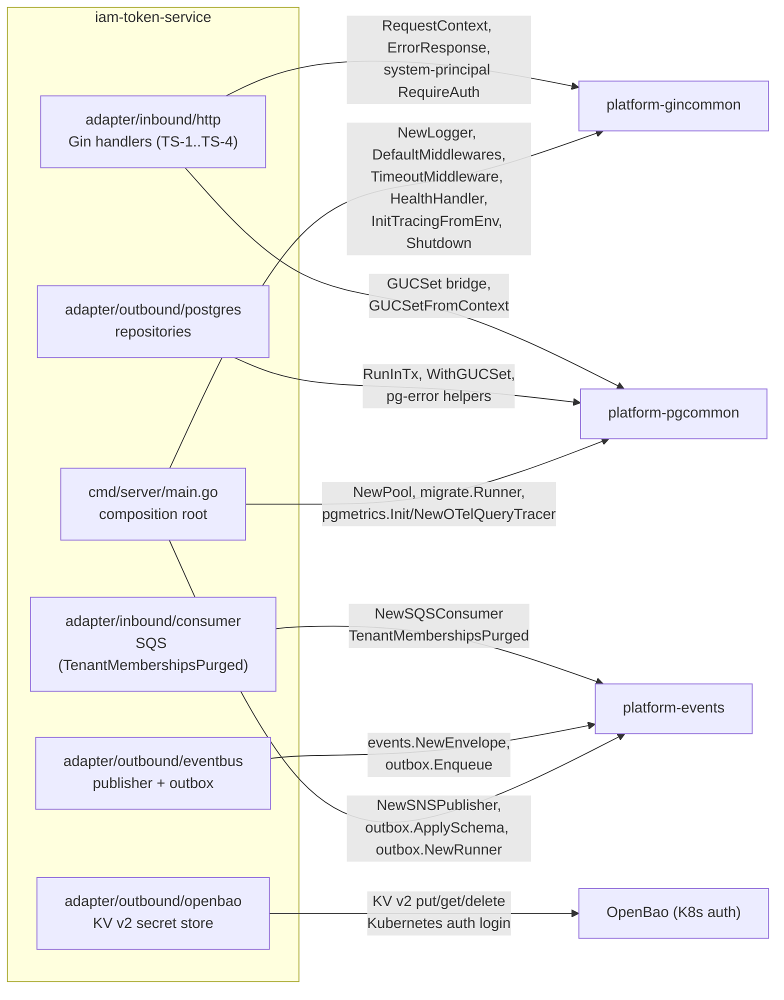
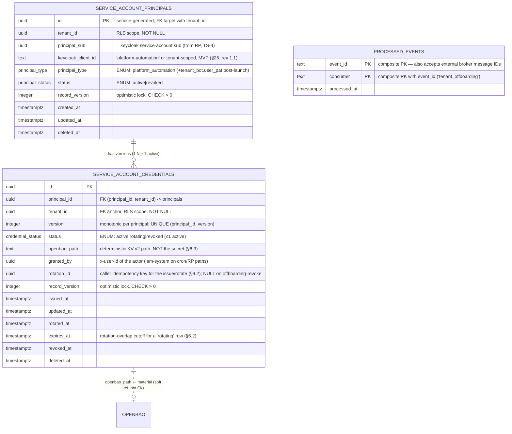
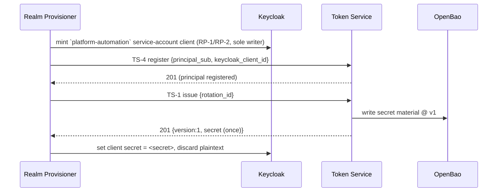
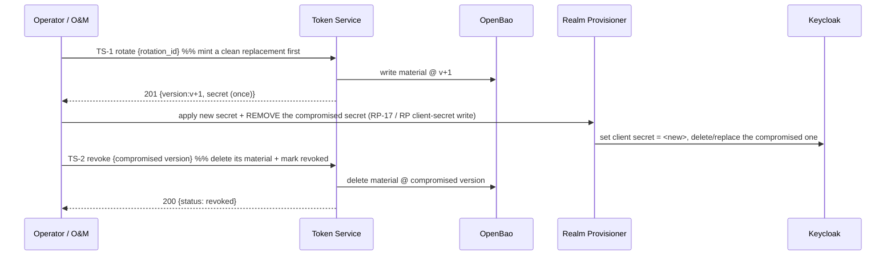

# Token Service — Low-Level Design

## Tender Management SaaS Platform — IAM Subsystem

| Field | Value |
|---|---|
| Document type | Low-Level Design (LLD) |
| Service | `iam-token-service` (Token Service) |
| Go module | `github.com/BCBP-SOLUTIONS-FZC-LLC/iam-token-service` |
| Status | **Approved — design sign-off v1.0 (2026-09-15); amended v1.1 (2026-09-17, §25 name-freeze amendment, see revision history).** Names frozen (§25); all open questions resolved (§16). Brought forward from Phase 2 per HLD v1.45 §5.8/§11.7/§16/§17.1. Signed off by the document owner (IAM platform engineering); cross-service companion guards and the TSQ-1 realm-template verification are tracked as follow-ups (§16 sign-off record), to be confirmed as those siblings and environments come up. |
| Base HLD | `IAM HLD v1.45` (Service Account & Token Service in MVP) |
| Sibling LLDs | `iam-lld-realm-provisioner-service.md` (mints the Keycloak service-account client; caller of TS-1/TS-4, §2.5/RP-17/RP-18), `iam-lld-org-membership-service.md` (non-member guarantee, AUTH-9), `iam-lld-authz-enrichment.md`, `iam-lld-tender-acl-service.md`, `iam-lld-delegation-service.md`, `iam-lld-event-consumer-service.md` |
| Owner database | RDS PostgreSQL `serviceaccount` (Multi-AZ, PgBouncer transaction pooling) |
| External system of record | **OpenBao** (credential *material*); **Keycloak** (the service-account client identity + secret validation, written only by the Realm Provisioner, RP-INV-1) |
| Deployment stage | In development — nothing deployed to any environment (§13/§19) |
| Audience | IAM platform engineering (owner), Realm Provisioner team (credential handshake), Security / SRE, Audit Log |

### Revision history

| Rev | Date | Change |
|---|---|---|
| 0.1 | 2026-09-11 | **Initial draft.** Created as the companion service to the per-tenant automation principal brought forward into MVP (HLD §5.8/§11.7). Scope, boundaries, data model, credential lifecycle (issue/rotate/revoke), the Realm Provisioner handshake (RP-INV-1 preserved — this service never writes Keycloak), OpenBao secret handling, event contract, RLS/security invariants, and frozen-name inventory. PAT self-service and tenant-owned bots are documented as post-launch extensions of the same tables, not MVP surface. |
| 0.2 | 2026-09-11 | **Structural alignment to the sibling LLD template (HLD v1.45).** Renumbered to the canonical 25-section scheme shared with `iam-lld-event-consumer-service.md`; added Table of Contents and the previously-absent sections — §6 Credential Lifecycle and Secret Custody, §9 Concurrency/Consistency/Failure Handling, §12 Configuration, §14 Testing Strategy, §17 Error Taxonomy, §18 Integration Details, §19 Migration Strategy, §20 Operational Considerations, §21 Performance Considerations, §22 Decision Register, §23 Glossary, §24 Operational Runbooks. Disaster-recovery content folded into §13/§15; capacity content folded into §21. Also corrected §4.2/§4.4/§4.6 to state that `outbox_events` is library-owned (`platform-events`, `outbox.ApplySchema`) — this service only grants its app role on the table and customizes the payload column (MIG-1/MIG-2), matching the Realm Provisioner sibling. No design change — content preserved and expanded to sibling depth. |
| 0.3 | 2026-09-11 | **TSQ-3 resolved — plaintext-once handoff.** TS-1 returns the generated secret exactly once to the Realm Provisioner for the Keycloak update while retaining the authoritative copy in OpenBao (chosen over an OpenBao-handle-only response). Keeps RP the sole Keycloak writer (RP-INV-1) without granting RP OpenBao read access, and keeps a single issuance flow. §16 TSQ-3 marked Resolved; TS-D3 hardened from "leaning" to a firm decision. No structural change — the design already described this model (§5.4/§6.1/§10.5); this revision removes the remaining open-question hedging. |
| 0.4 | 2026-09-11 | **TSQ-5 resolved — proceed with the current design.** The base-HLD version mismatch (this LLD cites v1.45; the repository snapshot is v1.41) is acknowledged as an editorial inconsistency; the automation-principal design is materially identical across v1.41–v1.46, so no design change is required. The HLD maintainer will align the version reference in a follow-up. §16 TSQ-5 marked Resolved; the `HLD v1.45` references are left as-is pending that follow-up. |
| 0.5 | 2026-09-11 | **TSQ-2 resolved — rotation cadence & on-demand surface.** Default rotation cadence set to **90 days**; MVP supports both scheduled and operator-initiated on-demand rotation (O&M tooling / admin APIs, for break-glass and suspected-compromise), with tenant self-service deferred to post-launch. Rotation-overlap mechanism unchanged. §16 TSQ-2 marked Resolved; new decision **TS-D10**; §12 config comment firmed. No structural change — the design already carried the 90-day default and the operator/cron TS-1 paths (§8.2/§8.3/§12). |
| 0.6 | 2026-09-11 | **TSQ-1 resolved — Keycloak dual-secret grace accepted as a design assumption, pending ops validation.** The rotation/overlap design (§6.2/§8.2, TS-D4) assumes Keycloak client-secret rotation with a dual-secret grace period on the `platform-automation` template. Realm Provisioner + Keycloak Ops must validate that the deployed configuration supports the rotated-secret grace TTL and that it satisfies the overlap requirement; if dual-secret validation is not supported, the rotation and overlap assumptions must be revisited before implementation. §16 TSQ-1 marked Resolved (accepted assumption + validation gate); §6.2 and TS-D4 annotated accordingly. |
| 0.7 | 2026-09-15 | **Deepened §3, §4, §5, §7 to the `iam-lld-user-profile.md` sibling template.** §3 gains the full annotated repo tree, the `require(...)` shared-lib block, the CI dependency-rule gates, and a `platform-*` integration touch-point map with per-library symbol tables (3.3.1 gincommon / 3.3.2 pgcommon / 3.3.3 platform-events). §4 gains the DB/PgBouncer/pool preamble, an ER-overview + mermaid ER diagram, per-table DDL with indexes and Notes, the full RLS policy SQL (`app_tenant_id()`/`rls_check_tenant()`, `FORCE`/`REVOKE`/policy, least-privilege + `admin_readonly` roles, the RLS invariant/test matrix), expanded migrations, and the actual `touch_row` trigger SQL. §5 gains bulleted conventions, per-caller authorization, the endpoint-catalogue table, and full request/response JSON specs per endpoint (TS-1..TS-4) plus a status-code table. §7 gains the JSON-serialization rationale, the AsyncAPI-contract + Glue-registry-layout/evolution/wiring subsection (7.3/7.3.1), the SNS fan-out table, and the published-events + invariants tables. **No design change** — same tables, endpoints, events, and invariants; depth and structure only. |
| **1.1** | **2026-09-17** | **§25 name-freeze amendment — `keycloak_client_id` is no longer a single frozen literal (IB-2 / RP-1 coordination).** The Realm Provisioner's RP-1 (trial provisioning) mints the automation principal into the **shared** trial realm, which cannot hold two Keycloak clients named `platform-automation` (Keycloak `clientId` is unique per realm, not per tenant). TS-4's validation is relaxed from `keycloak_client_id == "platform-automation"` to `domain.ValidPlatformAutomationClientID`: either the literal base name (a dedicated-realm tenant, RP-2 direct or RP-3 post-conversion) or `"platform-automation-" + tenant_id` (a shared-realm/trial tenant, RP-1). §4.2/§4.4/§5.1/§5.4/§10.3/§23/§25 updated accordingly. **Also**, TS-4's `Register` conflict behavior changes from `ON CONFLICT ... DO NOTHING` to a conditional `DO UPDATE`: RP-3 conversion re-registers the same `(tenant_id, principal_type)` against a newly-minted dedicated-realm client, which necessarily carries a different `principal_sub` (Keycloak does not let a caller pin a service-account user's `sub` across realms the way `MigrateUser` pins a human user's). A differing `principal_sub`/`keycloak_client_id` on repeat now updates the existing row in place (same `principal_id`) and re-emits `ServiceAccountRegistered`; an identical repeat remains a true no-op. §5.4 updated. No table/column/event-name change — the `keycloak_client_id` column already stored a per-row value (§4.4's existing note), only the MVP validation and conflict-handling narrowed by this design were relaxed. Coordinated with `iam-realm-provisioner`'s RP-17/RP-18 implementation (its own LLD §2.5). |
| **1.0** | **2026-09-15** | **Design sign-off.** All open questions resolved (TSQ-1..5, §16); name inventory frozen (§25, TSQ-4). Status → **Approved (v1.0)**. Added the §16.1 sign-off record: pre-deployment design sign-off by the document owner; Security/SRE review and the Audit Log reconciliation deferred to implementation; three cross-service follow-ups (TSQ-1 realm-template verification, O&M non-member guard, Audit entry-type contract) tracked past sign-off. No design change from rev 0.10 — this revision records the sign-off and freezes names. |
| 0.10 | 2026-09-15 | **Closed the cross-tenant access gap for the scheduled jobs (review finding).** The overlap-expiry sweep (§8.3) and orphan-material reconciler (§8.6) are cross-tenant batch jobs, but the stated RLS posture (`serviceaccount_app` has no `BYPASSRLS`; the service "never uses `admin_readonly`") gave them no way to enumerate candidate rows — a fail-closed `SELECT` returns nothing. Added a dedicated read-only `serviceaccount_reconciler` role (`NOLOGIN BYPASSRLS`, `SELECT`-only) that the crons use **only to enumerate** the candidate set; each revoke write is then performed as `serviceaccount_app` in an RLS-scoped `RunInTx` bound to the row's tenant (new invariant **RLS-7** — writes never bypass RLS). Updated §4.3, §4.4 (role list), §8.3, §8.6, §13.1, RLS-1, and added §14.2 cross-tenant + orphan tests. No contract/table/event change. |
| 0.9 | 2026-09-15 | **TSQ-1 reframed to dev-stage reality.** Nothing is deployed (all IAM services and Keycloak are in development), so TSQ-1 cannot be a "confirm the deployed Keycloak" check. Reworded §16 TSQ-1, TS-D4, and the §6.2 inline note: the rotated-secret grace TTL is a **design-time coordination item with the Realm Provisioner** (who own the `platform-automation` realm template), verified in RP dev/integration tests (the §14.4 e2e case), not a deployment validation or a blocked external dependency. No design change. |
| 0.8 | 2026-09-15 | **Pre-sign-off review fixes.** (1) **Correctness:** added `updated_at` to `service_account_credentials` — the `touch_row` trigger set a column that did not exist; §4.2/§4.5/§9.1 reconciled. (2) **Design gap closed:** defined the orphan-material reconciler (`cmd/rotator` `ReconcileOrphanedMaterial`, new §8.6, TS-D11) that the §9.3/§13.3 failure paths relied on but never specified; added its metric (§11.2) and alert (§11.5/§20.3). (3) **Security-semantics gap closed:** made explicit that a TS-2 revoke does **not** invalidate the secret at Keycloak — break-glass is a two-halves operation requiring the paired RP action (new TS-INV-7, new §8.7 flow, TS-D12; §5.4 TS-2, §16 TSQ-2, §24 updated). (4) **Cross-refs:** repointed the CI-gate cites (§3.3→§3.2) and the outbox cite (§7.3→§7.4) left stale by the rev-0.7 renumbering. No change to the frozen name inventory (§25). |

---

## Table of Contents

1. [Document Overview](#1-document-overview)
2. [Service Responsibilities and Boundaries](#2-service-responsibilities-and-boundaries)
3. [Architecture and Package Layout](#3-architecture-and-package-layout)
4. [Data Model](#4-data-model)
5. [API Contract](#5-api-contract)
6. [Credential Lifecycle and Secret Custody](#6-credential-lifecycle-and-secret-custody)
7. [Event Architecture](#7-event-architecture)
8. [Key Request Flows](#8-key-request-flows)
9. [Concurrency, Consistency, and Failure Handling](#9-concurrency-consistency-and-failure-handling)
10. [Security](#10-security)
11. [Observability](#11-observability)
12. [Configuration](#12-configuration)
13. [Deployment and Scaling](#13-deployment-and-scaling)
14. [Testing Strategy](#14-testing-strategy)
15. [GDPR, Data Lifecycle, and Compliance](#15-gdpr-data-lifecycle-and-compliance)
16. [Open Questions and Sign-off Register](#16-open-questions-and-sign-off-register)
17. [Appendix — Error Taxonomy](#17-appendix--error-taxonomy)
18. [Integration Details](#18-integration-details)
19. [Migration Strategy](#19-migration-strategy)
20. [Operational Considerations](#20-operational-considerations)
21. [Performance Considerations](#21-performance-considerations)
22. [Decision Register](#22-decision-register)
23. [Appendix — Glossary](#23-appendix--glossary)
24. [Appendix — Operational Runbooks](#24-appendix--operational-runbooks)
25. [Appendix — Name Inventory (proposed freeze)](#25-appendix--name-inventory-proposed-freeze)

---

## 1. Document Overview

The Token Service owns the **credential lifecycle** for non-human principals on the platform. At MVP its only principal is the **per-tenant platform automation principal** (HLD §5.8) — the identity that platform automation (LLM-drafted sections, connector-completed workflow steps) authenticates as, so that automated actions are attributable per tenant and flow through the standard authorization path rather than an anonymous in-cluster shared secret.

The Token Service does **not** create the principal's identity. The Realm Provisioner, as the sole Keycloak writer (RP-INV-1), mints the `platform-automation` `service_account`-typed Keycloak client per tenant (§2.5 of the RP LLD). The Token Service generates and rotates that client's **secret material**, holds it in OpenBao, records credential metadata in its own `serviceaccount` database, and emits credential-lifecycle events for audit. The plaintext secret never touches this service's Postgres and never leaves the mesh.

### 1.1 Relationship to the HLD

| HLD section | This service |
|---|---|
| §5.8 Service Account & Token Service | Full service definition (credential half; RP owns the Keycloak-client half) |
| §11.7 Service Accounts and the Automation Principal | Credential issuance/rotation, OpenBao handling, internal-only posture |
| §11.2 Secrets Management | OpenBao KV as the secret store; Kubernetes-auth-bound policies |
| §11.3 Token Strategy | Service-account / integration credentials (MVP); opaque PATs (post-launch) |
| §9 Event Architecture | Publishes on `iam.serviceaccount.events`; consumes `TenantMembershipsPurged` |
| §11.5 Audit and Anomaly Triggers | Credential-lifecycle events feed the Audit Log; no secret in any record |
| §13 Disaster Recovery and Compliance | Metadata in Multi-AZ RDS; material in OpenBao HA; GDPR erasure on offboarding (§15) |
| §14 Capacity and Sizing | Trivially small — a few principals per tenant, writes only at provision/rotation (§21) |
| §15 Deployment and CI/CD | Shared-library and CI-gate conventions (§15.4); OpenBao via Kubernetes auth (§15.5.3) |
| §16 Build Roadmap | Pulled forward from Phase 2 into Phase 1.5 |
| §17.1 Resolved Decisions | ADR `0009-automation-principal.md` — brought forward, non-member, internal-only |

The base HLD is `IAM HLD v1.45`. Where a cross-reference below cites an HLD section, the section numbering follows the HLD's own scheme (§5 Service Inventory, §6 Role and Permission Model, §7 Data Architecture, §9 Event Architecture, §11 Security, §15 Deployment and CI/CD, §16 Build Roadmap, §17 Open Decisions).

---

## 2. Service Responsibilities and Boundaries

### 2.1 In scope

- **Credential lifecycle for the automation principal** — issue the initial credential, rotate it (with a bounded validity overlap), and revoke it. One live credential version per principal, plus at most one prior version inside the rotation-overlap window.
- **Service-account principal registry (metadata only)** — one row per tenant automation principal: its Keycloak `sub`, Keycloak `client_id`, type, status, and credential version pointers. **No secret is ever stored here** — only an OpenBao path reference.
- **Secret material custody** — generate cryptographically-random secret material, write it to **OpenBao** (KV v2) under a deterministic per-tenant, per-version path, and return the plaintext **exactly once** to the trusted in-mesh caller (the Realm Provisioner) that applies it to Keycloak.
- **Credential-lifecycle events** — emit `ServiceAccountRegistered` / `…CredentialIssued` / `…CredentialRotated` / `…CredentialRevoked` / `ServiceAccountRevoked` on `iam.serviceaccount.events` via the transactional outbox, for the Audit Log.
- **Tenant-offboarding cleanup** — on `TenantMembershipsPurged`, revoke every credential for the tenant, delete its OpenBao material, and hard-delete its registry rows (mirrors the Tender-ACL cascade, §10.1 of that LLD).
- **Own `serviceaccount` database** — `service_account_principals`, `service_account_credentials` (tenant-scoped, RLS), plus `outbox_events` / `processed_events` (operational, RLS-exempt).

### 2.2 Out of scope (owned elsewhere)

| Concern | Owner | Why not here |
|---|---|---|
| Minting/deleting the `platform-automation` Keycloak client; **setting** its secret | **Realm Provisioner** | RP is the sole Keycloak Admin API writer (RP-INV-1). This service generates and custodies secret material; RP applies it to Keycloak (RP-17). |
| Human-user tokens / JWT issuance / login | **Keycloak** | This service issues no user tokens; it never sits on a human login path. |
| Authorization decisions for the principal | **AuthZ Enrichment** | The principal carries no roles; it is a non-member (O&M AUTH-9). This service issues credentials, never grants. |
| Making the principal a member or granting it a role | **Org & Membership** | Structurally barred (O&M AUTH-9 + membership FK). Not this service's concern. |
| Tenant-owned bots; general user PAT self-service | **Post-launch** | A future extension of the same tables (§2.4); not MVP surface. |

### 2.3 The credential-authority distinction (design note)

Two services touch the automation principal's credential and the split is deliberate: the **Token Service** is the credential *system-of-record* (it generates the material, versions it, custodies it in OpenBao, and tracks status), while the **Realm Provisioner** is the sole *applier* to Keycloak (it writes the generated secret onto the Keycloak client, since only RP may write Keycloak). Neither can complete a rotation alone — the same two-halves pattern the Realm Provisioner already uses with O&M for RP-9 (MFA reset) and RP-16 (session revocation). Keycloak remains the runtime **validator** of the secret at the client-credentials token endpoint; this service is never on the hot token-issuance path. The lifecycle mechanics of this split are detailed in §6.

### 2.4 Post-launch extensions (documented, not built)

The `service_account_credentials` table and the lifecycle API are shaped so that two Phase-2 capabilities extend them without a redesign: **tenant-owned bots** (additional `service_account_principals` rows with `principal_type = 'tenant_bot'`, tenant-self-service-managed) and **user PATs** (opaque, Argon2id-hashed tokens where this service becomes the introspection authority, `principal_type = 'user_pat'`). MVP ships only `principal_type = 'platform_automation'`, one per tenant, and no self-service surface.

### 2.5 Core invariants

| # | Invariant |
|---|---|
| TS-INV-1 | **This service never writes Keycloak.** It has no gocloak dependency and no Keycloak Admin credential; RP-INV-1 is preserved. |
| TS-INV-2 | **No plaintext secret is ever persisted in Postgres or logged.** Secret material exists only in OpenBao and transiently in the TS-1 response body (mesh-mTLS, returned once). |
| TS-INV-3 | **One live credential version per principal.** At most one additional `rotating` version may be valid simultaneously, only within the bounded overlap window (§6.2/§8.2). |
| TS-INV-4 | The automation principal holds **no roles and no membership** (O&M AUTH-9); this service issues credentials only and makes no authorization decision. |
| TS-INV-5 | Every credential state transition (issue/rotate/revoke) is recorded locally **and** emitted on `iam.serviceaccount.events` through the outbox; audit visibility never depends on a live downstream call (§7). |
| TS-INV-6 | The service is reachable only in-mesh on `/api/v1/internal/*` under the reserved `iam-system` principal; it exposes no tenant-facing surface at MVP (§5.6). |
| TS-INV-7 | **Revocation is two-halves, like rotation.** A TS-2 revoke removes this service's custody/metadata of a version but does not invalidate the secret at Keycloak; cutting a live secret off at the auth plane requires the paired Realm Provisioner action (remove/rotate the Keycloak client secret). TS-2 alone is complete only where a Keycloak change is already implied — overlap-expiry (Keycloak grace TTL) or offboarding (realm deletion). See §5.4/§8.7. |

---

## 3. Architecture and Package Layout

The service follows the platform Clean Architecture / Ports-and-Adapters layout (HLD §15.3): dependencies point inward, `core/domain` imports nothing external, and wiring lives only in the three composition roots — `cmd/server/main.go` (the internal HTTP API + outbox runner), `cmd/consumer/main.go` (the `TenantMembershipsPurged` offboarding consumer, §7.1), and `cmd/rotator/main.go` (the overlap-expiry rotation-sweep CronJob, §8.3). Inward-only dependency direction is enforced in CI by `.go-arch-lint.yml` / `.github/scripts/arch-lint.sh` (§3.2). All three entrypoints ship in one binary image, selected by argument (`server` | `consumer` | `rotator`).

```
iam-token-service/
├── cmd/
│   ├── server/                            # internal HTTP API composition root + outbox runner (HLD §15.3)
│   │   ├── main.go
│   │   └── swagger_info.go                # swaggo @info metadata for the generated OpenAPI spec
│   ├── consumer/                          # SQS consumer composition root (TenantMembershipsPurged, §7.1)
│   │   └── main.go
│   └── rotator/                           # scheduled maintenance CronJob: overlap-expiry sweep (§8.3),
│       └── main.go                        #   orphan-material reconcile (§8.6), outbox prune (§3.3.3)
├── internal/
│   ├── core/
│   │   ├── domain/                        # entities, value objects, domain errors
│   │   │   ├── principal.go               # ServiceAccountPrincipal, PrincipalType, PrincipalStatus
│   │   │   ├── credential.go              # Credential, CredentialStatus, version/overlap rules (§6.2)
│   │   │   ├── events.go                  # DomainEvent payload types (the 5 published events, §7.4)
│   │   │   └── errors.go                  # ErrPrincipalNotFound, ErrRotationInFlight, ErrPrincipalRevoked, ...
│   │   ├── port/                          # interfaces required by the core
│   │   │   ├── principal_repository.go
│   │   │   ├── credential_repository.go
│   │   │   ├── secret_store.go            # OpenBao KV v2 put/get/delete of secret material (§6.3)
│   │   │   ├── event_publisher.go
│   │   │   ├── event_publisher_context.go # ctx-scoped publisher accessor (outbox inside the tx)
│   │   │   ├── processed_events.go        # ProcessedEventsStore{IsProcessed, MarkProcessed} — multi-consumer-shaped dedup port
│   │   │   ├── tx_runner.go               # TxRunner — runs fn inside a DB tx, binds RLS GUC + tx-bound EventPublisher into ctx
│   │   │   └── logger.go                  # logging port
│   │   └── service/                       # use cases
│   │       ├── credential_service.go      # IssueOrRotate (TS-1), Revoke (TS-2) — the credential lifecycle (§6)
│   │       ├── principal_service.go       # Register (TS-4), ReadPrincipal (TS-3)
│   │       ├── offboarding_service.go     # ScrubTenant on TenantMembershipsPurged (§8.4)
│   │       ├── rotation_sweep_service.go  # SweepExpiredOverlaps — the §8.3 overlap-expiry revoke
│   │       ├── material_reconcile_service.go # ReconcileOrphanedMaterial — deletes OpenBao paths with no live credential row (§8.6)
│   │       ├── validator.go               # shared input/domain validation (rotation_id, overlap_seconds clamp)
│   │       └── logging.go
│   ├── adapter/
│   │   ├── inbound/
│   │   │   ├── http/                      # Gin handlers, DTOs, router, middleware, Swagger UI
│   │   │   │   ├── credential_handler.go  # TS-1 (issue/rotate), TS-2 (revoke)
│   │   │   │   ├── principal_handler.go   # TS-3 (read), TS-4 (register)
│   │   │   │   ├── router.go              # route registration (all under /api/v1/internal)
│   │   │   │   ├── middleware.go          # RequireAuth (system principal), ContextMiddleware, GUC bridge
│   │   │   │   ├── dto.go / enums.go / errors.go / validation.go
│   │   │   │   ├── asyncapi.go            # serves the embedded api/asyncapi.yaml
│   │   │   │   └── swagger_initializer.go / swagger_theme.go   # Swagger UI (gated, §12.1)
│   │   │   └── consumer/                  # SQS consumer — TenantMembershipsPurged (§7.1)
│   │   │       ├── offboarding_consumer.go # OffboardingConsumer{Handle}; New() wires the SQS consumer from eventcfg.SQSConfigEnv
│   │   │       └── dedup.go               # skipDuplicate/ackUnknown/markProcessedInTx — shared processed_events dedup helpers
│   │   └── outbound/
│   │       ├── postgres/                  # repository impls, db.go, migrate.go, outbox_publisher.go, maintenance.go
│   │       │   └── migrations/            # 000001_schema.up.sql/.down.sql (consolidated base)
│   │       ├── openbao/                   # KV v2 secret store (OpenBao SDK; Kubernetes auth, §10.5)
│   │       ├── eventbus/                  # SNS publisher + Glue codec + ValidatingCodec (enqueue-time JSON Schema check)
│   │       │   └── schemas/               # embedded JSON Schemas: the 5 events + TenantMembershipsPurged (consumed)
│   │       │       ├── service_account_registered.json / service_account_credential_issued.json
│   │       │       ├── service_account_credential_rotated.json / service_account_credential_revoked.json
│   │       │       ├── service_account_revoked.json
│   │       │       └── tenant_memberships_purged.json
│   │       └── metrics/                   # business metrics (Prometheus, iam_token_service_*)
├── pkg/
│   └── requestctx/                        # request-scoped tenant/user/trace context (exported package)
│       └── context.go
├── api/
│   ├── asyncapi.yaml                      # AsyncAPI 3.0 spec (iam.serviceaccount.events) — hand-authored source of truth (§7.3)
│   └── embed.go                           # go:embed of asyncapi.yaml (served by http/asyncapi.go)
├── docs/
│   ├── swagger/                           # OpenAPI 3 REST spec — GENERATED by `make swag` (swaggo), checked in;
│   │   ├── swagger.yaml / swagger.json / docs.go   #   CI `make swag-check` fails the build on any drift
│   ├── lld/iam-lld-token-service.md       # this document
│   └── architecture/                      # README.md + mermaid/
├── deploy/
│   ├── helm/                              # Chart.yaml, values.yaml, templates/ (server, consumer, rotator-cronjob)
│   ├── openbao/                           # OpenBao policy.hcl + role (Kubernetes auth, §10.5)
│   ├── iam/                               # AWS IAM policy (SNS/SQS only — no Secrets Manager, §12)
│   └── monitoring/                        # Prometheus alert rules (app + schema-registry)
├── test/                                  # unit/<pkg>/… , postgres/ (RLS + DB, testcontainers), integration/, e2e/, fixtures/
├── scripts/                               # init-db.sql, init-localstack.sh, coverage/swagger helpers
├── .github/                               # workflows (ci, schema-registry, release, …) + scripts (arch-lint, swag-check, no-gocloak, no-secret-log)
├── ARCHITECTURE.md  README.md  CHANGELOG.md  CONTRIBUTING.md
└── Dockerfile  docker-compose.yml  Makefile  go.mod  go.sum  .golangci.yml  .go-arch-lint.yml
```

As with the sibling services, the REST OpenAPI spec is **generated** by `swag` (swaggo) from Gin-handler doc-comment annotations into `docs/swagger/{swagger.yaml,swagger.json,docs.go}` via `make swag`; the generated artifacts are checked in and CI's `make swag-check` fails the build on any diff, so the committed spec cannot drift from the handler annotations. The AsyncAPI document (`api/asyncapi.yaml`) has no annotation-driven generator and is hand-authored as its own source of truth (§7.3). Every reference in this document to "the OpenAPI 3 contract" means the generated `docs/swagger/swagger.yaml`, not a hand-maintained `api/` file.

### 3.1 Shared library dependencies (HLD §15.4)

```
require (
    github.com/BCBP-SOLUTIONS-FZC-LLC/platform-gincommon           v1.3.0
    github.com/BCBP-SOLUTIONS-FZC-LLC/platform-events              v1.4.0
    github.com/BCBP-SOLUTIONS-FZC-LLC/platform-pgcommon            v1.2.1
    github.com/openbao/openbao/api/v2                              v2.x.x  // OpenBao KV v2 client (Vault-API-compatible)
    github.com/aws/aws-sdk-go-v2/service/glue                      v1.x.x  // Glue Schema Registry client
)
```

`iam-keycloakclient` is **deliberately not** a dependency — the Token Service never touches the Keycloak Admin API (TS-INV-1), and CI enforces that no `gocloak` import exists (§3.2). Gin middleware, logging, and tracing come from `platform-gincommon`; the pgx pool, RLS GUC injection, migrations, and pg-error helpers from `platform-pgcommon`; the outbox runner, SNS publisher, and SQS consumer from `platform-events`. The OpenBao SDK provides KV v2 read/write/delete of secret material (§6.3, §10.5); the AWS Glue SDK provides schema encode/decode for `iam.serviceaccount.events` payloads (§7.3.1). There is **no Valkey / cache dependency** — this service holds no read cache (§6 has no cache path; the only external state is OpenBao and Postgres).

### 3.2 Dependency rules (enforced in CI)

- `core/domain` imports nothing outside itself.
- `core/port` imports only `core/domain`.
- `core/service` imports only `core/domain` and `core/port`.
- `adapter/*` implements `core/port` and uses `core/domain` types; nothing in `core/` imports `adapter/`.
- Enforced by `go-arch-lint` in `ci.yml` (zero violations).

Three additional grep-based CI gates, unique to this service's invariants:

- **No-`gocloak` gate** (`.github/scripts/check-no-gocloak.sh`) — fails the build if any `gocloak`/Keycloak-Admin import appears anywhere in the module. This is the inverse of the Realm Provisioner's gate (RP *requires* `gocloak`; this service *forbids* it), and makes TS-INV-1 structural rather than conventional.
- **`SET LOCAL`-only RLS gate** (RLS-6, §4.3) — forbids any session-scoped `SET app.tenant_id`; the GUC must be transaction-local.
- **Secret-logging gate** (`.github/scripts/check-no-secret-log.sh`) — fails the build if a credential/secret field name reaches a `slog`/`fmt` sink (TS-INV-2, §11.4).

### 3.3 Shared library integration scope

This section specifies exactly how the three platform libraries are integrated — which exported packages are used, where they are wired, and which features are in or out of scope. All three are private Go modules under `github.com/BCBP-SOLUTIONS-FZC-LLC/` consumed via the versions pinned in §3.1; none is deployed on its own.

Integration touch-point map:



#### 3.3.1 `platform-gincommon` — HTTP middleware, logging, tracing

The Token Service is a **Gin HTTP service only** (internal API) — it exposes no gRPC server. Only the `gincommon` and `logger` packages are used; `grpccommon` is out of scope.

| Symbol | Where | Use in Token Service |
|---|---|---|
| `logger.NewLogger(env)` | `main.go` | Builds the structured `port.Logger` injected into the pool, middleware config, outbox runner, and OpenBao client |
| `gincommon.Config{Logger, ServiceName, BuildVersion, Tracing}` | `main.go` | One config feeding all middleware stacks; `ServiceName = "iam-token-service"` (required — `ObservabilityMiddlewares` panics on empty). Tracing configured via `OTEL_*` env + `InitTracingFromEnv`, not the optional `Tracing` field |
| `gincommon.TimeoutMiddleware(30*time.Second)` | router | Per-request deadline on the `/api` group; inserted before `DefaultMiddlewares` |
| `gincommon.DefaultMiddlewares(cfg)` | `/api` group | Full stack = Observability ++ Protected (order below) |
| `gincommon.HealthHandler()` | `/healthz` | Liveness; registered before auth |
| `gincommon.RequestContext(c)` | every handler | Retrieves `*domain.RequestContext{TenantID, UserID, TraceID, ClientIP}` |
| `gincommon.ErrorResponse` | error mapper | Standard 4xx/5xx body shape (§17) |
| `gincommon.InitTracingFromEnv()` / `gincommon.Shutdown(logger)` | `main.go` | OTLP tracer init + graceful flush on SIGTERM; call after the HTTP server stops, before `pool.Close()` |
| `gincommon.MetricsRegisterer()` | `main.go` | Returns the `prometheus.Registerer` that middleware HTTP metrics register against; passed to `metrics.Register(...)` so `iam_token_service_*` business counters land in the same registry |

**Exact middleware order** (from the library):

```
PanicRecovery → RequestID → Tracing → CorrelationHeaders → Metrics → Logging   (Observability)
        → RequireAuth → ContextMiddleware                                       (Protected)
```

`RequireAuth` validates `x-user-id` / `x-tenant-id` via `domain.NormalizeHeaderValue` and rejects with `401`. For this service the accepted `x-user-id` on every route is the **reserved system principal** (`…00a1`, "iam-system"), and the route prefix is restricted to `/api/v1/internal/*` (RLS-5, §5.2) — there is no tenant-facing principal path. `ContextMiddleware` then builds the `RequestContext`. The service performs **no JWT validation** — it trusts gateway/mesh headers under mesh mTLS (§10.2). The `RequirePermission` / RBAC helpers are deliberately not used: this service makes no per-user authorization decision (TS-INV-4); authorization is the coarse system-principal-on-internal-routes check in §5.2.

#### 3.3.2 `platform-pgcommon` — pool, RLS GUC injection, transactions, errors

The entire data-access substrate and the enforcement point for Layer-2 tenant isolation (§10.1).

| Symbol | Where | Use in Token Service |
|---|---|---|
| `pgcommon.NewPool(ctx, Config{...})` | `main.go` | The single `*pgcommon.Pool`, injected into all repositories and the outbox runner; pings on creation → fails fast on bad DSN |
| `pgcommon.Config.PGBouncerMode` (env-driven) | `main.go` | From `PG_BOUNCER_MODE`; **`false`** in dev/test (direct Postgres), **`true`** in production/staging (SimpleProtocol + transaction-local GUC injection) |
| `pgcommon.Config.GUCProvider = pgcommon.GUCSetFromContext` | `main.go` | Wires the pool to pull the per-request `GUCSet` from context on every acquire |
| `pgcommon.WithGUCSet(ctx, GUCSet{UserID, TenantID})` | `/api` GUC-bridge middleware | Stores the system-principal + target-tenant identity for pool-time RLS injection; identity is already validated upstream so `WithGUCSet` (not `WithValidatedGUCSet`) is used |
| `pgcommon.RunInTx(ctx, pool, opts, fn)` | repositories / services | Every write; injects `app.user_id` / `app.tenant_id` as `SET LOCAL` (txn-local) and commits the credential-state row + outbox row atomically |
| `pgcommon.RunInTxWithRetry` / `…Opts` | contended writes | `40001`/`40P01` retry with optional backoff+jitter; used only where contention is real (concurrent rotation, §9.1) |
| `pgcommon.IsUniqueViolation` / `IsForeignKeyViolation` / `IsCheckViolation` / `IsDeadlock` / `IsSerializationFailure` / `ConstraintName` | error mapping | Maps pg `SQLSTATE` → HTTP codes (§17) — never raw string matching. `uq_sac_one_active` violation → `409`; `uq_sac_version` → idempotent-retry path (§9.2) |
| `pgcommon.Pool.Health(ctx)` | `/readyz` | Pool liveness + utilization snapshot; 5 s internal timeout |
| `pgcommon.Pool.DrainAndClose(ctx)` | `main.go` shutdown | Graceful shutdown; registered first in the LIFO defer chain so it runs last, after the outbox runner and consumer stop (§13) |
| `pgcommon.ConfigFromEnv() (Config, []ConfigWarning)` | `main.go` | Builds `Config` from `DATABASE_URL`/`PG_*`; structured warnings logged at startup, not silently discarded |
| `migrate.Runner{DSN, Logger}.Up(ctx)` | `main.go` | Runs `postgres/migrations/` on startup; appends `lock_timeout=30s` for rolling-deploy safety |
| `pgmetrics.Init(serviceName, buildVersion)` / `pgmetrics.NewOTelQueryTracer(tracer)` | `main.go` | Registers pg Prometheus collectors before `NewPool`; per-query OTel spans via `Config.Tracer` |

**The GUC names are fixed by the library**: `app.user_id`, `app.tenant_id`. Under `PGBouncerMode=true` they are set with `set_config(..., true)` (transaction-local) at the start of each `RunInTx`/`WithConn`, so they clear at commit and cannot leak across the pooled backend — the mechanism the §4.3 RLS policies depend on (RLS-6). `app.tenant_roles` is **not** used — this service makes no role-based decision (TS-INV-4), so only `app.user_id` (the system principal) and `app.tenant_id` (the target tenant) are injected. **Pool sizing:** `MinConns: 0` under PgBouncer transaction pooling; `MaxConns: 10` per pod (this service is trivially small, §21). Under `PGBouncerMode=true`, migrations bypass PgBouncer (`MIGRATION_DATABASE_URL` on the direct 5432 port; advisory locks are session-scoped, §4.4).

#### 3.3.3 `platform-events` — outbox, SNS publisher, SQS consumer

The Token Service is a **single-topic producer** (`iam.serviceaccount.events`) **and** a **single-subscription consumer** (`TenantMembershipsPurged`), so it wires the full outbox + SNS-publisher + SQS-consumer surface.

| Symbol | Where | Use in Token Service |
|---|---|---|
| `outbox.ApplySchema(ctx, runner)` | `main.go` | Creates `outbox_events` / `outbox_dead_letters` via the library's embedded migrations — **run after business migrations** (MIG-2, §4.4). The table is library-owned; this service only grants its app role on it + customizes the payload column (§4.2) |
| `events.NewEnvelope(type, source, payload, opts...)` | `eventbus/publisher.go` | Builds the CloudEvents-aligned envelope; `source = "iam-token-service"`, `ID` is UUID v7 (dedup key). Options: `WithTenantID`, `WithTraceID` |
| `outbox.Enqueue(ctx, tx, env)` | inside `RunInTx` | Writes the event row in the **same** `pgx.Tx` as the credential-state change (no dual-write, EVT-1). Payload is plain, schema-validated JSON (Glue encoding happens at publish time, §7.3.1) |
| `events.NewSNSPublisher(SNSConfig{TopicARN, Region}, opts...)` | `main.go` | Single SNS publisher → `iam.serviceaccount.events`; **no RoutingPublisher** (one topic). `events.WithCodec(glueCodec)` sets Glue wire-format encoding at publish time |
| `outbox.NewRunner(Config{Pool, Publisher, PollInterval:500ms, BatchSize:50, MaxAttempts:5, DrainTimeout:30s, ...})` | `main.go` | Background publisher; `Stop()` drained before pool close (LIFO defers). All tunables `OUTBOX_*`-env-configurable (§12) |
| `outbox.Runner.PrunePublished(ctx, olderThan, limit)` | scheduled `CronJob` | Deletes successfully-published rows older than `olderThan`; wired into `cmd/rotator`'s maintenance tick (daily, `olderThan: 24h`) so `outbox_events` does not grow unbounded |
| `events.NewSQSConsumer(SQSConfig{QueueURL, Region, MaxMessages}, handler, opts...)` | `adapter/inbound/consumer` | **One active subscription: `TenantMembershipsPurged`** on `iam.tenant.events` (queue `tenant-lifecycle-tokensvc-q`, §7.1), dispatched to `OffboardingService.ScrubTenant` (§8.4). Options: `WithConcurrency`, `WithVisibilityTimeout` |
| `events.metrics.Init` / OTel | implicit | Publish/consume Prometheus + tracing from the library; `outbox_dead_letters_total` counter (alert on `rate() > 0`, §11.5) |

**HMAC signing/verification is out of scope** — this service is reached only as authenticated in-mesh HTTP (Realm Provisioner, operators) and SNS→SQS transport, never a raw external webhook. The `Envelope` is published with its UUID v7 `ID` as the dedup key so the Audit consumer stays idempotent (HLD §9.3). Retryable AWS errors (`ThrottlingException`, `ServiceUnavailable`, …) are reschedule-without-attempt-advance (library v1.1.0), so transient SNS throttling never dead-letters a credential-lifecycle event.

---

## 4. Data Model

Database: `serviceaccount` on the shared RDS PostgreSQL Multi-AZ instance (HLD §7.1). Fronted by PgBouncer in transaction-pooling mode. The pool is created with `pgcommon.NewPool(... PGBouncerMode: <PG_BOUNCER_MODE>, GUCProvider: pgcommon.GUCSetFromContext, MinConns: 0, MaxConns: 10 ...)` — `PGBouncerMode` is env-driven (`true` in production/staging where PgBouncer fronts the DB, `false` in dev/test; §3.3.2); `MinConns: 0` applies under PgBouncer transaction pooling (direct-Postgres mode defaults it to `2`); `MaxConns: 10` per pod is ample for this service's trivial write volume (§21). The `pgcrypto` extension is required for `gen_random_uuid()`.

The schema extends the HLD §5.8/§7.4 baseline for non-human principals. Unlike User Profile, this service stores **no human PII and no secret material** — only a service-account principal registry and credential *metadata* (an OpenBao path reference, never the secret).

**Entity-relationship overview.** `service_account_principals` is the hub (one row per tenant automation principal); its own primary key is `id`, and it carries the composite unique key `(id, tenant_id)` that the child FK targets. `service_account_credentials` hangs off it via a **composite `(principal_id, tenant_id)` foreign key** referencing `service_account_principals(id, tenant_id)` — not `principal_id` alone — so the DB itself prevents a credential row from referencing a principal in a different tenant; the FK carries `ON DELETE CASCADE`. The relationship is 1:N (a principal accrues one credential row per version; §6.2), constrained so at most one is `active` at a time (`uq_sac_one_active`, TS-INV-3). `openbao_path` is a *reference* to material in OpenBao — an external system of record, shown dashed — **not** a secret column and not a DB FK. `outbox_events`, `processed_events`, and `schema_migrations` are standalone operational tables (not tenant-scoped, no FK). Mermaid has no enum type, so status columns appear as plain text.



### 4.1 Extensions and enums

```sql
CREATE EXTENSION IF NOT EXISTS pgcrypto;   -- gen_random_uuid()

CREATE TYPE principal_type    AS ENUM ('platform_automation');            -- MVP; 'tenant_bot','user_pat' added post-launch (§2.4)
CREATE TYPE principal_status  AS ENUM ('active', 'revoked');
CREATE TYPE credential_status AS ENUM ('active', 'rotating', 'revoked');
```

Enums are used (rather than `CHECK` constraints) for the same reasons the siblings do: stricter, faster on index scans, type-level enforcement. Adding a post-launch `principal_type` value is an additive `ALTER TYPE principal_type ADD VALUE 'tenant_bot'` (no full table rewrite in PostgreSQL ≥ 12, §4.4).

### 4.2 Tables

#### `service_account_principals`

```sql
CREATE TABLE service_account_principals (
  id                  uuid NOT NULL DEFAULT gen_random_uuid(),
  tenant_id           uuid NOT NULL,
  principal_sub       uuid NOT NULL,                 -- the Keycloak service-account client's user sub (from RP, TS-4)
  keycloak_client_id  text NOT NULL,                 -- 'platform-automation' or tenant-scoped, MVP (§25, rev 1.1)
  principal_type      principal_type NOT NULL DEFAULT 'platform_automation',
  status              principal_status NOT NULL DEFAULT 'active',
  record_version      integer NOT NULL DEFAULT 1 CHECK (record_version > 0),  -- optimistic-lock token; bumped by trigger (§4.5)
  created_at          timestamptz NOT NULL DEFAULT now(),
  updated_at          timestamptz NOT NULL DEFAULT now(),
  deleted_at          timestamptz,
  CONSTRAINT service_account_principals_pkey PRIMARY KEY (id),
  CONSTRAINT uq_sap_id_tenant               UNIQUE (id, tenant_id),          -- FK target for the composite child FK
  CONSTRAINT uq_sap_active_principal        UNIQUE (tenant_id, principal_type) -- one automation principal per tenant
);

-- Indexes
CREATE INDEX idx_sap_tenant        ON service_account_principals (tenant_id);
CREATE INDEX idx_sap_sub           ON service_account_principals (tenant_id, principal_sub);   -- reconcile-by-sub (RP-18)
CREATE INDEX idx_sap_status        ON service_account_principals (tenant_id, status) WHERE deleted_at IS NULL;
```

Notes:

- **`principal_sub` is supplied by the Realm Provisioner (TS-4), never generated here.** The Token Service is a *projection* of the RP-minted Keycloak service-account identity, the same way User Profile projects the human Keycloak `sub`. This service never mints an identity (TS-INV-1).
- **`id` is service-generated** (a surrogate key, `gen_random_uuid()`) — unlike User Profile, whose PK *is* the Keycloak `sub`. Here the Keycloak identity is carried in `principal_sub`, and `id` is the stable local handle the credential rows and TS-3/TS-4 paths key on. The composite `uq_sap_id_tenant` exists solely so the child table's `(principal_id, tenant_id)` FK has a unique target that also structurally scopes it to one tenant.
- **One `platform_automation` principal per tenant** (`uq_sap_active_principal` on `(tenant_id, principal_type)`). Post-launch `tenant_bot`/`user_pat` principals (§2.4) are additional rows under the same tenant with a different `principal_type`, so the per-tenant-per-type uniqueness composes without a schema change.
- **`keycloak_client_id`** is either the frozen base name `platform-automation` (a dedicated-realm tenant) or that base name suffixed with the owning tenant's UUID (a shared-realm/trial tenant — a shared realm cannot hold two clients with the same `clientId`), validated by `domain.ValidPlatformAutomationClientID` (§5.1/§10.3, rev 1.1); it is stored (rather than assumed) so the OpenBao path (§6.3) and any future multi-client principal derive from a real column, not a constant.
- **`status` lifecycle**: `active` → `revoked` (terminal at offboarding, §8.4). A `revoked` principal rejects new issue/rotate (`422 principal_revoked`, §5.5). There is no `disabled` state — the automation principal is either live or gone.
- **`record_version`** is the optimistic-concurrency token used by §9.1 (a monotonic counter, not `updated_at` — timestamps collide under sub-millisecond concurrent writes); it and `updated_at` are maintained by the §4.5 trigger.

#### `service_account_credentials`

```sql
CREATE TABLE service_account_credentials (
  id             uuid NOT NULL DEFAULT gen_random_uuid(),
  tenant_id      uuid NOT NULL,
  principal_id   uuid NOT NULL,
  version        integer NOT NULL,                    -- monotonically increasing per principal (§6.2)
  status         credential_status NOT NULL DEFAULT 'active',
  openbao_path   text NOT NULL,                       -- deterministic KV v2 path; NOT the secret (§6.3, §10.5)
  granted_by     uuid NOT NULL,                       -- x-user-id of the actor (iam-system on cron/RP paths)
  rotation_id    uuid,                                -- the caller's idempotency key for the issue/rotate that created this row (§9.2); NULL for the offboarding-revoke path
  record_version integer NOT NULL DEFAULT 1 CHECK (record_version > 0),
  issued_at      timestamptz NOT NULL DEFAULT now(),
  updated_at     timestamptz NOT NULL DEFAULT now(),   -- last status transition (rotate/sweep/revoke); maintained by the trigger (§4.5)
  rotated_at     timestamptz,
  expires_at     timestamptz,                          -- nullable; rotation-overlap cutoff for a 'rotating' row (§6.2)
  revoked_at     timestamptz,
  deleted_at     timestamptz,
  CONSTRAINT service_account_credentials_pkey PRIMARY KEY (id),
  CONSTRAINT fk_sac_principal FOREIGN KEY (principal_id, tenant_id)
      REFERENCES service_account_principals (id, tenant_id) ON DELETE CASCADE,
  CONSTRAINT uq_sac_version   UNIQUE (principal_id, version)
);

-- Indexes
CREATE INDEX idx_sac_tenant    ON service_account_credentials (tenant_id);
CREATE INDEX idx_sac_principal ON service_account_credentials (principal_id, version DESC);  -- TS-3 metadata read (§8.5)
CREATE INDEX idx_sac_overlap   ON service_account_credentials (expires_at)
                                  WHERE status = 'rotating' AND expires_at IS NOT NULL;       -- the §8.3 overlap-expiry sweep scans exactly this
CREATE UNIQUE INDEX uq_sac_one_active
  ON service_account_credentials (principal_id) WHERE status = 'active' AND deleted_at IS NULL;
CREATE UNIQUE INDEX uq_sac_rotation_id
  ON service_account_credentials (principal_id, rotation_id) WHERE rotation_id IS NOT NULL;   -- TS-1 idempotency (§9.2)
```

Notes:

- **No secret column — this is the crux (TS-INV-2).** `openbao_path` references the material in OpenBao (§6.3/§10.5); the plaintext exists only in OpenBao and transiently in the one-time TS-1 response. A `text` column holding a secret would violate the core invariant and be caught by the secret-logging CI gate's sibling review.
- **`uq_sac_one_active`** (partial unique index) enforces at most one `active` credential per principal (TS-INV-3, CONC-2). A `rotating` prior version bounded by `expires_at` may coexist during the overlap window (§6.2) — it is not `active`, so it does not conflict with the partial index.
- **`uq_sac_rotation_id`** (partial unique index) makes TS-1 idempotent per `rotation_id`: a replayed issue/rotate observes the existing row for that `(principal_id, rotation_id)` and returns the same version **without generating new material** (§9.2) — a re-generation would orphan an OpenBao entry and double-emit.
- **`version`** is monotonically increasing per principal (`uq_sac_version`), never reused; the offboarding cascade hard-deletes the rows rather than recycling versions.
- **`expires_at`** is set only on a `rotating` row (the overlap cutoff); `idx_sac_overlap` is the narrow partial index the §8.3 sweep scans, so the sweep never reads `active`/`revoked` rows.
- **`granted_by`** records the actor for audit attribution — the reserved `iam-system` principal on the cron/RP paths, an operator id on an operator-initiated rotation (§5.2).

#### Operational tables (RLS-exempt)

`outbox_events` — **the schema is created and owned by `platform-events`, not by this service's migrations.** `outbox.ApplySchema` runs at startup and creates the table (and `outbox_dead_letters`) with the library's own column shape; this service's migration only (a) `GRANT`s the `serviceaccount_app` role `SELECT/INSERT/UPDATE/DELETE` on it (guarded by `IF EXISTS`, since the table is created out-of-band) and (b) applies the same customization the sibling services apply — `ALTER TABLE outbox_events ALTER COLUMN payload TYPE text` plus a `BEFORE INSERT` normalize-payload trigger, working around pgx encoding `[]byte` as bytea-hex under PgBouncer's SimpleProtocol mode. `outbox.Enqueue` writes rows inside the state-change transaction and `outbox.Runner` publishes/marks/prunes them (§7.4). `processed_events` (composite PK `(event_id, consumer)`, 8-day retention) is **service-owned DDL**, as is `schema_migrations` (migrate bookkeeping):

```sql
CREATE TABLE processed_events (
  event_id     text NOT NULL,                     -- TEXT, not uuid: dedupes replayed SQS/SNS deliveries whose broker message IDs are external strings
  consumer     text NOT NULL,                     -- 'tenant_offboarding'
  processed_at timestamptz NOT NULL DEFAULT now(),
  PRIMARY KEY (event_id, consumer)                -- composite; the table's sole job is idempotency (§7.6)
);
CREATE INDEX processed_events_processed_at_idx ON processed_events (processed_at);  -- prunes the retention sweep's range scan
```

**Idempotency pattern**: the consumer inserts `ON CONFLICT DO NOTHING` and inspects rows-affected — `1` = new (process it), `0` = duplicate (skip). Safe under concurrent consumers because the PK serialises duplicate deliveries at the DB level. Pruning of rows older than 8 days is a batched `DELETE … WHERE event_id IN (SELECT … LIMIT 10000)` loop on `cmd/rotator`'s maintenance tick (§13.1).

### 4.3 Row-Level Security

Per HLD §7.2 (Layer 2), every tenant-scoped table carries an RLS policy keyed on the `app.tenant_id` GUC, which `platform-pgcommon` injects transaction-locally (`SET LOCAL`) under PgBouncer transaction-pooling mode. The connection role lacks `BYPASSRLS`. The `true` (missing-ok) flag on `current_setting('app.tenant_id', true)` is critical: without it, any connection that hasn't had the GUC set would raise an error rather than silently returning `NULL`; with `missing_ok = true`, an unset GUC evaluates to `NULL`, `tenant_id = NULL::uuid` is always false, and the policy **denies all rows** rather than erroring or allowing everything — the correct fail-closed behaviour.

```sql
ALTER TABLE service_account_principals  ENABLE ROW LEVEL SECURITY;
ALTER TABLE service_account_credentials ENABLE ROW LEVEL SECURITY;

-- FORCE RLS: enforces policies even for the table owner, preventing accidental bypass.
ALTER TABLE service_account_principals  FORCE ROW LEVEL SECURITY;
ALTER TABLE service_account_credentials FORCE ROW LEVEL SECURITY;

-- DEFAULT DENY: strip all PUBLIC privileges; serviceaccount_app is granted only what it needs.
REVOKE ALL ON service_account_principals  FROM PUBLIC;
REVOKE ALL ON service_account_credentials FROM PUBLIC;

-- app_tenant_id(): STABLE SECURITY DEFINER GUC parser; fail-closed to NULL on any error.
CREATE OR REPLACE FUNCTION app_tenant_id() RETURNS uuid
LANGUAGE plpgsql STABLE SECURITY DEFINER AS $$
DECLARE v text;
BEGIN
  v := current_setting('app.tenant_id', true);
  IF v IS NULL OR v = '' THEN RETURN NULL; END IF;
  RETURN v::uuid;
EXCEPTION WHEN OTHERS THEN RETURN NULL;
END;
$$;

-- rls_check_tenant(): the policy predicate used identically in USING and WITH CHECK.
CREATE OR REPLACE FUNCTION rls_check_tenant(p_tenant_id uuid, p_table_name text)
RETURNS boolean
LANGUAGE plpgsql STABLE STRICT SECURITY DEFINER
SET search_path = public AS $$
DECLARE v_app uuid;
BEGIN
  v_app := app_tenant_id();
  IF v_app IS NULL     THEN RETURN false; END IF;   -- fail-closed: no GUC → no rows / write rejected
  IF p_tenant_id <> v_app THEN RETURN false; END IF;-- cross-tenant → hidden / rejected
  RETURN true;
END;
$$;

-- FOR ALL with BOTH USING (read) and WITH CHECK (write) stated explicitly, named "<table>_rls".
CREATE POLICY service_account_principals_rls ON service_account_principals
  USING      (rls_check_tenant(tenant_id, 'service_account_principals'))
  WITH CHECK (rls_check_tenant(tenant_id, 'service_account_principals'));
CREATE POLICY service_account_credentials_rls ON service_account_credentials
  USING      (rls_check_tenant(tenant_id, 'service_account_credentials'))
  WITH CHECK (rls_check_tenant(tenant_id, 'service_account_credentials'));

-- outbox_events, processed_events are NOT tenant-scoped (operational) → no RLS.
```

**Invariant: `tenant_id` is never NULL on either tenant-scoped table.** Both declare `tenant_id uuid NOT NULL` — load-bearing for RLS correctness (a nullable value would make the comparison `NULL`, silently hiding the row rather than rejecting the integrity bug), and the composite child FK `(principal_id, tenant_id)` means no credential row can exist without a valid `(id, tenant_id)` pair in `service_account_principals`. Preserving this is a hard constraint on every future migration.

**Least-privilege roles.** The API server (`cmd/server`) and the offboarding consumer connect as a dedicated `serviceaccount_app` role holding only `SELECT, INSERT, UPDATE, DELETE` on its own tables — no DDL (migrations run as `serviceaccount_migrator` at startup, §4.4), no `BYPASSRLS`, no access to other services' schemas. Every write goes through an RLS-scoped `RunInTx` with `app.tenant_id` bound to the acting tenant.

The **scheduled jobs** (`cmd/rotator`: overlap-expiry sweep §8.3, orphan-material reconcile §8.6) are inherently **cross-tenant batch** work — they must find candidate rows across every tenant, which a tenant-GUC-scoped read cannot do. They therefore use a dedicated **read-only** `serviceaccount_reconciler` role (`NOLOGIN BYPASSRLS`, `SELECT`-only on the two `service_account_*` tables, no `INSERT/UPDATE/DELETE`) **only to enumerate the candidate set** — the `(tenant_id, principal_id, version, openbao_path)` tuples due for action. Each resulting **write** (the revoke) is then performed as `serviceaccount_app` in a normal RLS-scoped `RunInTx` with `app.tenant_id` set to that row's tenant, so no write ever bypasses RLS (RLS-7). This is the same enumerate-under-BYPASSRLS-then-scoped-write pattern the sibling reconcilers use (Delegation's snapshot exporter, RP's cross-tenant administrative reads). `admin_readonly` remains a separate `SELECT`-only role for human operator tooling; the service's own jobs use `serviceaccount_reconciler`, never `admin_readonly`, and the API path never uses either.

**Provisioning writes and the RLS actor.** The internal endpoints (TS-1..TS-4) create or mutate rows under the *target* tenant. The Realm Provisioner / operator / cron calls them with the target tenant's `x-tenant-id` and the reserved system principal `x-user-id` (`00000000-0000-0000-0000-0000000000a1`, "iam-system"), so the GUC-bridge builds `GUCSet{UserID: system, TenantID: target}` — which makes the INSERT's `WITH CHECK` succeed for the new row. No row is ever inserted without a tenant context. The system principal is recognised only on `/api/v1/internal/*` (NetworkPolicy-restricted to in-mesh callers, §10.2) and is rejected elsewhere.

| # | Invariant |
|---|---|
| RLS-1 | Both tenant-scoped tables run `FORCE` RLS + default-deny; CI (`test/postgres/rls_test.go`, testcontainers) verifies `relrowsecurity = true AND relforcerowsecurity = true` for both, that `serviceaccount_app` has `rolbypassrls = false`, and that `serviceaccount_reconciler` has `rolbypassrls = true` **with no write grant** on the tenant-scoped tables (RLS-7). |
| RLS-2 | A missing/malformed `app.tenant_id` GUC yields zero rows and permits no writes (fail-closed) — the `app_tenant_id()` `EXCEPTION` guard + the policy's `IF v_app IS NULL RETURN false`. |
| RLS-3 | `WITH CHECK` is stated identically to `USING`, so a cross-tenant INSERT/UPDATE is rejected, not just hidden — a credential row can never be written with a foreign `tenant_id`. |
| RLS-5 | Internal endpoints (TS-1..TS-4) execute under the reserved system principal (`x-user-id = …00a1`) + the target tenant's `x-tenant-id`; accepted **only** on `/api/v1/internal/*`. |
| RLS-6 | `app.tenant_id` is bound `SET LOCAL` per checkout, auto-reset at COMMIT/ROLLBACK; never leaks across a pooled backend. A session-scoped `SET app.tenant_id` is a CI-forbidden pattern. |
| RLS-7 | **`BYPASSRLS` is read-only and enumeration-only.** The `serviceaccount_reconciler` cron role may `SELECT` across tenants to build a candidate set, but holds no write privilege; every write (revoke/delete) is performed as `serviceaccount_app` in an RLS-scoped `RunInTx` bound to the row's own `tenant_id`. No code path writes a tenant-scoped table while bypassing RLS; CI asserts `serviceaccount_reconciler` has no `INSERT/UPDATE/DELETE` grant. |

### 4.4 Migrations

Migrations live in `internal/adapter/outbound/postgres/migrations/` and run via `platform-pgcommon`'s `migrate.Runner{DSN, Logger}.Up(ctx)` at startup, which appends `lock_timeout=30s` for rolling-deploy safety. Dev-stage posture: the history is a **single consolidated file** (`000001_schema.up.sql`/`.down.sql`) — extensions, enums, `app_tenant_id()`/`rls_check_tenant()`, the two `service_account_*` tables with their indexes, the `touch_row` trigger + attachments (§4.5), RLS, `processed_events`, and the `serviceaccount_app`/`serviceaccount_migrator`/`serviceaccount_reconciler`/`admin_readonly` roles, in that order (`serviceaccount_reconciler` is `NOLOGIN BYPASSRLS` with `SELECT`-only grants on the two `service_account_*` tables — the cross-tenant enumeration role for the scheduled jobs, §4.3/RLS-7). `outbox.ApplySchema` (owned by `platform-events`) runs **separately, before the domain migration references `outbox_events`**, so the domain migration's `GRANT`/`ALTER` on that table is `IF EXISTS`-guarded (§4.2, MIG-2). Nothing is deployed to any environment (§19), so migrations are **outright** (no expand/contract dance); once a real deployment exists, column drops split across two releases (deprecate-then-drop) for rolling-deploy compatibility.

DDL runs via `MIGRATION_DATABASE_URL` on the direct 5432 port, bypassing PgBouncer (transaction pooling is incompatible with DDL, whose advisory locks are session-scoped); the `serviceaccount_app` role cannot `CREATE` on `public`. `serviceaccount_migrator` owns the tables and is granted `BYPASSRLS` explicitly and narrowly (so a data migration is not blocked by `FORCE` RLS with no GUC set); `serviceaccount_app` is **never** granted `BYPASSRLS` — verified by `TestAppRoleLacksBypassRLS` on every CI run.

**RLS integration tests** (run in CI against real PostgreSQL via `testcontainers`, `test/postgres/rls_test.go`) — the canonical fail-closed matrix, run after every migration:

```sql
-- Case 1: Missing GUC → fail-closed (0 rows, no error)
RESET app.tenant_id;
SELECT count(*) FROM service_account_credentials;               -- expect: 0

-- Case 2: Cross-tenant write → rejected by WITH CHECK
SET LOCAL app.tenant_id = 'aaaa...-0001';
INSERT INTO service_account_principals (id, tenant_id, principal_sub, keycloak_client_id)
VALUES (gen_random_uuid(), 'bbbb...-0002', gen_random_uuid(), 'platform-automation');  -- expect: ERROR (WITH CHECK)

-- Case 3: Malformed GUC → fail-closed (0 rows, no error — EXCEPTION handler catches bad cast)
SET LOCAL app.tenant_id = 'not-a-uuid';
SELECT count(*) FROM service_account_principals;                -- expect: 0
```

| # | Invariant |
|---|---|
| MIG-1 | `outbox_events` is library-owned (`outbox.ApplySchema`); this service never defines its schema, only grants its app role on it and applies the payload-column customization (§4.2). |
| MIG-2 | `outbox.ApplySchema` runs before the domain migration references `outbox_events`, so every `GRANT`/`ALTER` against it is `IF EXISTS`-guarded. |
| MIG-3 | Post-launch `principal_type` values are added by additive `ALTER TYPE … ADD VALUE` (no table rewrite, PostgreSQL ≥ 12); the tenant-scoped-`NOT NULL`-`tenant_id` invariant (§4.3) must be preserved by every migration. |

### 4.5 Triggers — `updated_at` and optimistic-lock version

`updated_at` and `record_version` are maintained by the database, not application code, so every write path (including a rare direct/operator UPDATE) keeps them correct and the §9.1 optimistic-concurrency guard is reliable. The trigger carries a `WHEN (OLD.* IS DISTINCT FROM NEW.*)` guard so it fires **only when a row actually changes** — an idempotent TS-1 replay that produces an identical row writes nothing, so `record_version` does not churn and a concurrent optimistic-lock holder is never spuriously invalidated. No trigger reads or writes a secret or a secret-derived value.

```sql
CREATE OR REPLACE FUNCTION touch_row() RETURNS trigger AS $$
BEGIN
  NEW.updated_at     := now();
  NEW.record_version := OLD.record_version + 1;
  RETURN NEW;
END;
$$ LANGUAGE plpgsql;

CREATE TRIGGER service_account_principals_touch_row  BEFORE UPDATE ON service_account_principals
  FOR EACH ROW WHEN (OLD.* IS DISTINCT FROM NEW.*) EXECUTE FUNCTION touch_row();
CREATE TRIGGER service_account_credentials_touch_row BEFORE UPDATE ON service_account_credentials
  FOR EACH ROW WHEN (OLD.* IS DISTINCT FROM NEW.*) EXECUTE FUNCTION touch_row();
```

Both tenant-scoped tables carry `updated_at` and `record_version`, maintained by `touch_row()`. On `service_account_credentials`, `updated_at` records the row's last status transition (issue is an INSERT; rotate → `rotating`, sweep/revoke → `revoked` are UPDATEs that fire the trigger). Because the version bump happens in a `BEFORE UPDATE` trigger, the §9.1 guard (`WHERE id=$1 AND record_version=$2`) compares against the pre-update value and the new value is written atomically in the same statement. There is **no** `sync_*` or projection trigger (this service has no derived column analogous to User Profile's primary-email mirror).

### 4.6 Data ownership summary

This service owns the two `service_account_*` tables (and `processed_events`, service-owned DDL) and the `iam.serviceaccount.events` topic; it owns **no** Keycloak state and **no** membership/role state. The `outbox_events` table is **library-owned** (`platform-events`, via `outbox.ApplySchema`) — this service only writes rows into it and customizes its payload column (§4.2). OpenBao is an external system of record for the secret *material*, referenced by path only (§6.3). Keycloak is an external system of record for the client identity and the secret *validation*, written only by the Realm Provisioner (TS-INV-1).

---

## 5. API Contract

### 5.1 Conventions

- **API version** in the path: all routes are under `/api/v1`, and — unlike User Profile — **every route is additionally under `/internal`** (`/api/v1/internal/...`), because this service has no public/tenant-facing surface at MVP (§5.6). Breaking changes ship under a new prefix (`/api/v2/internal`) with both served during a deprecation window; additive changes stay on `v1`. The catalogue (§5.3) and specs write paths **in full** so every row is copy-paste-exact.
- All routes sit behind `gincommon.DefaultMiddlewares`, whose exact order is `PanicRecovery → RequestID → Tracing → CorrelationHeaders → Metrics → Logging → RequireAuth → ContextMiddleware` (verified against the library — §3.3.1), followed by the GUC-bridge middleware. `/healthz` and `/readyz` are registered before auth.
- The service **trusts the mesh-injected headers** `x-user-id`, `x-tenant-id` (mesh mTLS guarantees they came from an in-mesh caller — HLD §4.3). There is **no JWT parsing** in this service; `RequireAuth` only validates header presence/shape, and the only accepted `x-user-id` is the reserved `iam-system` principal (§5.2).
- Identity is never taken from the request body or path for authorization. `tenant_id` for every query is the GUC, not a parameter — the `:id` path segment is the target tenant, validated to equal the `x-tenant-id` GUC before any checkout (a mismatch is `403`).
- Content type `application/json`. Timestamps are RFC 3339 UTC. Errors use `gincommon.ErrorResponse` (§17).
- **Input validation** is applied in the service layer before any write: `rotation_id` must be a UUID; `overlap_seconds` is an integer clamped to `[0, 900]` (§6.2); `principal_sub` must be a UUID; `keycloak_client_id` is validated by `domain.ValidPlatformAutomationClientID` — the frozen base name `platform-automation` or that name suffixed with the target tenant's UUID (§25, rev 1.1); path `:id`/`:principal_id`/`:version` are typed-parsed. Validation failures return `400 invalid_request` with the specific field in `details` (§17).
- **Mutation responses include `record_version`** so callers can round-trip the optimistic-concurrency token (§9.1). No response body ever includes a stored secret; only the TS-1 response carries a freshly-generated plaintext, exactly once (§5.6, TS-INV-2).
- One route class only: **Internal routes** (`/api/v1/internal/...`) — reached only by other backend services on the mesh (Realm Provisioner, O&M, operators via the internal gateway) and the in-cluster rotation CronJob. Subject to mTLS + headers, restricted to in-mesh callers by Kubernetes NetworkPolicy, authorized as in §5.2. There are **no** public/edge routes.

### 5.2 Authorization rules per route

**All routes are internal (`/api/v1/internal/*`) and use a single authorization model** — there is no user-facing route class and no per-user/role decision (TS-INV-4). The rules:

- Every route is reachable only from in-mesh service callers (NetworkPolicy allow-list of the Realm Provisioner, O&M, the operator gateway, and this service's own rotation CronJob); the public Envoy listener does not route `/internal/*`.
- Every route requires the reserved system principal `x-user-id` (`00000000-0000-0000-0000-0000000000a1`, "iam-system") and the **target tenant's** `x-tenant-id`, establishing the RLS write actor (§4.3). The system principal is accepted **only** on `/internal/*` and is rejected elsewhere. A request missing either header is `401 missing_identity_headers` before any DB checkout (RLS-5).
- **Caller-by-route** (advisory, not enforced per-caller — all callers present the same system principal): the **Realm Provisioner** calls TS-4 (register) and TS-1 (issue/rotate, RP-17); **operators** and this service's **rotation CronJob** call TS-1 (rotate) and TS-2 (revoke); **O&M / operators / RP-18** call TS-3 (read). No route accepts a tenant-facing principal, and no route makes an authorization *grant* — this service issues credentials, it does not authorize the principal (TS-INV-4).

### 5.3 Endpoint catalogue

| # | Method & path | Purpose | AuthZ | Idempotent |
|---|---|---|---|---|
| TS-1 | `POST /api/v1/internal/tenants/:id/service-accounts/:principal_id/credentials` | **Issue or rotate** the principal's credential — generate new secret material into OpenBao at `version+1`, mark it `active`, move the prior `active` → `rotating` with `expires_at = now()+overlap`, and **return the plaintext once**. Emits `…CredentialIssued`/`…CredentialRotated` | system principal (RP / operator / rotation cron) | key (per `rotation_id`) |
| TS-2 | `POST /api/v1/internal/tenants/:id/service-accounts/:principal_id/credentials/:version/revoke` | Revoke a specific credential version immediately (`status='revoked'`, delete its OpenBao material). Emits `…CredentialRevoked` | system principal (operator / offboarding cascade) | yes |
| TS-3 | `GET /api/v1/internal/tenants/:id/service-accounts/:principal_id` | Read the principal + credential **metadata** (versions, status, timestamps, OpenBao *path*) — **never a secret** | system principal (O&M / operator / RP-18) | read |
| TS-4 | `POST /api/v1/internal/tenants/:id/service-accounts` | **Register** the principal after RP mints the Keycloak client — records `principal_sub`, `keycloak_client_id`. Emits `ServiceAccountRegistered` | system principal (Realm Provisioner) | yes (on `(tenant_id, principal_type)`) |
| TS-H | `GET /healthz`, `GET /readyz` | Liveness / readiness (DB + OpenBao reachability) | none (pre-auth) | read |
| TS-D | `GET /asyncapi`, `GET /asyncapi.yaml`, `GET /swagger/*any` | Rendered + raw contracts | gated (§12.1) | read |

There is no listing endpoint (`GET …/service-accounts`) at MVP — there is exactly one automation principal per tenant, read directly by TS-3; a post-launch multi-principal surface (§2.4) would add one.

### 5.4 Key endpoint specifications

#### TS-4 `POST /api/v1/internal/tenants/:id/service-accounts` — register (Realm Provisioner)

Idempotent create from the Realm Provisioner, **after** RP has minted the `platform-automation` Keycloak client (RP-1/RP-2). Body carries the Keycloak service-account `sub` and client id:

```jsonc
// POST /api/v1/internal/tenants/acme-uuid/service-accounts
{ "principal_sub": "7f3c...", "keycloak_client_id": "platform-automation" }
```

```jsonc
// 201 Created (or 200 on idempotent repeat)
{ "principal_id": "2b1f...", "tenant_id": "acme-uuid",
  "principal_type": "platform_automation", "status": "active", "record_version": 1 }
```

Behaviour: **idempotent on `(tenant_id, principal_type)`** (`uq_sap_active_principal`) — an `INSERT ... ON CONFLICT (tenant_id, principal_type) DO UPDATE ... WHERE <principal_sub or keycloak_client_id differs>` followed by a read (rev 1.1). A repeat call whose `principal_sub`/`keycloak_client_id` are **unchanged** is a true no-op and returns the existing principal as `200`, never a duplicate, never re-emitting. A repeat call whose `principal_sub`/`keycloak_client_id` **differ** from the stored row — RP-3 conversion re-registering against a newly-minted dedicated-realm Keycloak client — updates the row in place (same `principal_id`) and **re-emits** `ServiceAccountRegistered`, since silently keeping the stale trial-realm identity would be incorrect. This **must precede** the first TS-1 for the principal (TS-1 against an unknown `principal_id` is `404 principal_not_found`). `principal_sub` is stored verbatim (RP-supplied, never generated here); `keycloak_client_id` is validated by `domain.ValidPlatformAutomationClientID` (§25, rev 1.1).

#### TS-1 `POST …/service-accounts/:principal_id/credentials` — issue / rotate (the crux)

Issue the first credential or rotate to the next version, and **return the generated secret exactly once** (TSQ-3 Resolved, §16). This is the only endpoint that ever returns a plaintext secret.

```jsonc
// POST /api/v1/internal/tenants/acme-uuid/service-accounts/2b1f.../credentials
{ "rotation_id": "c0ffee...-uuid", "overlap_seconds": 300 }
```

```jsonc
// 201 Created — `secret` is present exactly once and is never re-readable
{ "version": 4,
  "secret": "<plaintext, returned once, applied to Keycloak by RP then discarded>",
  "openbao_path": "iam/serviceaccount/acme-uuid/platform-automation/v4",
  "expires_prior_at": "2026-09-15T10:05:00Z" }   // when the superseded 'rotating' secret stops validating
```

Behaviour:

- **Issue vs rotate.** The first-ever call for a principal is an *issue* (`version = 1`, no prior to move, emits `ServiceAccountCredentialIssued`); every later call is a *rotate* (`version = prior+1`, moves the prior `active` → `rotating` with `expires_at = now() + overlap_seconds`, emits `ServiceAccountCredentialRotated` with `prior_version`/`expires_prior_at`).
- **Write ordering** (fail-closed, §9.3): generate material → write it to OpenBao at `v+1` → in one `RunInTx`, insert the credential row (`active`), demote the prior to `rotating`, and enqueue the event → commit. An OpenBao failure returns `502 secret_store_unavailable` with nothing committed; a crash after the OpenBao write but before commit leaves the row uncommitted and the material re-derivable/reconcilable (CUST-3).
- **Idempotency per `rotation_id`** (`uq_sac_rotation_id`, §9.2): a lost response retried under the **same** `rotation_id` returns the same version and the same secret **without generating new material** — no double-rotation, no orphaned OpenBao entry, no double-emit. A **different** `rotation_id` arriving while a rotation is mid-flight is `409 rotation_in_flight`.
- **`overlap_seconds`** is clamped server-side to `[0, 900]` regardless of the request (§6.2, TS-CONFIG-4). `0` is a hard cutover (prior secret invalid immediately); the default is 300 (§12).
- The caller (Realm Provisioner) applies `secret` to the Keycloak client (RP-17) and discards the plaintext; this service never writes Keycloak (TS-INV-1).

#### TS-2 `POST …/credentials/:version/revoke` — revoke one version

```jsonc
// 200 OK
{ "version": 3, "status": "revoked", "revoked_at": "2026-09-15T10:05:00Z", "keycloak_invalidation": "caller_responsibility" }
```

Revokes one credential version at **this service's** half of the credential: sets `status='revoked'`, `revoked_at=now()`, **deletes that version's OpenBao material** (CUST-2), emits `ServiceAccountCredentialRevoked`. Idempotent — a re-revoke of an already-`revoked` version is a `200` no-op.

**TS-2 alone does not stop the secret from authenticating at Keycloak (the two-halves rule, TS-INV-7).** Keycloak is the runtime validator and only the Realm Provisioner writes Keycloak (§6.1, TS-INV-1); TS-2 removes this service's *custody and metadata* of a version but does not touch the Keycloak client, so the applied secret keeps validating until RP removes or rotates it. This is safe and complete for the two paths that pair with a Keycloak change automatically — the **overlap-expiry sweep** (§8.3; Keycloak's own rotated-secret grace TTL expires the superseded secret, TSQ-1) and **offboarding** (§8.4; RP deletes the whole realm). It is **not** sufficient on its own for a **break-glass / suspected-compromise revoke of a live `active` version**: cutting off a leaked secret requires the *paired RP action* (RP removes or rotates the Keycloak client secret) — see §8.7 and §16 TSQ-2. The `keycloak_invalidation: "caller_responsibility"` field in the response is the explicit reminder that the second half is the caller's.

#### TS-3 `GET …/service-accounts/:principal_id` — read metadata

```jsonc
// 200 OK — metadata only; no secret, ever
{ "principal_id": "2b1f...", "tenant_id": "acme-uuid",
  "keycloak_client_id": "platform-automation", "principal_type": "platform_automation",
  "status": "active", "record_version": 2,
  "credentials": [
    { "version": 4, "status": "active",   "openbao_path": "iam/serviceaccount/acme-uuid/platform-automation/v4",
      "issued_at": "2026-09-15T10:00:00Z" },
    { "version": 3, "status": "rotating", "openbao_path": "iam/serviceaccount/acme-uuid/platform-automation/v3",
      "issued_at": "2026-06-17T09:00:00Z", "expires_at": "2026-09-15T10:05:00Z" }
  ] }
// 404 principal_not_found if no principal for (tenant_id, principal_id)
```

Returns the principal plus its full credential-version list as **metadata only** — versions, statuses, timestamps, and the OpenBao *path* string. It runs a single RLS-scoped `SELECT` join over `service_account_principals` + `service_account_credentials` (`idx_sac_principal`), **never reads OpenBao**, and **never returns a secret** (§5.6). This is the service's only steady-state read path (§21).

### 5.5 Status codes

| Code | When |
|---|---|
| `200` | Successful read (TS-3), revoke (TS-2), or idempotent no-op register/revoke |
| `201` | First-time creation — credential issued/rotated (TS-1) or principal registered (TS-4, first time) |
| `400` | Malformed request — bad UUID, `overlap_seconds` non-integer, bad content type (`invalid_request`) |
| `401` | Missing/invalid identity headers — `x-user-id` (must be `iam-system`) or `x-tenant-id` absent (`missing_identity_headers`, RLS-5) |
| `403` | Path `:id` tenant ≠ `x-tenant-id` GUC (cross-tenant attempt) |
| `404` | Principal not found within the caller's tenant (`principal_not_found`) |
| `409` | `rotation_in_flight` (a different `rotation_id` mid-rotation) or `optimistic_lock_conflict` (§9.1) |
| `422` | `principal_revoked` — issue/rotate against a `revoked` principal |
| `502` | `secret_store_unavailable` — OpenBao read/write/delete failed |

The full machine-readable error taxonomy is in §17. The OpenAPI 3 contract is generated into `docs/swagger/swagger.yaml` (§3) and is the source of truth for request/response schemas; this section is the human-readable summary.

### 5.6 What this service does NOT expose

No public/tenant-facing routes at MVP (§5.1). No endpoint ever returns a *stored* secret: TS-3 returns metadata + the OpenBao *path* string only, and only TS-1 returns a freshly-generated plaintext, exactly once (TS-INV-2). There is no endpoint that reads material back from OpenBao to a caller. A Swagger UI covers the internal contract, gated identically to `/asyncapi` — dev-only by default, bearer-token-locked in production (§12.1).

---

## 6. Credential Lifecycle and Secret Custody

This is the service's distinctive concern — the analogue of the Event Consumer's realm→tenant resolution (that LLD's §6). It draws together the two-halves authority split (§2.3), the versioning/overlap rules (TS-INV-3), and the OpenBao custody model (§10.5) into one place.

### 6.1 The two-halves model

A credential's life is split across exactly two services and neither can complete a transition alone:

1. **Token Service (system-of-record).** Generates cryptographically-random secret material, writes it to OpenBao at the next version, versions and status-tracks the credential in Postgres, and returns the plaintext to the caller exactly once.
2. **Realm Provisioner (sole applier).** Takes that plaintext and writes it onto the `platform-automation` Keycloak client (RP-17), because only RP may write Keycloak (RP-INV-1). It then discards the plaintext.

Keycloak is the runtime **validator** — it checks the presented secret at the client-credentials token endpoint. This service is never on that hot path. The handshake is the same producer-and-applier shape RP already uses with O&M for RP-9/RP-16.

### 6.2 Versioning and the rotation-overlap window

`version` is monotonically increasing per principal (`uq_sac_version`). At any instant there is **exactly one `active` version** (`uq_sac_one_active`, TS-INV-3). A rotation creates `version+1` as `active` and moves the prior `active` to `rotating` with `expires_at = now() + overlap_seconds` (clamped `[0, 900]`). During the overlap window **both** secrets validate at Keycloak — via Keycloak's own client-secret rotation grace TTL, a design-time agreement with the Realm Provisioner realm template (nothing is deployed yet; TSQ-1) — so an in-flight caller still holding the old secret is not cut off mid-request. When the window closes, the `rotating` version is revoked and its OpenBao material deleted (§8.3). A zero `overlap_seconds` is a hard cutover (prior secret invalid immediately).

### 6.3 OpenBao path scheme and custody

Secret material is written to KV v2 under the deterministic path `iam/serviceaccount/<tenant_id>/<keycloak_client_id>/v<version>` (frozen, §25). Postgres stores only that path string, never the material. Access is authorized by an OpenBao policy bound via the **Kubernetes auth method** (this service's pod ServiceAccount → an OpenBao role → a path-scoped policy), never AWS IAM (HLD §11.2). A version's material is deleted from OpenBao on revoke (§8.3) and on offboarding (§8.4).

### 6.4 Custody invariants

| # | Invariant |
|---|---|
| CUST-1 | The plaintext exists in exactly two transient places — the OpenBao KV entry and the single TS-1 response body — and one durable place, OpenBao. Postgres and logs never hold it (TS-INV-2). |
| CUST-2 | A credential version's OpenBao material is deleted no later than the version's revoke; a `revoked` row never has live OpenBao material. |
| CUST-3 | The OpenBao path is a pure function of `(tenant_id, keycloak_client_id, version)` — reconstructible without a Postgres read, so a metadata/material divergence is detectable and reconcilable by rotation (§13). |

---

## 7. Event Architecture

### 7.1 Inbound — SQS consumer

The Token Service has **one active inbound SQS subscription: `TenantMembershipsPurged` on `iam.tenant.events`**, which drives the tenant-offboarding cleanup (§8.4). All other Token Service state changes originate from its own internal API (TS-1..TS-4), not from inbound events.

| Queue | Event | State change |
|---|---|---|
| `tenant-lifecycle-tokensvc-q` (DLQ `tenant-lifecycle-tokensvc-q-dlq`, `maxReceiveCount=5`) | `TenantMembershipsPurged` — Core's tenant hard-delete / GDPR-wipe signal (renamed from `TenantOffboarded` under ADR-0008, TS-D9) | **Hard-delete** the tenant's `service_account_*` rows (FK-cascade principal → credentials) and **delete all OpenBao material** for the tenant, then emit `ServiceAccountRevoked`. Idempotent via `processed_events` (`consumer = 'tenant_offboarding'`), keyed on the envelope `id`. |

The queue is created and owned by this service, with an SNS filter policy on `EventType = TenantMembershipsPurged` so no other `iam.tenant.events` type is delivered. It follows the `tenant-lifecycle-<svc>-q` naming (the `lifecycle` segment deliberate, mirroring the siblings' equivalent queues), not the plain HLD §9.1 `<topic>-<consumer>-q` convention.

**Why the Token Service consumes this event (cross-service PII/credential completeness).** Tenant offboarding must destroy the tenant's credentials everywhere they live. The Realm Provisioner deletes the Keycloak realm (and with it the `platform-automation` client) and Org & Membership scrubs its own rows, but **the Token Service holds the tenant's credential metadata in its own database and its secret material in OpenBao** that neither of those reaches. Each service destroys the data **it** owns on the same terminal `TenantMembershipsPurged` event — the GDPR-correct boundary (§15.2).

The Token Service **does not** consume `MembershipRevoked` — a per-user membership removal never touches a service-account principal (the principal is a non-member by construction; O&M AUTH-9, TS-INV-4).

### 7.2 Serialization format

Event payloads are serialized as **JSON** (UTF-8) — the format registered in the Glue Schema Registry, referenced in `api/asyncapi.yaml`, and used on the wire in SNS/SQS.

**Rationale:** credential-lifecycle events are very low-frequency (a handful per tenant per quarter — provision, rotate, revoke), so payload size and parse-speed differences between JSON and binary formats are immaterial. JSON is natively readable in CloudWatch Logs, SQS dead-letter queues, and incident post-mortems without a decoder — which matters especially for security-adjacent credential events. AWS Glue Schema Registry has first-class JSON Schema support that works cleanly with the AsyncAPI spec, and the binary-toolchain overhead (`protoc`, generated stubs) is unjustified for one internal Go consumer (Audit). The envelope (`id`, `type`, `source`, `time`, `tenant_id`) comes from the shared `platform-events` CloudEvents-aligned envelope; the `EventType` SNS message attribute is **PascalCase** because it is what subscribers filter on.

### 7.3 AsyncAPI contract

The event contract for `iam.serviceaccount.events` is specified in **`api/asyncapi.yaml`** (AsyncAPI 3.0) — the single source of truth for channel name, envelope structure, per-event JSON payload schemas, SQS consumer bindings, and schema version metadata. It is hand-authored (there is no annotation-driven equivalent of `swag` for AsyncAPI, the same gap the REST surface does not have — §3). The canonical spec is **referenced here, not reproduced**, to avoid drift; consult the file for the exact channel/operation/message/schema definitions. It is served at `/asyncapi` (gated, §12.1).

**CI gate (`platform-schemagov`).** Schema governance is delegated to the shared `schema-gov` CLI (pinned Docker image). On every PR, `schema-gov validate --asyncapi api/asyncapi.yaml` runs in the schema-registry workflow alongside the OpenAPI/Swagger check (§13.5); the spec must pass (JSON Schema structural validity + AsyncAPI 3.0 lifecycle) before merge. The same image provides `diff` (breaking-change detection), `register` (idempotent Glue registration — the only safe path), and `enforce-lifecycle`. `api/asyncapi.yaml` must be updated in the same commit as any Glue registry version bump — the CI gate enforces consistency.

#### 7.3.1 AWS Glue Schema Registry

**`api/asyncapi.yaml` is the design-time contract; AWS Glue Schema Registry (ap-south-1) is the runtime enforcement point.** Each event type's JSON Schema is registered as a separate schema version in a single Glue registry named `iam-serviceaccount-events`. The registry name and ARN are injected via env vars (§12). Registration is performed by `schema-gov register` in CI — never hand-rolled `aws glue` calls.

**Registry layout:**

| Glue registry | Glue schema name | Glue data format | Version |
|---|---|---|---|
| `iam-serviceaccount-events` | `ServiceAccountRegistered` | JSON | 1 |
| `iam-serviceaccount-events` | `ServiceAccountCredentialIssued` | JSON | 1 |
| `iam-serviceaccount-events` | `ServiceAccountCredentialRotated` | JSON | 1 |
| `iam-serviceaccount-events` | `ServiceAccountCredentialRevoked` | JSON | 1 |
| `iam-serviceaccount-events` | `ServiceAccountRevoked` | JSON | 1 |

The event-type constant is PascalCase and **is** the Glue schema name, the AsyncAPI message definition, the `EventType` SNS attribute name *and* value, and the envelope `type` field — one naming form, no translation (matching the User Profile rev-0.46 model).

**Encoding happens at SNS-publish time, not before `outbox.Enqueue`** (the `platform-events` v1.4.0 model, §3.3.3). `Publisher.Enqueue` marshals plain JSON, validates it via the `ValidatingCodec` against the registered JSON Schema (the returned bytes discarded — only the validation side effect is used), and calls `outbox.Enqueue`; `outbox_events.payload` therefore always holds plain JSON. Glue wire-format encoding (an 18-byte version-prefixed header) happens later, when the outbox runner hands the record to `events.NewSNSPublisher`'s configured `events.WithCodec(glueCodec)` hook, immediately before the SNS publish — so the payload column is never corrupted under `PGBouncerMode` (§3.3.2). The Audit consumer decodes with the Glue SDK, strips the version prefix, fetches the (locally cached) schema, and validates before its handler runs; invalid payloads go to its DLQ.

**Schema evolution rules:**
- Additive changes (new optional fields) → register a new Glue schema version + update `api/asyncapi.yaml` in the same PR.
- Breaking changes (remove/rename fields, change types) → new Glue schema name + new AsyncAPI message definition; bump the major version. After sign-off (§25) this is a breaking change under the schema-evolution discipline.

**Wiring (mirrors the sibling pattern — enqueue uses the `ValidatingCodec`, Glue encoding happens only at publish time):**

```go
// Enqueue time (eventbus/publisher.go) — plain JSON, validate-only:
return pgcommon.RunInTx(ctx, pool, pgx.TxOptions{}, func(ctx context.Context, tx pgx.Tx) error {
    if err := repo.RotateCredential(ctx, tx, cred); err != nil { return err }   // state write
    payload, _ := json.Marshal(rotatedPayload)
    if _, _, err := validatingCodec.Encode(ctx, "ServiceAccountCredentialRotated", payload); err != nil { return err } // schema check
    env := events.NewEnvelope("ServiceAccountCredentialRotated", "iam-token-service",
        json.RawMessage(payload), events.WithTenantID(rc.TenantID), events.WithTraceID(rc.TraceID))
    return outbox.Enqueue(ctx, tx, env)     // same tx as the state write (EVT-1)
})

// Publish time (cmd/server/wiring.go) — Glue encoding via the separate snsCodec:
publisher := events.NewSNSPublisher(snsConfig, events.WithCodec(glueCodec))
```

**Cost:** AWS Glue Schema Registry is free in ap-south-1 (Data Catalog free tier); no per-encode/decode fee.

### 7.4 Outbound — `iam.serviceaccount.events` via the outbox

The Token Service publishes to a **single** SNS topic, so it uses a plain `events.NewSNSPublisher` with no RoutingPublisher (HLD §9.2). Every credential state change writes its event to `outbox_events` in the **same transaction** as the business write (HLD §9.2, EVT-1): the credential-row transition and the outbox row commit together, so an event is never published for a rotation that rolled back, and no committed transition lacks its event. The `outbox.Runner` polls at 500 ms and relays to `iam.serviceaccount.events` at-least-once; event-type names are PascalCase (the `EventType` SNS attribute subscribers filter on).

**SNS/SQS fan-out (HLD §9.1).** The `iam.serviceaccount.events` topic fans out to one consumer queue at MVP; each queue is created and owned by its consuming service, each with a DLQ (`maxReceiveCount=5`):

| Consumer | SQS queue | DLQ |
|---|---|---|
| Audit Log | `serviceaccount-audit-q` | `serviceaccount-audit-q-dlq` |

No downstream **authorization** consumer subscribes — the automation principal carries no roles, so nothing in AuthZ Enrichment reacts to these events (TS-INV-4). They are **audit-only**. A post-launch tenant-bot/PAT surface (§2.4) would not change this topic's audit-only character.

### 7.5 Published events

The canonical payload schemas live in `api/asyncapi.yaml` (§7.3) and are registered in Glue (§7.3.1). Serialization is JSON (§7.2). The table is a summary reference.

| Event Type | Emitted when | Payload (key fields) | Consumers |
|---|---|---|---|
| `ServiceAccountRegistered` | TS-4 registers a principal | `tenant_id, principal_id, principal_sub, keycloak_client_id, principal_type, created_at` | Audit |
| `ServiceAccountCredentialIssued` | TS-1 first credential for a principal (`version = 1`) | `tenant_id, principal_id, version, issued_at` | Audit |
| `ServiceAccountCredentialRotated` | TS-1 rotation (`version > 1`) | `tenant_id, principal_id, version, prior_version, expires_prior_at` | Audit |
| `ServiceAccountCredentialRevoked` | TS-2, overlap-expiry sweep, or offboarding revoke of a version | `tenant_id, principal_id, version, revoked_at` | Audit |
| `ServiceAccountRevoked` | Principal fully revoked (offboarding) | `tenant_id, principal_id, revoked_at` | Audit |

**No secret, and no secret-derived value, ever appears in any payload** (TS-INV-2, EVT-2) — a negative contract test asserts no payload contains a `secret`/material field (§14.3). Payloads are self-contained snapshots (the full current value of the changed fields), not deltas, so a consumer applying them out of order converges to the correct latest state.

Event invariants:

| # | Invariant |
|---|---|
| EVT-1 | Every credential state transition emits exactly one event through the outbox, in the **same transaction** as the state write (TS-INV-5, §7.4). |
| EVT-2 | No event payload carries a secret or a secret-derived value (TS-INV-2). |
| EVT-3 | Redelivery is safe: each envelope `id` (UUID v7) is stable and Audit dedups on it (HLD §9.3); the inbound offboarding cascade dedups via `processed_events`. |
| EVT-4 | Audit visibility does not depend on a live call — the outbox decouples emission from Audit availability (§10.6, §20.1). |

### 7.6 Idempotency and ordering

Publishing is at-least-once (outbox + SNS); the Audit consumer is idempotent via `processed_events` keyed on the envelope `id` (UUID v7, HLD §9.3). The inbound offboarding cascade is idempotent via `processed_events` (`consumer = 'tenant_offboarding'`). There is **no ordering requirement** — each credential operation is idempotent per `rotation_id` (TS-1, §9.2) or per version (TS-2), and payloads are self-contained snapshots (§7.5), so out-of-order or redelivered events converge. A consumer that rejects a Glue-decode failure routes it to its DLQ rather than retrying indefinitely — a persistent schema mismatch is a registry misconfiguration, not a transient error.

---

## 8. Key Request Flows

### 8.1 Provisioning handshake (tenant create)



### 8.2 Rotation (RP-17)

Triggered by operator, O&M, or the rotation CronJob. TS-1 generates `v+1` into OpenBao, marks it `active`, moves the prior version to `rotating` with `expires_at = now()+overlap`; RP applies the new secret to the Keycloak client using Keycloak's client-secret rotation so the prior secret stays valid until `expires_at`. A cron sweep (or the next TS call) revokes the expired `rotating` row and deletes its OpenBao material, emitting `…CredentialRevoked`. A lost TS-1 response is retried under the same `rotation_id` and returns the same version — no double-rotation.

### 8.3 Overlap-expiry sweep (rotation CronJob)

`cmd/rotator` runs on a schedule (default every 5 minutes). It first **enumerates** — as the read-only `serviceaccount_reconciler` role (`BYPASSRLS`, §4.3) — every `rotating` credential across all tenants whose `expires_at < now()` (one indexed cross-tenant `SELECT` over `idx_sac_overlap`, returning `(tenant_id, principal_id, version, openbao_path)`). Then, **per row**, it revokes in a normal RLS-scoped `RunInTx` as `serviceaccount_app` with `app.tenant_id` bound to that row's tenant (RLS-7): sets `status='revoked'`, deletes its OpenBao material, emits `…CredentialRevoked`. Availability-first and self-retrying — a missed run is caught by the next; the operation is idempotent (an already-revoked row is skipped). The next TS-1 for the principal also opportunistically sweeps its own principal's expired `rotating` row (that path runs under the request's own tenant GUC, no `BYPASSRLS`), so the credential state converges even if the cron is paused.

### 8.4 Offboarding cleanup

On `TenantMembershipsPurged`, the consumer hard-deletes the tenant's `service_account_*` rows (FK-cascade from principal to credentials) and deletes every OpenBao path for the tenant, then emits `ServiceAccountRevoked`. Inert-if-delayed, like the sibling cascades: nothing reads a departed tenant's credential.

### 8.5 Read metadata (TS-3)

O&M, an operator, or RP-18 reads the principal and its credential-version metadata for display or reconciliation. The handler runs a single RLS-scoped `SELECT` join over `service_account_principals` + `service_account_credentials`; it never touches OpenBao and returns no secret. This is the service's only steady-state read path (§21).

### 8.6 Orphaned-material reconciliation (rotation CronJob)

The TS-1 write is ordered **material-first, then row, then commit** (§9.3), so a crash between the OpenBao write and the Postgres commit leaves an OpenBao entry at `…/v<n+1>` with **no committed credential row**. Because `version` is monotonic and never reused (§4.2), that path is never overwritten by a later issue, so it does not self-heal — it must be reclaimed. `cmd/rotator`'s `ReconcileOrphanedMaterial` task (default hourly, alongside the §8.3 overlap sweep and the outbox prune) does this:

1. **Enumerate** the principal registry across all tenants as the read-only `serviceaccount_reconciler` role (`BYPASSRLS`, §4.3) — `(tenant_id, principal_id, keycloak_client_id, max(version))` — and, for each, list the OpenBao paths under `iam/serviceaccount/<tenant_id>/<keycloak_client_id>/` (KV v2 `LIST`).
2. Left-join those paths against the principal's committed `service_account_credentials.openbao_path` set (also read under the reconciler role).
3. **Delete any OpenBao path with no matching row** whose implied version is **below** the principal's current max committed `version` (a path *above* the max may belong to an issue/rotate committing concurrently, so it is left for the next run — the reconciler never races a live TS-1). The delete targets OpenBao only (no tenant-scoped table write); any Postgres side effect would go through an RLS-scoped `RunInTx` per tenant (RLS-7), but this task writes no Postgres row.

The operation is idempotent and availability-first: a missed run is caught by the next, and a deleted-then-absent path is a no-op. It is the recovery mechanism the §9.3 failure rows and §13.3 DR posture rely on; without it an interrupted issue/rotate leaks an inert (never-applied, never-readable) KV entry forever. The inverse divergence — a committed row whose OpenBao material is missing — is **not** repaired by deletion; it is surfaced as an alert (`iam_token_service_material_reconcile_total{result="missing_material"}`, §11.2) and resolved by **rotation** (regenerate → re-apply, §6.4/CUST-3), never by fabricating material.

### 8.7 Break-glass / suspected-compromise revoke (two-halves, TS-INV-7)

The operator on-demand revoke path (TSQ-2) exists for suspected compromise of a live `active` secret. Because Keycloak is the validator and only RP writes Keycloak (§6.1), **stopping a leaked secret is a two-service operation** — a TS-2 revoke alone leaves it authenticating.



The **recommended order is rotate-then-revoke** (mint and apply a clean replacement *before* removing the compromised one) so the principal is never left with no working credential. A hard cutover (revoke first, `overlap_seconds=0` on the replacement) is available if the compromise requires the old secret dead immediately and a brief automation outage is acceptable. Either way the load-bearing step is the **RP action that removes the compromised secret from Keycloak** — TS-2 is the custody/metadata half, not the auth-plane half (TS-INV-7). The operator runbook is §24; the O&M/operator tooling that drives this is TSQ-2's MVP surface.

---

## 9. Concurrency, Consistency, and Failure Handling

### 9.1 Optimistic concurrency

Every UPDATE carries the read `record_version`; a mismatch is a `409 optimistic_lock_conflict` (CONC-1). The `trg_touch_*` triggers bump `record_version` and `updated_at` on each UPDATE (§4.5). Two concurrent rotations on the same principal are serialized: the second either observes the first's new `active` version (and is a lock conflict) or, under the same `rotation_id`, returns the first's result idempotently.

### 9.2 Idempotency strategy

TS-1 is idempotent per `rotation_id` — the `rotation_id` is recorded with the issued version, so a retried call returns the same version and secret **without re-generating** material (a re-generation would orphan an OpenBao entry and double-emit). TS-2 is idempotent per version (re-revoke is a no-op). TS-4 is idempotent on `(tenant_id, principal_type)`. The inbound offboarding cascade is idempotent via `processed_events` (`consumer='tenant_offboarding'`). Produced events dedup downstream on their stable `id` (EVT-3).

**Stale `rotation_id` replay (implementation-phase refinement, TS-D13).** A `rotation_id` is keyed to the row it created for that row's entire lifetime, not just "the current in-flight rotation" — a caller may legitimately replay a `rotation_id` from a rotation later superseded by a subsequent one. While that row is still `active` or `rotating` (inside its overlap window), the replay returns the same historical secret, which is correct idempotency-key semantics. Once the row reaches `revoked` (past overlap-expiry, or a TS-2/offboarding revoke), its OpenBao material is gone; the replay is classified explicitly as `409 credential_replay_revoked` rather than surfacing a misleading `502 secret_store_unavailable` from the failed OpenBao read.

**Concurrent-revoke idempotency (implementation-phase refinement, TS-D13).** TS-2's "idempotent" guarantee must hold against a genuine concurrent race (another TS-2 call, or the §8.3 overlap-expiry sweep, revoking the exact same row between this call's read and its own write), not only against a stale read taken before such a race began. Both TS-2's `revoke` and the sweep's `revokeExpiredRotating` re-check the row after an `optimistic_lock_conflict` and return the already-achieved idempotent outcome (200 revoked / sweep-skipped) instead of surfacing `409`/counting a sweep failure for a race that already converged correctly.

### 9.3 Failure scenarios

| Failure | Handling |
|---|---|
| OpenBao unavailable on TS-1 write | `502 secret_store_unavailable`; nothing committed in Postgres (write is ordered material-first, then row, then commit — a material orphan with no row is reclaimed by the reconciler, §8.6). |
| Crash after OpenBao write, before Postgres commit | The row never commits; the orphaned OpenBao path is at a version below the principal's committed max and is deleted by the §8.6 reconciler; the caller retries under the same `rotation_id`. |
| Lost TS-1 response (secret generated, caller never saw it) | Caller retries same `rotation_id` → same version + same secret returned; no double-rotation (§8.2). |
| Different `rotation_id` mid-rotation | `409 rotation_in_flight`. |
| Optimistic-lock conflict | `409 optimistic_lock_conflict`; caller re-reads and retries. |
| Issue against a revoked principal | `422 principal_revoked`. |
| Offboarding event redelivered | `processed_events` short-circuit → no-op. |
| Outbox relay lag / SNS outage | Events queue in `outbox_events`; the runner drains when SNS recovers; audit is delayed, never lost (EVT-4). |
| Concurrent revoke race (another TS-2 call, or the §8.3 sweep, revokes the same row first) | The loser's optimistic-lock write re-checks the row and returns the already-achieved idempotent outcome, not `409` (TS-D13, §9.2). |
| TS-1 `rotation_id` replay against a since-revoked version | `409 credential_replay_revoked`, not a misleading `502` from a failed OpenBao read (TS-D13, §9.2). |

### 9.4 Consistency guarantees

Postgres is the consistency authority for credential *state*; OpenBao is authoritative for *material*. The two are bound by the write ordering in §9.3 and reconciled by rotation, never by reading a stale secret (§13). Within Postgres, all writes are transactional and RLS-scoped; the outbox binds event emission to the state write (§7.4).

### 9.5 Operational invariants

| # | Invariant |
|---|---|
| CONC-1 | Optimistic locking on `record_version` for both tenant-scoped tables; a stale write is rejected, never silently overwritten. |
| CONC-2 | At most one `active` credential per principal at all times (`uq_sac_one_active`), even under concurrent rotation (§9.1). |
| CONC-3 | An emitted event always corresponds to a committed state change (outbox, §7.3); there is no committed-partial state a consumer can observe. |

---

## 10. Security

### 10.1 Tenant isolation — three layers

Layer 1 — the reserved `iam-system` principal + target `x-tenant-id` on every internal route (RLS-5). Layer 2 — `FORCE` RLS + default-deny on both tenant-scoped tables, keyed on the transaction-local `app.tenant_id` GUC (RLS-1/RLS-6, §4.3). Layer 3 — the composite FK `(principal_id, tenant_id)` ties every credential to a principal in the same tenant, so a cross-tenant credential row is structurally impossible.

### 10.2 Network isolation

Mesh-mTLS only; a NetworkPolicy restricts ingress to in-mesh callers (Realm Provisioner, O&M, operators via the internal gateway) and blocks all external traffic. The `/api/v1/internal/*` prefix is the only application surface; `/healthz`/`/readyz`/`/asyncapi`/`/swagger` are infra/docs routes (§12.1 gating).

**Implementation-phase hardening (TS-D13).** The Helm chart's `networkPolicy.ingressNamespaceSelector` has **no safe default** — an empty `{}` selector matches every namespace in the cluster, which is not a mesh-scoped restriction, it is no restriction at all. The chart template fails the Helm render if `networkPolicy.enabled: true` and this value is left unset, forcing every real install to supply a real namespace label selector scoping ingress to the mesh namespace(s) (§13.4).

### 10.3 Input validation

`rotation_id` must be a UUID; `overlap_seconds` is clamped to `[0, 900]`; `principal_sub` must be a UUID; `keycloak_client_id` is validated by `domain.ValidPlatformAutomationClientID` — the frozen base name `platform-automation` or that name suffixed with the target tenant's UUID (§25, rev 1.1). Path `:id`/`:principal_id`/`:version` are typed-parsed; a malformed identifier is `400` before any DB checkout.

### 10.4 Authorization rules

Internal-only routes; the reserved system principal is accepted only on `/api/v1/internal/*` (RLS-5, AUTH-5 parity). The automation principal itself holds no roles and is a non-member (O&M AUTH-9) — this service issues credentials and makes no authorization decision (TS-INV-4). No route accepts a tenant-facing principal (§5.2).

### 10.5 Secret handling (the crux)

- **OpenBao is the only home for plaintext.** Secret material is written to KV v2 under the deterministic path `iam/serviceaccount/<tenant_id>/<keycloak_client_id>/v<version>`, authorized by an OpenBao policy bound via the **Kubernetes auth method** (this service's pod ServiceAccount → an OpenBao role → a path-scoped policy), never AWS IAM. Postgres stores only the path.
- **Returned once.** TS-1 returns the plaintext in a single response body over mesh-mTLS to the Realm Provisioner; it is never cached, never logged (CI secret-logging gate, §3.2), never re-readable (TS-3 is metadata-only).
- **This service never writes Keycloak** (TS-INV-1) and holds no Keycloak Admin credential; the only actor that applies a secret to the client is the Realm Provisioner.
- **Rotation bounds exposure.** A leaked secret is cut off at the next rotation; `overlap_seconds` bounds how long a superseded secret remains valid (§6.2).

### 10.6 Audit

Every issue/rotate/revoke is audit-logged locally **and** evented (§7.4) through the outbox; audit visibility does not depend on the bus being live (TS-INV-5/EVT-4). No audit record carries a secret. The Audit Log Service consumes `iam.serviceaccount.events`; entry-type vocabulary is this service's produce contract, to be reconciled with the Audit Log LLD when it exists.

---

## 11. Observability

### 11.1 SLOs

This service is not on any latency-critical path — the hot token-issuance path is Keycloak's, not this service's (§6.1). Its SLOs are availability-oriented: internal API availability **99.9% monthly** (per-service, HLD §3.4); TS-1 issue/rotate p99 **≤ 500 ms** excluding the OpenBao round-trip; TS-3 read p99 **≤ 100 ms**. The rotation-overlap sweep is availability-first, not latency-bound — its objective is that no `rotating` version outlives `expires_at` by more than one cron interval.

### 11.2 Metrics

**Enterprise Platform Observability Standard adoption (TS-D13, implementation-phase).** Metrics follow the platform-wide three-tier taxonomy — Tier 1 `platform_*` (semantics shared across every domain), Tier 2 `iam_*` (shared across IAM services only), Tier 3 `iam_token_service_*` (this service only, §25 frozen prefix). Tier 1/Tier 2 labels (`domain`/`service`/`environment`, `service`/`environment` respectively) are injected **centrally** by `metrics.Register(environment)` — instrumentation call sites never set them, so they cannot be omitted or misspelled. A CI gate (`make gates` → `metrics-taxonomy`) enforces naming/namespace compliance (prefix classification, counter `_total`/histogram `_seconds` suffixes).

Three Tier-3 metrics have a **registry-proposed** Tier-1/Tier-2 equivalent, **dual-emitted in parallel** during the compatibility period (neither existing metric was renamed or removed) — full submission (semantic definition, labels, allowed values, aggregation expectations) in `docs/observability-registry-proposals.md`; dashboards/alerts remain on the legacy name until a governance reviewer ratifies the proposal:

| Legacy (Tier 3, unchanged) | Proposed (dual-emitted) |
|---|---|
| `iam_token_service_openbao_call_duration_seconds{op}` | `platform_dependency_request_seconds{domain,service,environment,dependency,operation}` (Tier 1) |
| `iam_token_service_processed_events_duplicates_total` | `platform_duplicate_messages_total{domain,service,environment,queue}` (Tier 1) |
| `iam_token_service_offboarding_cascade_total{result}` | `iam_offboarding_cascade_total{service,environment,outcome}` (Tier 2) |

Full Tier-3 set (prefix `iam_token_service_*`):

| Metric | Type | Labels | Meaning |
|---|---|---|---|
| `iam_token_service_credentials_issued_total` | counter | `op` (`issue`/`rotate`/`revoke`) | Credential state transitions |
| `iam_token_service_rotation_overlap_active` | gauge | — | Live `rotating` versions (should trend to zero between rotations) |
| `iam_token_service_openbao_call_duration_seconds` | histogram | `op` (`write`/`delete`) | OpenBao KV latency |
| `iam_token_service_offboarding_cascade_total` | counter | `result` (`ok`/`error`) | Offboarding-cascade outcomes |
| `iam_token_service_rotation_sweep_total` | counter | `result` | Overlap-expiry sweep outcomes (§8.3) |
| `iam_token_service_material_reconcile_total` | counter | `result` (`orphan_deleted`/`missing_material`/`ok`) | Orphaned-material reconciler outcomes (§8.6); `missing_material` is a page-worthy divergence |
| `iam_token_service_processed_events_duplicates_total` | counter | `consumer` | Deduped SQS redeliveries (§9.2) |
| `iam_token_service_unknown_event_acknowledged_total` | counter | `consumer`, `event_type` | Forward-compat acks of unrecognized event types |
| `iam_token_service_outbox_pending` | gauge | — | Unrelayed outbox rows (bus-health signal; emitted by `platform-events`, not this service directly) |

Additionally, `platform-pgcommon`'s `pgcommon_pool_*` gauges (total/idle/acquired/max conns, `pgcommon_pool_empty_acquire_total`) are registered for every connection pool this service opens (the app pool and the BYPASSRLS reconciler pool, distinguished by a `-reconciler`-suffixed `service` label) — a pre-Standard shared-library metric family, noted here as a known platform-wide follow-up (§25 is unaffected; this is a shared-library naming gap, not something this service can fix unilaterally).

### 11.3 Tracing

OpenTelemetry via `platform-gincommon` middleware on the internal API; each use-case starts a span (`credential.issue_rotate`, `credential.revoke`, attrs `tenant_id`, `principal_id`, `version`, `op`) and propagates `trace_id` onto the produced envelope, so a rotation is traceable from the TS-1 call to the Audit projection.

### 11.4 Structured logs

`slog` JSON via `platform-gincommon`. Every operation logs `tenant_id`, `principal_id`, `version`, `op`, `result`, and OpenBao call outcomes. **No credential field is ever a log attribute** — the CI secret-logging gate (§3.2) fails the build if a credential field name reaches a `slog`/`fmt` sink.

### 11.5 Dashboards and alerts

Grafana dashboard: credential-transition rate by `op`, `rotation_overlap_active`, OpenBao call latency/error rate, offboarding-cascade / rotation-sweep / material-reconcile outcomes, and `outbox_pending`. Alerts: OpenBao failure-rate (page), stuck `rotating` versions past `expires_at` (`rotation_overlap_active` non-zero beyond one interval), **`iam_token_service_material_reconcile_total{result="missing_material"}` > 0 (page — a committed credential whose OpenBao material is gone, §8.6)**, offboarding-cascade DLQ depth, and `outbox_pending` growth (bus stall).

**Implementation-phase additions (TS-D13):** `pgcommon_pool_empty_acquire_total` growth (Postgres connection-pool exhaustion, either pool), a growing `outbox_pending_total` backlog (earlier warning stage than the DLQ-depth alert above), and an offboarding-queue message-age alert (`aws_sqs_approximate_age_of_oldest_message_maximum` — dormant until a CloudWatch exporter is deployed for this queue, since neither this service nor `platform-events` exposes SQS queue depth/age in-process). `deploy/monitoring/app-alerts.yml` and the Helm chart's `templates/prometheusrule.yaml` are kept in sync by hand (the file's own header comment states this).

---

## 12. Configuration

```yaml
# values-prod.yaml (excerpt)
tokenService:
  database: { logicalName: serviceaccount, appRole: serviceaccount_app }
  openbao:
    address: <from env OPENBAO_ADDR>
    authMethod: kubernetes
    role: iam-token-service
    kvMount: iam
    pathPrefix: serviceaccount        # → iam/serviceaccount/<tenant>/<client>/v<n> (§6.3)
  rotation:
    defaultOverlapSeconds: 300        # clamped [0,900] (§6.2)
    sweepSchedule: "*/5 * * * *"      # cmd/rotator (§8.3)
    defaultCadenceDays: 90            # default cadence; operator on-demand always available (TSQ-2 Resolved)
  sqs:
    offboardingQueueUrl: <from env SQS_OFFBOARDING_QUEUE_URL>   # tenant-lifecycle-tokensvc-q
    offboardingConcurrency: 2
    maxMessages: 10
    waitSeconds: 20
    visibilityTimeoutSeconds: 60
  events: { topic: iam-serviceaccount-events, source: iam-token-service, glueRegistry: iam-serviceaccount-events }
  processedEvents: { ttlDays: 8 }
  docs: { enabled: false, authToken: "" }
```

Key env vars (non-secret in Helm `env`; OpenBao access via Kubernetes auth, not a static secret):

| Var | Meaning |
|---|---|
| `APP_ENV`, `APP_PORT`, `METRICS_PORT` | environment; API + metrics ports |
| `PG_HOST/PORT/USER/DBNAME/SSLMODE`, `PG_MAX_CONNS`, `PG_BOUNCER_MODE`, `PG_STATEMENT_TIMEOUT` | `platform-pgcommon` DB config |
| `OPENBAO_ADDR`, `OPENBAO_ROLE`, `OPENBAO_KV_MOUNT`, `OPENBAO_PATH_PREFIX` | OpenBao KV v2 custody (§6.3, §10.5) |
| `ROTATION_DEFAULT_OVERLAP_SECONDS`, `ROTATION_SWEEP_SCHEDULE`, `ROTATION_DEFAULT_CADENCE_DAYS` | rotation tuning (§6.2, §8.3) |
| `SQS_OFFBOARDING_QUEUE_URL`, `SQS_OFFBOARDING_CONCURRENCY`, `SQS_MAX_MESSAGES`, `SQS_WAIT_SECONDS`, `SQS_VISIBILITY_TIMEOUT` | offboarding queue + consumer tuning |
| `AWS_REGION`, `GLUE_REGISTRY_NAME` (`iam-serviceaccount-events`), `SNS_TOPIC_SERVICEACCOUNT_ARN` | produced events (§7) |
| `PROCESSED_EVENTS_TTL_DAYS` | dedup retention (> 8-day SQS lifetime) |
| `SYSTEM_PRINCIPAL_USER_ID` | the `iam-system` sub (`…00a1`) accepted on internal routes (RLS-5); pinned, not free-form |
| `MIGRATION_DATABASE_URL` | direct Postgres DSN for migrations (bypasses PgBouncer + app role) |
| `DOCS_ENABLED`, `DOCS_AUTH_TOKEN` | AsyncAPI/Swagger viewer gating |
| `OTEL_SERVICE_NAME` | `iam-token-service` |

**Configuration invariants:**

| # | Invariant |
|---|---|
| TS-CONFIG-1 | All infrastructure endpoints (OpenBao, SNS/SQS, Postgres) are environment-supplied; no environment value is compiled into the binary (only `BUILD_VERSION`). The same image runs everywhere. |
| TS-CONFIG-2 | Migrations use `MIGRATION_DATABASE_URL` and bypass PgBouncer (DDL incompatible with transaction pooling); the app role cannot `CREATE` on `public`. |
| TS-CONFIG-3 | OpenBao access is via the Kubernetes auth method (pod ServiceAccount → role → policy); there is no static OpenBao token and no AWS Secrets Manager permission (HLD §11.2, §15.5.3). |
| TS-CONFIG-4 | `overlap_seconds` is clamped server-side to `[0, 900]` regardless of the request or default; a config value outside the range is rejected at startup. |

### 12.1 Docs gating and fail-fast

`DocsConfig` gates `/asyncapi` and `/swagger` exactly as the siblings do — always mounted outside `APP_ENV=production`, opt-in via `DOCS_ENABLED` in production, optionally bearer-gated. `cmd/server/config.go` fail-fast-validates on startup: an empty `OPENBAO_ADDR`, `SNS_TOPIC_SERVICEACCOUNT_ARN`, or `SQS_OFFBOARDING_QUEUE_URL` (outside dev defaults) panics rather than starting a mis-wired service.

---

## 13. Deployment and Scaling

### 13.1 Topology

EKS: a Deployment (2 replicas) serving `cmd/server` (internal API + outbox runner), the offboarding consumer (`cmd/consumer`), and a rotation CronJob (`cmd/rotator`, §8.3/§8.6) — one Helm chart matching the sibling convention (`deploy/helm/`). RDS PostgreSQL `serviceaccount` (Multi-AZ, PgBouncer transaction pooling). OpenBao (in-cluster HA) for secret material. `cmd/server` and `cmd/consumer` connect as `serviceaccount_app` (RLS-scoped, no `BYPASSRLS`); `cmd/rotator` connects as `serviceaccount_reconciler` (`BYPASSRLS`, read-only) for cross-tenant enumeration and opens `serviceaccount_app` RLS-scoped transactions for the per-tenant revoke writes (§4.3/RLS-7). Migrations bypass PgBouncer on the direct port (§4.4).

### 13.2 Scaling

The service is trivially small (§21). 2 replicas cover HA, not load; no HPA is required at MVP. The offboarding consumer runs at low concurrency (2); the rotation cron is a singleton. Scaling triggers, if ever needed, would be tenant count (registry size) and rotation cadence — both far below any single-replica limit.

### 13.3 Migration safety and disaster recovery

Dev-stage migrations are outright (no expand/contract, §19). **Disaster recovery:** metadata is protected by RDS Multi-AZ + automated backups; secret material by OpenBao's own HA/backup posture. Because plaintext lives only in OpenBao, a Postgres restore never resurrects a secret; a metadata/OpenBao divergence is reconciled by **rotation** (regenerate → re-apply, §6.4/CUST-3), never by reading a stale secret. RTO/RPO follow the platform defaults (HLD §13.1).

### 13.4 Helm chart

`deploy/helm/` mirrors the sibling layout: Deployment, CronJob, and consumer as separate workloads off one image, shared `values-*.yaml`, ServiceAccount bound to the OpenBao Kubernetes-auth role, NetworkPolicy restricting ingress to in-mesh callers (§10.2 — `networkPolicy.ingressNamespaceSelector` is a required value with no safe default, TS-D13). The rotator CronJob's `activeDeadlineSeconds` (240 s) is deliberately shorter than its 5-minute schedule interval, leaving slack before the next scheduled tick under `concurrencyPolicy: Forbid` (TS-D13).

### 13.5 CI/CD

CI mirrors the siblings (HLD §15.5): `go-arch-lint`, the RLS-6 `SET LOCAL` gate, the no-`gocloak` gate (§3.2), the secret-logging gate, the metrics-taxonomy gate (§11.2, TS-D13), `schema-gov validate` for the AsyncAPI/Glue contract, `govulncheck` (dependency CVEs), **`gosec` (Go-code SAST, TS-D13)** — distinct from `govulncheck` and the release pipeline's Trivy container/OS-CVE scan, this is the one gate that inspects this service's own source for code-level issues — and SBOM + Trivy + Cosign on release. AWS access via OIDC (no long-lived keys); OpenBao access via Kubernetes auth, not an AWS IAM action (HLD §15.5.3).

### 13.6 Environments

dev → staging → prod promotion per HLD §15.7. Nothing is deployed to any environment yet (§19). Docs routes are open in dev, gated in prod (§12.1).

---

## 14. Testing Strategy

### 14.1 Unit tests

Use-case tests over mocked `core/port` interfaces: issue vs rotate branching, `overlap_seconds` clamping, optimistic-lock conflict, `rotation_id` idempotency (same version returned, no re-generate), `422` on revoked principal.

### 14.2 Integration tests

`testcontainers-go` Postgres + a test OpenBao (KV v2): full issue → rotate → overlap-sweep → revoke cycle; verify exactly one `active` version at every step (CONC-2), that OpenBao material is written at issue and deleted at revoke (CUST-2), and that no secret column exists in either table. Offboarding-cascade test: seed a tenant, deliver `TenantMembershipsPurged`, assert rows and OpenBao material gone and `ServiceAccountRevoked` in the outbox. **Cross-tenant sweep test (RLS-7):** seed `rotating` credentials past `expires_at` under *two* tenants, run the `cmd/rotator` sweep, and assert both are revoked and both OpenBao paths deleted — proving the reconciler enumerates cross-tenant (BYPASSRLS read) yet each revoke wrote only its own tenant's row (RLS-scoped); assert `serviceaccount_reconciler` cannot `UPDATE`/`DELETE` the tables directly. **Orphan-material test (§8.6):** write OpenBao material without committing the row (simulated crash), run the reconciler, assert the below-max orphan path is deleted and an above-max concurrent path is left.

### 14.3 Contract tests

AsyncAPI/Glue validation (`schema-gov validate`) for the five produced events and the one consumed event; OpenAPI validation for TS-1..TS-4. A negative contract test asserts **no** event payload contains a `secret`/material field (EVT-2).

### 14.4 End-to-end / smoke

Against a dev mesh: RP mints the client → TS-4 register → TS-1 issue → RP applies secret → a client-credentials token is obtained from Keycloak → rotate → old secret still valid within overlap, invalid after. Smoke: `/healthz`/`/readyz` reflect DB + OpenBao reachability.

### 14.5 RLS test cases (canonical)

The canonical sibling RLS matrix, applied to both tenant-scoped tables:

| # | Case | Expectation |
|---|---|---|
| RLS-T1 | Read with no `app.tenant_id` GUC | zero rows (fail-closed, RLS-2) |
| RLS-T2 | Read/write with tenant A's GUC against tenant B's row | zero rows / write rejected |
| RLS-T3 | Insert a credential whose `tenant_id` ≠ GUC | `WITH CHECK` violation |
| RLS-T4 | Session-scoped `SET app.tenant_id` (not `SET LOCAL`) | CI-forbidden pattern; gate fails (RLS-6) |
| RLS-T5 | Composite FK to a principal in another tenant | rejected (Layer 3, §10.1) |
| RLS-T6 | `outbox_events`/`processed_events` under RLS | exempt; operate without a tenant GUC |

---

## 15. GDPR, Data Lifecycle, and Compliance

### 15.1 What PII passes through this service

Almost none. The service stores no human PII — only a service-account principal's Keycloak `sub`, `client_id`, and credential metadata. The secret material is not personal data. `granted_by` holds the actor `x-user-id` (the `iam-system` principal on cron/RP paths, an operator id otherwise) for audit attribution.

### 15.2 Role in tenant offboarding and GDPR erasure

On `TenantMembershipsPurged` the service hard-deletes the tenant's `service_account_*` rows and deletes all its OpenBao material (§8.4). Because the plaintext lived only in OpenBao and is deleted, and the metadata is hard-deleted, no credential survives erasure. The emitted `ServiceAccountRevoked` audit event is retained by the Audit Log Service (security records override erasure).

### 15.3 Data residency

Metadata resides in the regional RDS `serviceaccount` instance; secret material in the regional OpenBao. Neither crosses region. Data residency follows the platform default (HLD §13.3).

### 15.4 Retention schedule summary

| Data | Retention |
|---|---|
| `service_account_*` rows | Life of the tenant; hard-deleted on offboarding (§8.4) |
| OpenBao secret material | Life of the credential version; deleted on revoke/offboarding (CUST-2) |
| `processed_events` | 8 days (> SQS message lifetime), then pruned |
| `outbox_events` | Until relayed + short grace, then pruned |
| Credential-lifecycle audit events | Retained by the Audit Log Service (compliance) |

---

## 16. Open Questions and Sign-off Register

| # | Item | Status |
|---|---|---|
| TSQ-1 | Confirm Keycloak client-secret rotation (rotated-secret grace TTL) is enabled on the `platform-automation` client template — the overlap in §6.2/§8.2 depends on it. Owner: Realm Provisioner + Keycloak ops. | **Resolved 2026-09-11 — accepted as a design assumption; confirmation is a development-time coordination item, not a deployment check.** The rotation design **assumes** Keycloak client-secret rotation with a dual-secret grace period on the `platform-automation` client template: during rotation the newly issued secret and the immediately preceding secret validate concurrently for the configured overlap window, after which the prior secret is revoked. **Nothing is deployed yet (all IAM services, Keycloak included, are in development — §Deployment stage / §15), so there is no running Keycloak to validate against.** The confirmation is therefore a design-time agreement with the **Realm Provisioner** team, who own the realm template: the `platform-automation` client template must be authored with the rotated-secret grace TTL set to ≥ the max `overlap_seconds` (900 s, §6.2), and that setting is verified in the RP realm-provisioning dev/integration tests (a client-credentials token obtained on the old secret still validates within the window, invalid after) — the same e2e case §14.4 already lists. If the template cannot carry a dual-secret grace, the overlap assumptions (§6.2/§8.2, TS-D4) are revisited before implementation. This is a normal cross-LLD coordination item at dev stage, not a blocked external dependency. |
| TSQ-2 | Default rotation cadence (proposed 90 days) and whether O&M/operator UI exposes on-demand rotation at MVP. | **Resolved 2026-09-11 — 90-day cadence; scheduled + operator on-demand at MVP.** Default credential-rotation cadence is **90 days** for platform automation principals. MVP supports **both** scheduled rotation (the `cmd/rotator`/cron path, §8.2/§8.3) **and** operator-initiated **on-demand** rotation via O&M tooling / admin APIs, for break-glass and suspected-compromise scenarios (both call TS-1). **Tenant self-service rotation is out of scope for MVP** (post-launch, §2.4). The rotation-overlap mechanism (§6.2) is unchanged — one `active` version plus at most one prior `rotating` version during the configured grace window (TS-INV-3). **A break-glass revoke of a compromised secret is a two-halves operation** (TS-INV-7): TS-2 removes this service's material/metadata, but cutting the secret off at Keycloak requires the paired Realm Provisioner action (§8.7). The MVP operator tooling therefore drives *both* halves; TS-2 alone must not be presented to operators as "the secret is now dead." |
| TSQ-3 | Whether TS-1's plaintext-once response or an OpenBao-handle-only response (RP reads OpenBao directly) is preferred; both keep RP-INV-1 and TS-INV-2. | **Resolved 2026-09-11 — plaintext-once.** TS-1 returns the generated secret exactly once to the Realm Provisioner for the Keycloak update while retaining the authoritative copy in OpenBao. This keeps RP the sole Keycloak writer (RP-INV-1), avoids granting RP any OpenBao read access, and keeps a single issuance flow (one round-trip, no second RP→OpenBao read path to authorize or monitor). TS-D3 updated accordingly. |
| TSQ-4 | Name-freeze (§25) at sign-off. | **Resolved 2026-09-15 — frozen at design sign-off v1.0.** The §25 inventory (tables, enums, the `platform-automation` client name, the 5 published events + queue, the endpoint paths, the OpenBao path shape, the metric prefix, the Glue registry / SNS topic) is frozen as of this sign-off; any change to a frozen name after this date is a breaking change under the §7 schema-evolution discipline. **Amended rev 1.1 (2026-09-17):** the `keycloak_client_id` *value shape* (not the frozen base name itself) was widened to also accept a tenant-scoped variant, needed for RP-1's shared trial realm; see the rev 1.1 revision-history row for the full rationale. No table/enum/event/path/metric name changed. |
| TSQ-5 | Reconcile the base-HLD version reference: this LLD cites `HLD v1.45` while the repository snapshot is `iam-hld-tender-saas-v1.41.md`. Confirm the intended base version (the automation-principal design is stable across v1.41–v1.46). Owner: HLD maintainer. | **Resolved 2026-09-11 — proceed with the current design.** The version mismatch (v1.45 cited vs the v1.41 repository snapshot) is acknowledged as an editorial inconsistency, not a design gap: the automation-principal design (§5.8/§11.7/§16/§17.1) is materially identical across v1.41–v1.46, so no design change is required. The HLD maintainer will align the version reference in a follow-up documentation update. |

### 16.1 Sign-off record

**Design sign-off: v1.0, 2026-09-15.** All open questions (TSQ-1..TSQ-5) are resolved and the name inventory (§25) is frozen. This is a **pre-deployment design sign-off** — it approves the design for implementation; it is not a production-readiness or security-operations sign-off (nothing is deployed, §15/§19).

| Sign-off dimension | State at v1.0 |
|---|---|
| Design owner (IAM platform engineering) | **Signed off** — scope, boundaries, data model, credential lifecycle, RLS, event contract, invariants (TS-INV-1..7, RLS-1..7, CUST, EVT, CONC, MIG). |
| Name inventory (§25) | **Frozen** (TSQ-4). |
| Open questions | **All resolved** (TSQ-1..5). |
| Security / SRE review | **Code-level pass performed at implementation (TS-D13)** — adversarial security/correctness/operational-readiness review against running code, findings fixed (§9.2/§9.3, §10.2, §11.2/§11.5, §13.4/§13.5, §17, §19). **Still outstanding:** a review against a real deployed footprint (mesh, live OpenBao HA, live cluster) — nothing is deployed yet (§15/§19), so that pass remains appropriate at first deployment, not before. |
| Audit Log LLD reconciliation | **Carried forward** — the `iam.serviceaccount.events` entry-type vocabulary (§7.5) is this service's produce contract, to be reconciled when the Audit Log LLD exists. |

**Cross-service follow-ups carried past sign-off** (tracked, not blocking this document — each lands in the named sibling's own work):

1. **TSQ-1 realm-template verification (Realm Provisioner + Keycloak).** The `platform-automation` client template must be authored with the rotated-secret grace TTL ≥ 900 s (now specified in the RP LLD §2.5, rev 1.13); verified in RP provisioning integration tests once a Keycloak realm exists. Until then it is an accepted design assumption (TS-D4).
2. **O&M non-member guard.** O&M's role/membership-grant endpoints must reject a `service_account`-typed subject (the mechanism behind TS-INV-4 / the non-member guarantee); tracked as an O&M-side companion guard, mirroring RP-9/RP-16.
3. **Audit Log entry-type contract** (as above).

Post-sign-off, a change to any frozen name (§25) or to a resolved TSQ is a **revision with a new rev number and a breaking-change note**, not an in-place edit.

---

## 17. Appendix — Error Taxonomy

`platform-gincommon.ErrorResponse` flat wire shape:

```json
{ "error": "principal_not_found", "status": 404, "trace_id": "abc123", "request_id": "req-xyz", "details": {} }
```

Internal API (`/api/v1/internal/*`) codes:

| `error` | HTTP | Meaning | `details` |
|---|---|---|---|
| `missing_identity_headers` | 401 | `x-user-id` (iam-system) or `x-tenant-id` absent (RLS-5) | — |
| `principal_not_found` | 404 | No principal for `(tenant_id, principal_id)` | — |
| `rotation_in_flight` | 409 | A different `rotation_id` arrived while one is mid-rotation | `details.active_rotation_id` |
| `optimistic_lock_conflict` | 409 | `record_version` mismatch on UPDATE (CONC-1) | `details.expected_version` |
| `principal_revoked` | 422 | Issue/rotate against a `revoked` principal | — |
| `secret_store_unavailable` | 502 | OpenBao read/write/delete failed | — |
| `invalid_request` | 400 | Malformed `rotation_id`/`overlap_seconds`/path id (§10.3) | `details.field` |
| `db_unavailable` | 503 | Postgres connectivity/resource failure (SQLSTATE class `08`/`53`/`57`/`58`, closed pool, network I/O) — additive to this taxonomy, implementation-phase (TS-D13) | — |
| `credential_replay_revoked` | 409 | TS-1 `rotation_id` replay against a version that has since been revoked (overlap-expiry, TS-2, or offboarding) — additive to this taxonomy, implementation-phase (TS-D13, §9.2) | `details.version` |

Consumer processing dispositions (not HTTP responses — surfaced via metrics/DLQ):

| Disposition | Trigger | Effect |
|---|---|---|
| `duplicate` | `processed_events` hit | ack, no side effect |
| `retry` | OpenBao/DB transient failure | no delete → SQS redelivery |
| `dlq` | decode failure or `maxReceiveCount=5` exhausted | DLQ + alert (§11.5) |

---

## 18. Integration Details

### 18.1 Realm Provisioner (`iam-realm-provisioner`) — RP ↔ this service

| Call | Endpoint | When | Notes |
|---|---|---|---|
| TS-4 | `POST …/tenants/:id/service-accounts` | after RP mints the `platform-automation` client (RP-1/RP-2) | RP supplies `principal_sub`, `keycloak_client_id`; idempotent on `(tenant_id, principal_type)` |
| TS-1 | `POST …/service-accounts/:principal_id/credentials` | provisioning (issue) and rotation (RP-17) | RP applies the returned secret to Keycloak and discards it (§6.1); idempotent per `rotation_id` |
| TS-3 | `GET …/service-accounts/:principal_id` | RP-18 reconcile/read | metadata only; RP never reads the secret from here |

RP is the sole Keycloak writer (RP-INV-1); this service never writes Keycloak (TS-INV-1). The split is the two-halves handshake (§6.1).

### 18.2 OpenBao — this service → OpenBao

| Call | Operation | When |
|---|---|---|
| KV v2 write | `PUT iam/serviceaccount/<tenant>/<client>/v<n>` | TS-1 issue/rotate (§6.3) |
| KV v2 delete | `DELETE …/v<n>` | TS-2 revoke, overlap-sweep, offboarding (CUST-2) |

Authorized by the Kubernetes auth method (pod ServiceAccount → role → path-scoped policy), never AWS IAM (§10.5, HLD §11.2). No static token.

### 18.3 Keycloak — indirect only

This service has **no** Keycloak coupling (TS-INV-1) — no gocloak import, no Admin credential. Keycloak is the runtime validator of the applied secret at the client-credentials token endpoint; the secret is applied by RP, never by this service.

### 18.4 Audit Log — this service → Audit (via the bus)

**No direct HTTP coupling to Audit.** Every credential-lifecycle record is published on `iam.serviceaccount.events` through the outbox (§7) and consumed by the Audit Log Service. Audit-side dedup is on the stable envelope `id` (EVT-3). The entry-type vocabulary is this service's produce contract, to be reconciled with the Audit Log LLD when it exists.

### 18.5 Org & Membership / operator — O&M ↔ this service

O&M and operators may call TS-3 to read credential metadata (for a tenant-admin view of the automation principal's credential status). O&M enforces the non-member guarantee on its own side (AUTH-9) — its role/membership-grant endpoints reject a `service_account`-typed subject; this service depends on that guarantee but makes no call to O&M.

### 18.6 Cross-service dependency table

| Direction | Interface | Purpose | Failure posture |
|---|---|---|---|
| Realm Provisioner → this | TS-4 (register), TS-1 (issue/rotate) | Provision + rotate the automation credential; RP applies the secret (RP-17) | RP retries; TS-1 idempotent per `rotation_id` |
| this → OpenBao | KV v2 read/write/delete | Custody of secret material | `502 secret_store_unavailable`; nothing committed |
| Core (events) → this | `TenantMembershipsPurged` (`tenant-lifecycle-tokensvc-q`) | Offboarding cascade | at-least-once; idempotent via `processed_events` |
| this → Audit Log (events) | `iam.serviceaccount.events` | Credential-lifecycle audit trail | outbox at-least-once; deterministic-`id` dedup |
| O&M / operator → this | TS-3 | Read credential metadata | plain read; no side effect |
| Keycloak | — | Runtime secret validator (indirect) | not called by this service |

---

## 19. Migration Strategy

Nothing is deployed to any environment. Initial deployment is a single migration creating the two enums, the two tenant-scoped tables (with RLS + triggers), and the operational tables (outbox via `outbox.ApplySchema`, `processed_events`, `schema_migrations`). Because no data exists anywhere, migrations are **outright** (no expand/contract dance). Post-launch, the `principal_type` enum is extended additively (`ALTER TYPE … ADD VALUE 'tenant_bot' | 'user_pat'`, §2.4) — forward-compatible, no table rewrite. Schema governance for events follows `platform-schemagov` (§7.6). Rollback in dev is a `DROP`/re-migrate; there is no production data to preserve.

**Implementation-phase fix (TS-D13).** The down migration's `REVOKE ... FROM admin_readonly` was unconditional, but `admin_readonly` is infra-provisioned ahead of the migration in prod and may legitimately not exist in dev/CI/a fresh environment (the up migration already guards its `GRANT` to that role the same way) — `REVOKE ... FROM <nonexistent role>` raises `role does not exist` and aborts the whole rollback. The down migration now guards the `REVOKE` identically, verified against a real Postgres instance in both branches (role present / role absent).

---

## 20. Operational Considerations

### 20.1 Outbox health

`outbox_pending` (§11.2) is the primary bus-health signal — sustained growth means the SNS relay is stalled; credential operations still succeed (state is committed), only audit emission is delayed (EVT-4). Drain resumes automatically when SNS recovers. A warning-level `outbox_pending_total` growth alert (TS-D13, §11.5) fires before the DLQ-depth alert, at an earlier and still fully-recoverable stage.

### 20.2 Stuck `rotating` versions

`rotation_overlap_active` should return to zero shortly after each rotation's `expires_at`. A non-zero gauge beyond one sweep interval means the rotation CronJob is not running or is failing OpenBao deletes — page and inspect `cmd/rotator` logs and OpenBao reachability (§8.3).

### 20.3 OpenBao dependency health

OpenBao failure-rate is a page-level alert: TS-1 cannot issue/rotate while OpenBao is down (`502`), and revokes cannot delete material (the row is still marked `revoked`; the now-orphaned material is reclaimed by the §8.6 reconciler on OpenBao recovery, CUST-2). Provisioning of new tenants stalls until OpenBao returns. The reconciler's own `missing_material` result (a committed row whose material is gone) is a separate page (§11.5), resolved by rotation not by the reconciler (§8.6).

### 20.4 Offboarding-cascade health

DLQ depth on `tenant-lifecycle-tokensvc-q-dlq` is an alert; a stuck offboarding is inert-if-delayed (nothing reads a departed tenant's credential, §8.4) but must be drained for GDPR completeness (§15.2). Replay is idempotent (§9.2).

### 20.5 Degradation matrix

| Dependency down | Effect | Posture |
|---|---|---|
| OpenBao | No issue/rotate/revoke-delete; reads (TS-3) unaffected | fail-closed on writes; retry on recovery |
| SNS bus | Audit emission delayed; operations succeed | outbox drains on recovery |
| SQS (offboarding) | Offboarding delayed | inert-if-delayed; DLQ + alert |
| RDS | Full outage (no metadata) | standard Multi-AZ failover |

---

## 21. Performance Considerations

The service is trivially small: a few principals per tenant (one at MVP), credential writes only at provisioning and on rotation (default cadence 90 days, plus on-demand). Sizing (HLD §14): 2 replicas for HA, not throughput. The dominant steady-state cost is TS-3 metadata reads (a single RLS-scoped join) and the periodic rotation cron — neither latency-sensitive. The write path (TS-1) is bounded by the OpenBao round-trip, not by Postgres. Generating cryptographically-random secret material is a single CSPRNG draw — negligible relative to the OpenBao write it precedes. There is no read cache because there is no hot read path to cache (§6 has no cache; §3.1).

---

## 22. Decision Register

Prefix `TS-D#`.

| # | Decision | Rationale |
|---|---|---|
| TS-D1 | **Credential system-of-record here; Keycloak applier is RP.** This service generates/versions/custodies material; RP applies it to Keycloak. | Preserves RP-INV-1 (sole Keycloak writer) and TS-INV-1 (this service never writes Keycloak); mirrors the RP-9/RP-16 two-halves pattern (§6.1). |
| TS-D2 | **No secret in Postgres — OpenBao only, path-referenced.** Postgres holds `openbao_path`, never material. | TS-INV-2; a Postgres restore can never resurrect a secret (§13.3). |
| TS-D3 | **Plaintext-once handoff (TS-1), never re-readable.** TS-1 returns the generated secret once to RP for the Keycloak update and retains the authoritative copy in OpenBao; TS-3 is metadata-only. Chosen over an OpenBao-handle-only response (RP reads OpenBao directly). | Minimizes plaintext exposure surface (CUST-1); keeps RP the sole Keycloak writer (RP-INV-1) without granting RP OpenBao read access; a single issuance flow, one round-trip, no second RP→OpenBao read path to authorize/monitor (TSQ-3 Resolved 2026-09-11). |
| TS-D4 | **Bounded rotation overlap via `expires_at` + Keycloak grace TTL.** Both secrets valid within `[0,900]s`. | In-flight callers on the old secret are not cut off mid-request; leaked secrets are bounded (§6.2). Assumes Keycloak dual-secret grace on the `platform-automation` template — a design-time agreement with the Realm Provisioner team (who own the realm template), verified in RP dev/integration tests; nothing is deployed yet, so this is coordination, not a deployment check. If the template cannot carry the grace, revisit before implementation (TSQ-1 Resolved 2026-09-11). |
| TS-D5 | **Transactional outbox for lifecycle events.** Event bound to the committed state write. | Audit visibility never depends on a live bus (EVT-4); no event for a rolled-back rotation (§7.3). |
| TS-D6 | **Offboarding hard-deletes rows + OpenBao material; inert-if-delayed.** Mirrors the Tender-ACL/Delegation cascades. | GDPR erasure completeness (§15.2); nothing reads a departed tenant's credential (§8.4). |
| TS-D7 | **No `iam-keycloakclient`/gocloak dependency, CI-enforced.** A grep gate forbids the import (inverse of RP's requirement). | Makes TS-INV-1 structural, not conventional (§3.2). |
| TS-D8 | **Tables/API shaped for post-launch `tenant_bot`/`user_pat` without redesign.** Additive enum values + `principal_type` discriminator. | Phase-2 tenant bots and user PATs extend the same tables (§2.4); MVP ships only `platform_automation`. |
| TS-D9 | **Renamed inbound signal `TenantMembershipsPurged` (from `TenantOffboarded`) under ADR-0008.** | Consistency with the platform-wide rename; the semantics (tenant hard-delete/GDPR-wipe) are unchanged (§7.1). |
| TS-D10 | **90-day default rotation cadence; MVP supports scheduled + operator on-demand rotation; no tenant self-service.** Both paths call TS-1; overlap mechanism unchanged. | Bounds credential lifetime by default while giving operators a break-glass / suspected-compromise rotation via O&M tooling/admin APIs; tenant self-service deferred with the rest of the post-launch surface (§2.4); one active + one prior version during the grace window (TS-INV-3, TSQ-2 Resolved 2026-09-11). |
| TS-D11 | **Material-first write ordering + a dedicated orphan-material reconciler** (`cmd/rotator` `ReconcileOrphanedMaterial`, §8.6). OpenBao write precedes the Postgres commit; an interrupted issue/rotate leaves an orphaned KV path that the reconciler reclaims. | Material must exist before a row references it (a row pointing at absent material is the worse failure); monotonic non-reused versions mean an orphan never self-heals, so a reclaiming sweep is required, not optional — it is the recovery mechanism §9.3/§13.3 depend on. The inverse (row without material) is alerted and fixed by rotation, never fabrication (CUST-3). |
| TS-D12 | **Revocation is two-halves, like rotation (TS-INV-7).** TS-2 removes this service's material/metadata; the paired RP action removes/rotates the Keycloak secret. TS-2 alone is complete only where a Keycloak change is already implied (overlap grace / realm deletion). | Keycloak is the validator and only RP writes it (§6.1, RP-INV-1); a metadata-only revoke cannot invalidate a live secret. Making this explicit closes a break-glass gap where a compromise revoke via TS-2 alone would leave the leaked secret authenticating (§8.7, TSQ-2). |
| TS-D13 | **Implementation-phase production-readiness hardening + Enterprise Platform Observability Standard adoption** (post-sign-off, no frozen name or resolved TSQ touched — normal living-document maintenance, not a revision): (1) NetworkPolicy `ingressNamespaceSelector` has no safe default, failing the Helm render if unset (§10.2/§13.4); (2) the down migration's `admin_readonly` REVOKE is guarded to match the up migration's grant guard (§19); (3) TS-2/overlap-sweep concurrent-revoke races re-check after an optimistic-lock conflict and return the already-achieved idempotent outcome instead of a false `409`/sweep failure (§9.2/§9.3); (4) a stale `rotation_id` replay against a since-revoked version is classified as `409 credential_replay_revoked` instead of a misleading `502` (§9.2, §17); (5) the OpenBao client clones its SDK client per call instead of mutating a shared client's token field, removing a logical (not Go-race-detector-flagged) token race under concurrent requests (§10.5); (6) `gosec` added as a Go-code SAST CI gate (§13.5); (7) the secret-logging CI gate rewritten to catch a secret-named field split across a multi-line log call or a capitalized Go identifier, which the original single-line regex could miss (§3.2/§11.4); (8) metrics adopt the three-tier `platform_*`/`iam_*`/`iam_token_service_*` taxonomy with three registry-proposed dual-emitted metrics and a CI naming gate (§11.2); (9) `pgcommon_pool_*` connection-pool metrics wired for every pool this service opens, with new pool-exhaustion/outbox-backlog/queue-age alerts (§11.5/§20.1); (10) the rotator CronJob's `activeDeadlineSeconds` shortened to leave slack before the next schedule tick (§13.4). | Found via an adversarial security/correctness/operational-readiness review conducted before any deployment (§16.1 notes a security/SRE review was "not yet performed" at design sign-off — this is that review, at implementation time, as anticipated). None of these change a frozen name (§25) or reopen a resolved TSQ (§16) — they are bug fixes and additive standard adoption within the signed-off design. |

---

## 23. Appendix — Glossary

| Term | Meaning |
|---|---|
| Automation principal | The per-tenant `service_account`-typed `platform-automation` identity the platform acts as on a tenant's behalf (HLD §5.8). |
| `platform-automation` | The frozen base Keycloak client name for the automation principal, one per tenant, minted by the Realm Provisioner (§25). A dedicated-realm tenant's client is named exactly this; a shared-realm/trial tenant's client is this name suffixed with the tenant's UUID (rev 1.1). |
| Credential version | A monotonically-increasing `service_account_credentials.version` per principal; exactly one is `active` (§6.2). |
| Rotation overlap | The bounded window in which a superseded (`rotating`) secret still validates, `[0,900]s` (§6.2). |
| OpenBao | The self-hosted, Vault-API-compatible secret store; the only home for plaintext material (HLD §11.2). |
| OpenBao path | `iam/serviceaccount/<tenant_id>/<keycloak_client_id>/v<version>` — the deterministic KV v2 location (§6.3). |
| `iam-system` | The reserved system principal sub `…00a1` accepted only on `/api/v1/internal/*` (RLS-5). |
| RP-INV-1 | The Realm Provisioner invariant that RP is the sole Keycloak Admin API writer. |
| TS-INV-1 | This service's invariant that it never writes Keycloak (the mirror of RP-INV-1). |
| Two-halves handshake | The RP-applies / TS-generates split in which neither service completes a credential transition alone (§6.1). |
| `sub` | The Keycloak subject UUID; here, the automation client's `principal_sub` supplied by RP. |

---

## 24. Appendix — Operational Runbooks

- **Rotate a tenant's credential on demand.** Call TS-1 with a fresh `rotation_id`; confirm RP applied the new secret to Keycloak; watch `rotation_overlap_active` drop to zero after `expires_at`. A lost response is safe to retry under the same `rotation_id` (§8.2).
- **Break-glass: revoke a compromised secret (two-halves, §8.7).** Do **not** stop at TS-2 — a TS-2 revoke does not stop the secret authenticating at Keycloak (TS-INV-7). Recommended order: (1) TS-1 rotate to mint a clean replacement; (2) have RP apply the new secret **and remove the compromised one** from the Keycloak client; (3) TS-2 revoke the compromised version to delete its material and mark it revoked. If the compromise demands the old secret dead immediately, use a hard cutover (`overlap_seconds=0`), accepting a brief automation outage until RP applies the replacement. Confirm at Keycloak that the old secret no longer authenticates before closing the incident.
- **Stuck `rotating` version.** Check `cmd/rotator` is scheduled and healthy and OpenBao is reachable; the next TS-1 for the principal also sweeps it (§8.3). If OpenBao delete is failing, drain the OpenBao incident first — the Postgres row is already `revoked`, only material cleanup is pending.
- **OpenBao outage.** Issue/rotate returns `502`; do not force a Postgres-only credential row (it would have no material). Wait for OpenBao recovery, then retry the provisioning/rotation; the §8.6 reconciler reclaims any orphaned material on its next run. If the reconciler reports `missing_material` (a committed row whose material is gone), rotate that principal (regenerate → RP re-applies) rather than trying to recover the lost secret.
- **Offboarding DLQ drain.** Inspect `tenant-lifecycle-tokensvc-q-dlq`; confirm the tenant is genuinely purged, then re-drive DLQ → main queue (idempotent, §9.2). For a malformed event, capture and file a Core tenant-lifecycle bug.
- **Outbox backlog.** If `outbox_pending` grows, check SNS/`iam-serviceaccount-events` health; the runner drains automatically on recovery. Credential operations are unaffected (EVT-4).
- **Secret-logging gate failure in CI.** A credential field name reached a `slog`/`fmt` sink; remove it — no credential field may ever be a log attribute (§11.4).
- **`409 credential_replay_revoked` from TS-1.** The caller replayed a `rotation_id` whose credential has since been revoked (overlap-expiry, a TS-2 revoke, or offboarding) — the material no longer exists in OpenBao. This is expected for a stale idempotency key; the caller must issue a fresh `rotation_id` to rotate again, not retry the old one (§9.2, §17).
- **`networkPolicy.ingressNamespaceSelector is required` Helm render failure.** Set a real namespace label selector scoping ingress to the mesh namespace(s) in your values file — an empty selector is refused deliberately, it is not a bug in the chart (§10.2/§13.4).
- **`pgcommon_pool_empty_acquire_total` growth alert.** A pool (app or `-reconciler`-suffixed) is exhausted — requests are waiting for a connection. Check `pgcommon_pool_acquired_conns` vs `pgcommon_pool_max_conns` and slow-query/long-held-transaction logs before raising `PG_MAX_CONNS` (§11.5).

---

## 25. Appendix — Name Inventory (proposed freeze)

*Frozen at design sign-off v1.0 (2026-09-15, TSQ-4 Resolved / §16.1); a change to any name below after this date is a breaking change under the §7 schema-evolution discipline.*

- **Postgres tables (2 tenant-scoped + 3 operational):** `service_account_principals`, `service_account_credentials`; `outbox_events`, `processed_events`, `schema_migrations`.
- **Enum types + values (3):** `principal_type` (`platform_automation`; post-launch adds `tenant_bot`, `user_pat`), `principal_status` (`active`, `revoked`), `credential_status` (`active`, `rotating`, `revoked`).
- **Keycloak client name (frozen base name, shared with RP §25):** `platform-automation` — the `service_account`-typed automation client, one per tenant; dedicated-realm tenants use it literally, shared-realm/trial tenants suffix it with the tenant's UUID (rev 1.1).
- **Published events (5) on `iam-serviceaccount-events`:** `ServiceAccountRegistered`, `ServiceAccountCredentialIssued`, `ServiceAccountCredentialRotated`, `ServiceAccountCredentialRevoked`, `ServiceAccountRevoked` — payload fields per §7.4; **no payload carries a secret**.
- **Consumed events / queues:** `tenant-lifecycle-tokensvc-q` (filter `[TenantMembershipsPurged]`), `-dlq`, `maxReceiveCount=5`; `processed_events.consumer` = `tenant_offboarding`.
- **Endpoint paths (frozen) — all under `/api/v1/internal`:** TS-1 `POST …/tenants/:id/service-accounts/:principal_id/credentials`, TS-2 `POST …/credentials/:version/revoke`, TS-3 `GET …/tenants/:id/service-accounts/:principal_id`, TS-4 `POST …/tenants/:id/service-accounts`. Unversioned infra/docs routes stay unversioned.
- **OpenBao path shape (frozen):** `iam/serviceaccount/<tenant_id>/<keycloak_client_id>/v<version>`.
- **Metric prefix (frozen):** `iam_token_service_*`.
- **Glue registry / SNS topic (frozen):** `iam-serviceaccount-events`.
